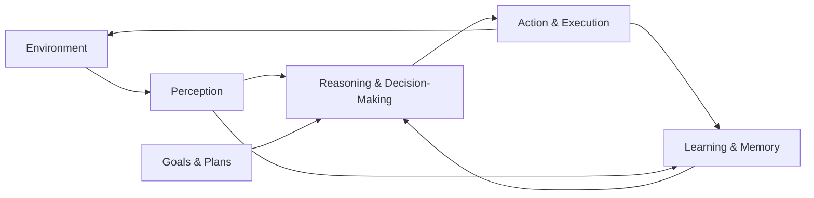

## Introduction: From Reactive Machines to Goal-Directed Intelligence

Artificial intelligence has undergone several waves of evolution, each expanding what machines are capable of doing and how they interact with the world. Early systems were rigid and rule-bound, following explicitly programmed instructions. Later, statistical machine learning enabled systems to recognize patterns and make predictions from data. More recently, large language models (LLMs) and deep learning systems have demonstrated impressive capabilities in perception, language understanding, and content generation. Yet, despite these advances, a fundamental limitation has persisted: most AI systems remain passive or reactive. They respond when prompted, execute a predefined task, and then stop.

Agentic AI represents a significant shift beyond this paradigm. It introduces the idea of AI systems that can act with a degree of independence—setting goals, making plans, taking actions over time, and adapting their behavior based on feedback from their environment. These systems are not merely tools that wait for instructions; they are agents that can operate semi-autonomously or fully autonomously within defined boundaries.

This chapter introduces the foundational concepts of Agentic AI and autonomous systems. It is designed to establish a shared conceptual grounding for the rest of the book. We will define what Agentic AI is and how it differs from other AI paradigms, explore what autonomy really means in the context of intelligent systems, examine real-world examples that already exist today, and explain why Agentic AI is becoming increasingly important across industries and society.

By the end of this chapter, you should have a clear mental model of agentic systems, understand why they represent a natural and necessary evolution in artificial intelligence, and be prepared to dive deeper into their architectures, capabilities, and implications in subsequent chapters.

---

## The Evolution of Artificial Intelligence Toward Agency

To understand Agentic AI, it is useful to see it as part of a broader historical progression rather than a sudden or isolated innovation. Each stage in AI’s development has solved certain problems while exposing new limitations that motivate the next stage.

### Rule-Based Systems: Explicit Intelligence Without Autonomy

The earliest AI systems were rule-based or symbolic systems. These systems relied on human experts encoding knowledge in the form of rules, such as “if X happens, then do Y.” Classic examples include expert systems used in medical diagnosis or industrial troubleshooting in the 1970s and 1980s.

These systems could be surprisingly effective within narrow domains, but they suffered from fundamental weaknesses. They were brittle, meaning they failed when encountering situations not anticipated by their designers. They also had no ability to learn from experience or adapt their behavior. Most importantly for our discussion, they had no agency. They did not decide what to do; they simply executed rules when triggered.

### Machine Learning: Pattern Recognition Without Intent

The rise of machine learning shifted the focus from explicit rules to statistical models trained on data. Instead of telling a system exactly how to recognize an object or predict an outcome, developers provided examples, allowing the system to infer patterns.

This shift enabled systems to handle complexity and variability far beyond what rule-based systems could manage. Image recognition, speech recognition, recommendation systems, and fraud detection became practical realities. However, most machine learning systems remained fundamentally reactive. They took an input and produced an output. They did not decide which problems to solve, when to act, or how to pursue long-term objectives.

### Generative Models and Foundation Models: Powerful Outputs, Limited Agency

Large language models and other foundation models represent a major leap in AI capability. They can generate coherent text, write code, analyze documents, and even reason through complex problems. However, in their default form, these systems remain tools rather than agents.

They respond to prompts, generating outputs based on learned patterns. They do not independently initiate actions, track goals over time, or interact with the environment beyond the immediate context of a prompt-response interaction. Without additional scaffolding, they lack persistence, memory across tasks, and the ability to decide what to do next.

### The Emergence of Agentic AI

Agentic AI builds on these advances by embedding powerful models within systems that can perceive their environment, reason about goals, plan sequences of actions, execute those actions, and adjust behavior based on outcomes. In other words, intelligence is no longer just about producing the right output—it is about acting effectively over time.

This shift marks the transition from AI as a passive computational engine to AI as an active participant in socio-technical systems. Understanding this transition is key to understanding the rest of this book.

---

## Defining Agentic AI

The term “Agentic AI” is sometimes used loosely, so it is important to define it clearly and precisely.

### What Is an Agent?

In artificial intelligence research, an agent is typically defined as an entity that:

- Perceives its environment through sensors
- Acts upon its environment through actuators
- Makes decisions aimed at achieving some objective or goal

This definition applies across a wide range of systems, from software programs that interact with APIs to physical robots navigating the real world.

An agent is not defined by how intelligent it is, but by how it interacts with its environment. Even a simple thermostat can be considered an agent: it perceives temperature and acts by turning a heater on or off to maintain a target range.

### What Makes AI “Agentic”?

Agentic AI refers to artificial intelligence systems that exhibit agent-like properties in a meaningful and non-trivial way. These systems typically possess several of the following characteristics:

- Goal-directed behavior: They pursue objectives rather than merely responding to inputs.
- Decision-making: They choose between alternative courses of action.
- Persistence over time: They maintain state, memory, or context across multiple steps.
- Adaptation: They adjust their behavior based on outcomes and feedback.
- Environmental interaction: They operate within and influence an environment, whether digital or physical.

Agentic AI is not a single technology or algorithm. It is a design paradigm that integrates perception, reasoning, planning, action, and learning into a coherent whole.

### Distinguishing Agentic AI from Other AI Paradigms

To clarify the concept further, it is helpful to contrast Agentic AI with other common AI paradigms.

A traditional supervised learning model, such as a spam classifier, is not agentic. It takes an email as input and outputs a probability that it is spam. It does not decide when to act or what to do next.

A language model, by itself, is also not agentic. It generates text in response to a prompt, but it does not have goals, memory, or the ability to initiate actions in the world.

An agentic system, on the other hand, might use a language model as a component. For example, an AI assistant that autonomously schedules meetings, negotiates time slots, and follows up with participants over several days is exhibiting agentic behavior. It is pursuing a goal across time and interacting with multiple systems to achieve it.

---

## Understanding Autonomy in Intelligent Systems

Autonomy is a central concept in Agentic AI, but it is often misunderstood. Autonomy does not mean absence of control, nor does it imply unrestricted freedom. Instead, autonomy exists on a spectrum.

### What Does Autonomy Mean?

At its core, autonomy refers to the ability of a system to operate without continuous human intervention. An autonomous system can make decisions and take actions on its own, within defined constraints and objectives.

Autonomy involves several dimensions:

- Decision autonomy: The ability to choose between actions.
- Temporal autonomy: The ability to operate over extended periods.
- Goal autonomy: The ability to pursue high-level objectives rather than just execute instructions.
- Adaptive autonomy: The ability to change behavior in response to new information or conditions.

Not all agentic systems are fully autonomous, and not all autonomous systems are highly intelligent. Understanding these distinctions is critical.

### Levels of Autonomy

Autonomy can be conceptualized as a continuum rather than a binary property.

At one end of the spectrum are fully manual systems, which require constant human input. A calculator is a simple example.

Next are automated systems, which follow fixed procedures without deviation. Many industrial machines fall into this category.

Beyond that are semi-autonomous systems, which can operate independently under normal conditions but rely on human oversight and intervention. Modern autopilot systems in aircraft are a classic example.

Further along are highly autonomous systems, which can handle complex, dynamic environments with minimal human involvement. Self-driving cars, although still under development, aim to reach this level.

Agentic AI systems can exist at any of these levels of autonomy. What matters is not whether humans are involved, but how decision-making is distributed between the system and its human operators.

### Autonomy Versus Control

A common concern about autonomous systems is loss of control. In practice, effective agentic systems are carefully designed with constraints, safeguards, and oversight mechanisms.

Autonomy does not mean that a system can do anything it wants. It means that it can decide how to achieve its goals within boundaries defined by designers, operators, and ethical guidelines. In many cases, increasing autonomy can actually improve safety and reliability by reducing human error and enabling faster responses.

---

## Core Components of Agentic Systems

While Agentic AI can take many forms, most agentic systems share a set of core functional components. Understanding these components provides a useful mental model for analyzing and designing agentic systems.

### Perception: Understanding the Environment

Perception refers to how an agent receives information about its environment. In software agents, this may involve reading data from databases, APIs, logs, or user inputs. In physical agents, perception may involve sensors such as cameras, microphones, lidar, or tactile sensors.

Perception is not just about raw data collection. It also involves interpreting and structuring that data in ways that support decision-making. For example, detecting that “a request is urgent” is a higher-level percept derived from multiple signals.

### Decision-Making and Reasoning

Decision-making is the process by which an agent chooses what to do next. This may involve symbolic reasoning, probabilistic inference, learned policies, or combinations of these approaches.

Modern agentic systems often rely on hybrid approaches. A large language model may be used for high-level reasoning and planning, while more specialized algorithms handle optimization, control, or execution.

The key feature is that the agent evaluates alternatives and selects actions based on goals, constraints, and expected outcomes.

### Planning and Goal Management

Agentic AI systems typically operate toward goals rather than executing isolated actions. Planning involves decomposing a high-level objective into a sequence of steps and determining the order in which those steps should be executed.

Goal management also involves prioritization, monitoring progress, and adjusting plans as conditions change. In complex environments, plans often need to be revised dynamically.

### Action and Execution

Action is how an agent affects its environment. In digital systems, actions may include sending messages, making API calls, modifying databases, or triggering workflows. In physical systems, actions may involve movement, manipulation, or communication.

Execution is not always trivial. Actions can fail, have unintended consequences, or produce delayed results. Robust agentic systems are designed to detect and handle such issues gracefully.

### Learning and Adaptation

While not all agentic systems learn, many incorporate learning mechanisms to improve performance over time. Learning may involve updating models, refining heuristics, or adjusting strategies based on feedback.

Adaptation is particularly important in dynamic environments where conditions change or where complete prior knowledge is not available.

---

## A Conceptual Model of an Agentic System

The following diagram illustrates a simplified conceptual model of an agentic system and the interactions between its core components.

This diagram emphasizes that agentic behavior is cyclical rather than linear. The agent continuously perceives its environment, reasons about what to do, takes action, and updates its internal state based on the results.

---

## Real-World Examples of Agentic AI

Agentic AI is not a speculative concept confined to research labs. It already appears in many real-world systems, often in forms that people interact with daily.

### Autonomous Digital Assistants

Advanced digital assistants go beyond answering questions. Some systems can manage calendars, coordinate tasks, monitor emails, and proactively suggest actions. For example, an enterprise AI assistant may:

- Monitor incoming requests
- Determine which ones require action
- Prioritize tasks based on urgency and importance
- Execute workflows across multiple software systems
- Follow up if tasks are not completed

Such a system is agentic because it operates across time, pursues goals, and takes initiative rather than waiting for explicit commands.

### Trading and Financial Agents

In financial markets, autonomous trading agents analyze market data, identify opportunities, and execute trades at speeds and scales impossible for humans. These agents operate under constraints such as risk limits and regulatory requirements, but within those bounds they make independent decisions.

### Robotics and Autonomous Vehicles

Physical robots are among the most intuitive examples of agentic systems. Autonomous drones, warehouse robots, and self-driving vehicles all perceive their environment, plan paths, avoid obstacles, and execute actions in real time.

These systems highlight the tight coupling between perception, decision-making, and action that defines agentic behavior.

### IT Operations and DevOps Agents

In modern IT infrastructure, autonomous agents increasingly monitor systems, detect anomalies, diagnose issues, and even apply fixes without human intervention. These agents help maintain reliability in highly complex and dynamic environments.

---

## Why Agentic AI Is Becoming Increasingly Important

The growing importance of Agentic AI is not accidental. It reflects broader trends in technology, economics, and society.

### Increasing System Complexity

Modern systems are too complex for humans to manage manually. From cloud computing infrastructures to global supply chains, the number of variables and interactions involved exceeds human cognitive capacity.

Agentic AI offers a way to manage this complexity by delegating decision-making and action to systems that can operate continuously and at scale.

### Demand for Responsiveness and Speed

In many domains, speed is critical. Financial markets, cybersecurity, healthcare, and logistics all require rapid responses to changing conditions. Autonomous agents can react faster than human-in-the-loop systems.

### Scarcity of Human Attention

Human attention is a limited resource. Agentic systems can handle routine, repetitive, or time-sensitive tasks, freeing humans to focus on strategic, creative, or ethical considerations.

### Advances in AI Capabilities

Recent advances in machine learning, particularly foundation models, have made it possible to build agents that can reason, communicate, and adapt in ways that were previously infeasible. Agentic AI leverages these capabilities to move from intelligence in isolation to intelligence in action.

### Economic and Strategic Advantages

Organizations that effectively deploy agentic systems can achieve significant advantages in efficiency, cost reduction, and innovation. At a national and global level, agentic AI is increasingly seen as a strategic technology with implications for competitiveness and security.

---

## Ethical and Societal Considerations (An Early Preview)

Although this chapter focuses on foundational concepts, it is important to acknowledge that agentic systems raise important ethical and societal questions.

When systems act autonomously, questions arise about accountability, transparency, and control. Who is responsible for an agent’s actions? How do we ensure that agents align with human values and intentions? How do we prevent unintended consequences?

These questions will be addressed in greater depth later in the book. For now, it is sufficient to recognize that Agentic AI is not just a technical challenge, but a socio-technical one.

---

## Common Misconceptions About Agentic AI

As interest in Agentic AI grows, so do misconceptions. Clarifying these early can prevent confusion later.

One common misconception is that agentic systems must be conscious or human-like. In reality, most agentic systems are narrow and task-specific.

Another misconception is that autonomy implies lack of control. As discussed earlier, effective agentic systems are designed with careful constraints and oversight.

Finally, some assume that Agentic AI is entirely new. While the term may be recent, the underlying ideas build on decades of research in AI, robotics, and control theory.

---

## Connecting This Chapter to the Rest of the Book

This introductory chapter lays the conceptual groundwork for everything that follows. In later chapters, we will:

- Explore architectures and design patterns for building agentic systems
- Examine how large language models can be integrated into agents
- Analyze coordination among multiple agents
- Address safety, alignment, and governance challenges
- Study advanced applications and emerging research directions

Understanding what Agentic AI is—and why it matters—is essential for engaging deeply with these topics.

---

## Key Takeaways

Agentic AI represents a shift from reactive, tool-based AI systems to goal-directed, autonomous systems that operate over time.

Autonomy exists on a spectrum and involves the ability to make decisions, pursue goals, and adapt behavior within defined constraints.

Agentic systems integrate perception, reasoning, planning, action, and learning into a cohesive loop.

Real-world examples of Agentic AI already exist in digital assistants, robotics, finance, and IT operations.

The growing importance of Agentic AI is driven by increasing complexity, demand for speed, and advances in AI capabilities.

---

With these foundational ideas in place, you are now prepared to explore the deeper technical, architectural, and ethical dimensions of Agentic AI in the chapters ahead.


