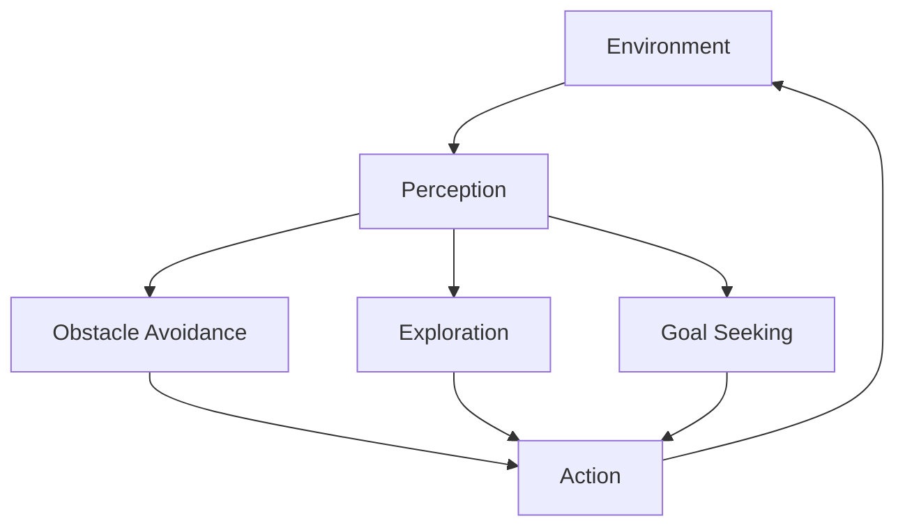

## Introduction: Why Study the History of Intelligent Agents?

To understand modern Agentic AI—systems that can perceive, decide, act, and adapt autonomously—it is essential to understand where these ideas came from. Agent-based intelligence did not emerge suddenly with large language models or reinforcement learning breakthroughs. Instead, it is the result of decades of intellectual exploration across artificial intelligence, cognitive science, philosophy, control theory, and computer science.

This chapter traces the historical evolution of intelligent agents, focusing on how early thought experiments and computational models gradually shaped what we now call agentic systems. Rather than merely listing dates and names, we will explore the motivations behind each era, the problems researchers were trying to solve, and why particular approaches succeeded or failed. By doing so, you will gain a deeper intuition for why modern Agentic AI looks the way it does—and what lessons from the past still matter today.

By the end of this chapter, you will be able to:
- Understand how early conceptions of intelligence influenced agent-based models
- Identify key milestones in the evolution of intelligent agents
- Recognize the influence of classical AI and cognitive science
- Relate historical approaches to contemporary agent architectures

This chapter builds directly on Chapter 1, which introduced agentic systems at a conceptual level. Here, we zoom out historically, laying the intellectual foundation for everything that follows in later chapters.

---

## Pre-Computational Roots: Philosophical and Biological Inspirations

### Early Philosophical Ideas About Agency and Intelligence

Long before computers existed, philosophers debated what it meant for an entity to act intelligently. These debates formed the conceptual soil from which artificial agents eventually grew.

In ancient philosophy, thinkers like Aristotle distinguished between different types of causes, particularly focusing on purposeful action. Aristotle’s concept of “final causes”—the idea that actions are guided by goals—foreshadowed one of the core ideas of agent-based systems: goal-directed behavior. Although Aristotle was not thinking about machines, his framework introduced a vocabulary for discussing intentional action.

In the early modern era, philosophers such as René Descartes proposed mechanistic views of organisms. Descartes famously compared animals to machines, suggesting that complex behavior could arise from mechanical principles without consciousness. While flawed and controversial, this mechanistic metaphor inspired later thinkers to imagine intelligent behavior as something that might be engineered.

Thomas Hobbes took this idea further by explicitly describing reasoning as a kind of computation. He famously wrote that “reason is nothing but reckoning,” implying that thought itself might be reducible to symbolic manipulation. This idea would later become a cornerstone of classical artificial intelligence and symbolic agent models.

What these philosophical traditions offered was not technical detail, but a conceptual framework: intelligence as goal-directed, mechanistic, and potentially formalizable.

### Biological Foundations: Behavior, Adaptation, and Control

Biology provided a second major source of inspiration. Observations of animals demonstrated that intelligence need not involve abstract reasoning or language. Simple organisms were able to navigate environments, avoid predators, and seek resources using relatively simple mechanisms.

The study of reflexes in the 19th century showed how stimulus-response systems could produce seemingly purposeful behavior. Later, ethologists such as Konrad Lorenz and Nikolaas Tinbergen studied instinctive behavior patterns, revealing how complex actions could emerge from simple rules triggered by environmental cues.

These insights strongly influenced early agent models. Rather than assuming that intelligence required high-level reasoning, researchers began exploring models in which behavior emerged from interactions between perception, internal state, and action.

Equally important was the development of control theory in the early 20th century. Cybernetics, pioneered by Norbert Wiener, studied how systems regulate themselves through feedback loops. Concepts such as negative feedback, homeostasis, and stability became crucial for thinking about autonomous agents capable of maintaining goals over time.

The cybernetic view treated agents as adaptive systems embedded in environments, a perspective that remains central to modern agentic AI.

---

## The Birth of Artificial Intelligence and Early Agent Concepts

### The Computational Turn: When Intelligence Became Programmable

The mid-20th century marked a radical shift: intelligence was no longer just a philosophical or biological concept; it became a computational one.

The invention of digital computers provided a concrete substrate for implementing reasoning processes. Alan Turing’s seminal 1950 paper, “Computing Machinery and Intelligence,” reframed the question of intelligence in operational terms. Rather than asking what intelligence “is,” Turing asked whether a machine’s behavior could be indistinguishable from that of a human.

Although Turing’s work did not explicitly define agents, it introduced several ideas essential for agentic AI:
- Intelligence as observable behavior
- The importance of interaction (e.g., dialogue)
- The idea that machines could potentially exhibit intelligent agency

Turing also proposed learning machines, hinting at agents that could adapt over time rather than relying on fixed rules.

### The Dartmouth Conference and the Early Optimism

The formal field of artificial intelligence began in 1956 at the Dartmouth Summer Research Project on Artificial Intelligence. Researchers such as John McCarthy, Marvin Minsky, Allen Newell, and Herbert Simon believed that general intelligence could be achieved within a few decades.

Early AI focused primarily on problem-solving and symbolic reasoning. Newell and Simon’s Logic Theorist and General Problem Solver (GPS) represented intelligence as a search through a space of symbolic states guided by heuristics.

While these systems were not agents in the modern sense—they operated in closed, well-defined problem spaces—they introduced essential components:
- Explicit representations of goals
- Decision-making processes for selecting actions
- Evaluation of outcomes

In hindsight, these systems can be seen as early, highly constrained agents operating in abstract environments such as logic puzzles or game boards.

### The Emergence of “Rational Action” as a Central Idea

One of the most enduring ideas from classical AI was rationality. A rational system was defined as one that selects actions expected to maximize some measure of performance given its beliefs.

This concept provided a bridge between philosophical ideas of agency and computational implementation. It also laid the groundwork for later formalizations of agents in terms of decision theory and utility maximization.

At this stage, however, most AI systems lacked key properties of modern agents: they did not perceive dynamic environments, they did not act continuously, and they did not adapt in real time.

---

## Symbolic Agents and the Physical Symbol System Hypothesis

### Symbols as the Basis of Intelligence

In 1976, Newell and Simon articulated the Physical Symbol System Hypothesis, which stated that any system capable of general intelligent action must be a physical symbol system. According to this view, intelligence arises from the manipulation of structured symbols according to formal rules.

This hypothesis dominated AI research for decades and strongly influenced the design of early agent systems. Agents were conceptualized as reasoning engines that:
- Represented the world using symbols
- Used logical inference to derive conclusions
- Selected actions based on explicit goals and plans

Planning systems such as STRIPS (Stanford Research Institute Problem Solver) exemplified this approach. Given a description of the initial state, a goal state, and a set of actions with defined preconditions and effects, the planner generated a sequence of actions to achieve the goal.

In agent terms, STRIPS-like planners defined a clear perception-decision-action loop:
- Perception: Observe the current symbolic state
- Decision: Generate a plan
- Action: Execute the plan

### Strengths and Limitations of Symbolic Agents

Symbolic agent systems excelled in domains with clear structure and well-defined rules, such as logistics planning or puzzle-solving. They provided transparency, interpretability, and formal guarantees about correctness.

However, they struggled in real-world environments. Symbolic representations were brittle, requiring exhaustive modeling of every relevant aspect of the environment. Small changes or unexpected events could cause plans to fail catastrophically.

Additionally, symbolic agents often assumed perfect perception and unlimited computational resources, assumptions that rarely hold outside toy environments.

These limitations would become increasingly apparent as researchers attempted to deploy agents in more complex, dynamic settings.

---

## The Influence of Cognitive Science on Agent Models

### Humans as Information-Processing Agents

During the same period, cognitive science emerged as a field dedicated to understanding how humans perceive, think, and act. Cognitive scientists adopted computational metaphors, viewing the mind as an information-processing system.

This mutual influence between AI and cognitive science was profound. AI models inspired theories of cognition, while psychological findings influenced agent architectures.

For example, research on human problem-solving revealed that people use heuristics rather than exhaustive search. This insight led to the development of heuristic-based agents that prioritized efficiency over optimality.

### Bounded Rationality and Its Implications

Herbert Simon introduced the concept of bounded rationality, arguing that real agents operate under constraints of limited memory, time, and information. Rather than maximizing utility, they satisfice—seeking solutions that are “good enough.”

This idea challenged the classical notion of perfectly rational agents and pushed researchers to consider more realistic agent models.

Bounded rationality directly influenced the design of agent architectures that:
- Limit the complexity of internal representations
- Trade optimality for speed and robustness
- Emphasize reactivity and adaptation

These ideas would later resurface in reactive and behavior-based agent paradigms.

---

## Reactive and Behavior-Based Agents: A Paradigm Shift

### The Breakdown of Symbolic Dominance

By the late 1980s, frustration with symbolic AI had reached a tipping point. Systems performed impressively in laboratory settings but failed in real-world environments such as robotics.

Rodney Brooks famously argued against the traditional “sense-think-act” pipeline, proposing instead that intelligence could emerge from direct coupling between perception and action.

Brooks’ subsumption architecture exemplified this shift. Instead of a centralized planner, the agent consisted of layered behaviors, each responsible for a specific function such as obstacle avoidance or goal-seeking.

Here is a simplified conceptual representation:

Higher-level behaviors could subsume lower-level ones, overriding them when necessary.

### Why Reactive Agents Mattered

Reactive agents demonstrated that complex behavior could arise without explicit symbolic reasoning or planning. They were:
- Fast, because they avoided expensive computation
- Robust, because they responded directly to environmental changes
- Scalable, because new behaviors could be added incrementally

However, reactive agents lacked long-term planning and abstract reasoning capabilities. They excelled at moment-to-moment interaction but struggled with tasks requiring foresight or complex coordination.

Nonetheless, this paradigm shift profoundly influenced later agent architectures, particularly those emphasizing embodied intelligence.

---

## Multi-Agent Systems and Social Intelligence

### From Single Agents to Agent Societies

As research progressed, attention shifted from isolated agents to systems of interacting agents. Multi-agent systems (MAS) investigated how multiple autonomous entities could coordinate, cooperate, or compete.

This shift was motivated by practical concerns—distributed systems, networked computing—as well as theoretical interests in social behavior.

In multi-agent settings, intelligence was no longer solely an individual property. Collective behaviors such as flocking, negotiation, and market dynamics emerged from interactions among agents.

### Communication, Coordination, and Protocols

Researchers developed formal languages and protocols for agent communication, such as the Knowledge Query and Manipulation Language (KQML). Agents exchanged messages to share beliefs, request actions, or negotiate agreements.

Coordination mechanisms included:
- Contract Net Protocols for task allocation
- Voting and consensus algorithms
- Game-theoretic strategies for conflict resolution

These developments introduced key ideas still relevant to modern Agentic AI, including decentralized decision-making and emergent behavior.

---

## Learning Agents and the Rise of Adaptive Behavior

### Reinforcement Learning and Trial-and-Error

One of the most significant milestones in the evolution of intelligent agents was the integration of learning. Reinforcement learning (RL) provided a formal framework for agents to learn from interaction with their environment.

In RL, an agent:
- Observes a state
- Takes an action
- Receives a reward
- Updates its policy to maximize cumulative reward

This framework aligned naturally with the agent paradigm and addressed many limitations of purely symbolic or reactive systems.

### Early Successes and Limitations

Classical RL methods, such as Q-learning, demonstrated that agents could learn effective strategies in controlled environments like grid worlds or simple games.

However, scalability and sample inefficiency limited their applicability. Agents required enormous amounts of experience and struggled with high-dimensional perception.

Despite these challenges, the idea of agents that could improve through experience fundamentally changed AI research.

---

## The Transition to Modern Agentic AI

### Integrating Perception, Learning, and Reasoning

The 21st century saw a convergence of ideas from classical AI, behavioral robotics, multi-agent systems, and machine learning. Advances in computation and data enabled agents to perceive complex environments using techniques like deep learning.

Modern agentic systems integrate:
- Perception through neural networks
- Decision-making via reinforcement learning or planning
- Memory and context management
- Communication with humans and other agents

While the technologies are new, the underlying principles trace back directly to earlier eras.

### Language Models as Cognitive Engines

The emergence of large language models introduced a powerful new component for agent architectures. These models provide:
- Rich world knowledge
- Flexible reasoning capabilities
- Natural language interfaces

In many ways, language models resurrect aspects of symbolic AI—explicit reasoning and representation—while overcoming brittleness through statistical learning.

Modern agents often combine language models with tools, planners, and learning modules, echoing decades-old ideas in a more scalable form.

---

## Continuities and Lessons from History

The history of intelligent agents is not a sequence of discarded ideas, but a layering of insights. Each era contributed something essential:
- Philosophy defined agency and purpose
- Classical AI introduced symbolic reasoning and planning
- Cognitive science emphasized bounded rationality
- Reactive systems highlighted embodiment and robustness
- Learning agents enabled adaptation
- Multi-agent systems revealed social intelligence

Understanding this history helps us avoid repeating past mistakes and appreciate the trade-offs inherent in different agent designs.

---

## Conclusion: From Ideas to Architectures

The evolution of intelligent agents reflects a broader story about artificial intelligence itself: a continuous negotiation between theory and practice, abstraction and embodiment, control and adaptability.

Modern Agentic AI stands on the shoulders of decades of research. By tracing its history, we gain not only technical insight, but also conceptual clarity about what it means for a system to act intelligently in the world.

In the next chapters, we will build on this foundation, examining concrete agent architectures and design principles informed by this rich historical legacy.


