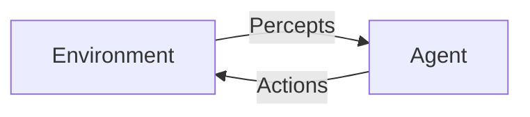

## Introduction: What Makes an AI System Truly Agentic

In the previous chapters, we established what Agentic AI is and why it represents a shift from passive, reactive software toward systems that can meaningfully operate in the world. We introduced the idea that an *agent* is not just a program that produces outputs, but an entity that perceives its environment, reasons about what it perceives, and takes actions over time to achieve goals. 

This chapter goes deeper into the *core characteristics* that distinguish agentic systems from other forms of artificial intelligence and automation. These characteristics are not arbitrary labels; they are the result of decades of research in artificial intelligence, robotics, cognitive science, and philosophy. Understanding them is critical because they shape how agents are designed, how they behave, and how we evaluate their effectiveness.

The four canonical characteristics we will explore—**autonomy, reactivity, proactiveness, and social ability**—form the conceptual backbone of agentic AI. Around these characteristics sit supporting concepts: environments, perception and action cycles, internal mental states (such as beliefs, desires, and intentions), and behavioral complexity. Together, these ideas explain *how* agents make decisions, *why* their behavior appears purposeful, and *when* we can reasonably trust them to operate with minimal human oversight.

This chapter is conceptual rather than implementation-focused, but it is not abstract for abstraction’s sake. Throughout, we will ground theory in concrete examples: software agents negotiating tasks, robots navigating physical spaces, and AI systems managing information, workflows, or resources. By the end of this chapter, you should be able to:

- Clearly explain what autonomy, reactivity, proactiveness, and social ability mean in the context of agentic AI.
- Analyze how an agent perceives and acts within its environment over time.
- Distinguish simple agents from more complex, cognitively rich agents.
- Understand the role of internal states such as beliefs, desires, and intentions in shaping agent behavior.

This knowledge will become foundational in later chapters, where we examine agent architectures, coordination among multiple agents, and real-world applications. Before we can build or evaluate agentic systems, we must understand what fundamentally makes an AI system an *agent*.

---

## Agentic AI as Situated Intelligence

### Agents Do Not Exist in Isolation

A defining feature of agentic AI is *situatedness*. An agent always exists within an **environment**, whether that environment is physical (such as a room, a factory floor, or a city) or virtual (such as a software ecosystem, a network, or a game world). The environment provides:

- Information the agent can perceive
- Constraints on what actions are possible
- Consequences for the actions the agent takes

An agent’s intelligence cannot be evaluated independently of the environment in which it operates. A navigation agent that performs well in a structured warehouse may fail completely in an unstructured natural environment. Similarly, a software agent that manages user requests efficiently in a stable system may struggle in a dynamic, adversarial network.

This dependency underscores an important principle: **agentic intelligence emerges from the interaction between the agent and its environment, not from internal computation alone**.

### The Perception–Decision–Action Loop

At the most basic level, all agents operate in a loop:

1. **Perceive** the environment through sensors or data inputs  
2. **Interpret and reason** about what was perceived  
3. **Decide** what action (if any) to take  
4. **Act** upon the environment using effectors or outputs  
5. **Repeat** as the environment changes

This cycle can occur many times per second in robotic agents or at irregular intervals in software agents. The speed, sophistication, and adaptability of this loop determine how effective the agent is.

We can visualize this loop as follows:

While simple on the surface, this loop becomes increasingly complex as agents incorporate memory, learning, goal reasoning, and social interaction. The four core characteristics discussed in this chapter describe *how* this loop is executed and *what qualities* the behavior exhibits.

---

## Autonomy: Acting Without Continuous External Control

### Defining Autonomy in Agentic Systems

Autonomy refers to an agent’s **capacity to operate without direct, continuous control by a human or another system**. An autonomous agent decides for itself which actions to take and when to take them, based on its perceptions, goals, and internal reasoning mechanisms.

This does not mean the agent is completely independent of humans. Most autonomous systems are still designed, configured, constrained, and monitored by people. The key distinction is that, once deployed, the agent does not require step-by-step instructions to function.

To understand autonomy properly, it helps to distinguish it from automation. A traditional automated system follows predefined rules in a fixed sequence. An autonomous agent, by contrast:

- Chooses among possible actions rather than executing a fixed script
- Adapts its behavior to changing circumstances
- Operates continuously over time rather than producing a single output

For example, a simple thermostat is automated: it turns heating on or off based on temperature thresholds. A smart climate-control agent, however, may learn usage patterns, predict weather changes, and proactively adjust settings while autonomously balancing comfort and energy efficiency.

### Degrees of Autonomy

Autonomy is not a binary property. Instead, it exists on a spectrum. Agents can be:

- **Low autonomy**: They act only when explicitly triggered and have little flexibility (e.g., a rule-based alert system).
- **Moderate autonomy**: They operate independently within well-defined boundaries (e.g., a scheduling assistant that reschedules meetings but asks for approval).
- **High autonomy**: They manage their own objectives and strategies with minimal human input (e.g., a warehouse robot fleet coordinating logistics).

Understanding degrees of autonomy is critical for system design because higher autonomy often brings higher risk. When agents make more decisions independently, designers must ensure alignment with human goals, safety constraints, and ethical considerations.

### Why Autonomy Matters

Autonomy is essential in environments that are:

- Too complex for all possibilities to be preprogrammed
- Too dynamic for real-time human control
- Too large-scale for manual coordination

In such contexts, requiring constant human intervention would negate the benefits of AI. Autonomy enables scalability, responsiveness, and resilience, allowing agents to remain effective even when humans are unavailable or overwhelmed.

---

## Reactivity: Responding Appropriately to Change

### Understanding Reactivity

Reactivity is an agent’s ability to **perceive changes in its environment and respond to them in a timely and appropriate manner**. A reactive agent does not merely execute a plan blindly; it continuously adjusts its behavior in response to new information.

This characteristic distinguishes agents from static decision-making systems. While a traditional algorithm may process a dataset and return a result, a reactive agent remains engaged with its environment over time.

Reactivity can be simple or sophisticated. At its simplest, it involves stimulus–response behavior, similar to reflexes in biological organisms. At more advanced levels, reactivity involves interpreting signals, weighing alternatives, and balancing competing priorities.

### Temporal Sensitivity and Real-Time Constraints

Timeliness is central to reactivity. Responding too late can be as harmful as not responding at all. For example:

- A collision-avoidance system in a vehicle must react within milliseconds.
- A financial trading agent must respond to market changes before conditions shift again.
- A conversational agent must respond quickly enough to maintain a natural interaction.

Reactive behavior therefore often imposes performance constraints on agent design. Perception and decision-making must be efficient, and the system must prioritize critical responses over less urgent tasks.

### Reactivity Versus Deliberation

Reactivity does not imply the absence of reasoning. Instead, it exists in tension with deliberation. Highly deliberative agents may analyze situations deeply but risk being too slow. Highly reactive agents may respond quickly but superficially.

Effective agentic systems balance these modes. For example:

- A robot may use reactive control to avoid obstacles while using deliberative planning to navigate toward its destination.
- A software agent may instantly handle routine requests while escalating complex cases for deeper analysis.

This balance is sometimes described as a layered or hybrid control structure, combining fast reactive layers with slower, more reflective reasoning layers.

---

## Proactiveness: Acting with Purpose and Initiative

### What Proactiveness Means

Proactiveness refers to an agent’s **ability to take initiative in pursuit of goals**, rather than merely responding to external stimuli. A proactive agent does not wait for something to happen; it anticipates future states and acts to influence outcomes.

This characteristic is closely tied to goal-directed behavior. Proactive agents:

- Maintain explicit or implicit goals
- Monitor progress toward those goals
- Take actions to advance, protect, or revise those goals

For example, a personal digital assistant that reminds you of an upcoming deadline is being proactive. It is not responding to a direct request at that moment; it is acting based on an internal representation of your goals and the passage of time.

### Anticipation and Prediction

Proactiveness often depends on the agent’s ability to anticipate future states of the environment. This may involve:

- Predicting likely events based on past data
- Simulating outcomes of possible actions
- Inferring the intentions of other agents

Anticipation allows agents to act earlier and more efficiently. Rather than reacting to problems after they occur, proactive agents can prevent problems or prepare for them.

### When Proactiveness Becomes a Liability

While proactiveness is powerful, it must be carefully managed. An agent that is too proactive may:

- Take unwanted actions
- Interfere with human autonomy
- Overcommit resources based on incorrect predictions

Designers must therefore define clear boundaries for initiative. In many systems, proactiveness is constrained by approval mechanisms, confidence thresholds, or explicit permission models.

---

## Social Ability: Interaction, Coordination, and Communication

### Agents as Social Actors

Social ability refers to an agent’s capacity to **interact with other agents or humans through communication and coordination**. In modern AI systems, agents rarely operate alone. They exist within ecosystems of users, services, and other agents.

Social ability includes the capacity to:

- Exchange information
- Negotiate and coordinate tasks
- Interpret social signals or conventions
- Adapt behavior based on others’ actions

An agent that lacks social ability may still function in isolation, but it will struggle in collaborative or competitive environments.

### Communication Modalities

Agent communication can take many forms:

- Structured messages (e.g., APIs, protocols)
- Natural language (spoken or written)
- Implicit signals (e.g., observing behavior)

The choice of communication modality affects the complexity and robustness of interactions. Human-facing agents must handle ambiguity, context, and pragmatics, while machine-facing agents prioritize precision and efficiency.

### Multi-Agent Coordination

In multi-agent systems, social ability enables agents to work together toward shared goals or to manage conflicts. Examples include:

- Autonomous vehicles coordinating traffic flow
- Distributed software agents balancing computational workloads
- Market-based agents bidding for resources

Such coordination requires mechanisms for trust, negotiation, and conflict resolution. Social ability thus introduces new challenges related to alignment, fairness, and system-wide behavior.

---

## Perception and Action: How Agents Sense and Influence the World

### Perception as Interpretation

Perception is not mere data ingestion. For agents, perception involves **interpreting signals from the environment into meaningful internal representations**. Sensors or input channels provide raw data, but the agent must process that data to extract relevant features.

For example, a vision-based robot does not perceive “pixels” in a meaningful sense. It perceives obstacles, objects, and spatial relationships derived from pixel data. Similarly, a software agent perceives events such as “a user request timed out” rather than raw log entries.

### Action as Transformation

Actions are the means by which agents influence their environment. An action may:

- Change the physical state of the world
- Modify data or system configurations
- Alter the informational environment of other agents

Importantly, the effects of actions are often uncertain. Agents must therefore operate under incomplete information and unpredictable outcomes, adjusting behavior as new percepts arrive.

### Closed-Loop Control

The continuous linkage between perception and action forms a closed-loop control system. Each action affects future perceptions, creating feedback. Effective agents use this feedback to refine their behavior over time.

---

## Simple and Complex Agent Behaviors

### Simple Reactive Agents

Simple agents operate using straightforward rules that map perceptions directly to actions. These agents have little or no memory and no explicit internal models of the world.

While limited, simple agents can be highly effective in constrained domains. Examples include:

- Rule-based monitoring systems
- Reflex-based robots
- Stateless chatbots

Their simplicity makes them predictable and easy to verify, which is valuable in safety-critical applications.

### Model-Based and Goal-Oriented Agents

More complex agents maintain internal models of the environment and explicit representations of goals. These agents can reason about possibilities, evaluate trade-offs, and plan sequences of actions.

Such agents exhibit behaviors that appear more intelligent and flexible but also become more difficult to design, test, and control.

### Behavioral Complexity and Emergence

As agents become more complex and interconnected, system-level behaviors may emerge that were not explicitly programmed. This emergence can be beneficial (e.g., efficient coordination) or problematic (e.g., unexpected feedback loops).

Understanding the progression from simple to complex behaviors helps designers choose the right level of sophistication for a given application.

---

## Internal States: Beliefs, Desires, and Intentions

### Why Internal States Matter

To explain and predict agent behavior, it is often useful to attribute internal mental states to agents. While these states are abstractions rather than literal mental experiences, they provide a powerful framework for reasoning about decision-making.

### Beliefs

Beliefs represent the agent’s informational state: what it thinks is true about the world. Beliefs may be incomplete or incorrect, and they are updated as new information is perceived.

### Desires

Desires represent what the agent wants to achieve. These may include goals, preferences, or utility functions. Desires guide the selection of actions among alternatives.

### Intentions

Intentions represent the agent’s commitments to particular courses of action. Once an agent forms an intention, it typically persists until the goal is achieved, abandoned, or deemed impossible.

### The BDI Model

The Belief–Desire–Intention (BDI) model is a widely used framework for agent design. It provides a structured way to connect perception, reasoning, and action while maintaining coherence over time.

---

## Bringing the Characteristics Together

The true power of agentic AI emerges when autonomy, reactivity, proactiveness, and social ability operate together within a coherent perception–action framework supported by internal states. An autonomous agent that cannot react will fail in dynamic environments. A reactive agent without proactiveness will remain short-sighted. A proactive agent without social ability may act at cross purposes with others.

These characteristics are not independent features to be “added on,” but interlocking aspects of a unified design philosophy. They shape how agents are built, evaluated, and trusted.

---

## Summary and Key Takeaways

Agentic AI systems are defined by a constellation of core characteristics that distinguish them from traditional AI and automated systems. Autonomy allows agents to operate independently over time. Reactivity ensures responsiveness to environmental change. Proactiveness enables goal-directed initiative. Social ability allows agents to function within multi-agent and human-centered contexts.

Underlying these characteristics is the continuous perception–decision–action loop, supported by internal states such as beliefs, desires, and intentions. Agent behavior exists on a spectrum from simple reactive responses to complex, deliberative, and socially coordinated strategies.

Understanding these core characteristics provides the conceptual foundation for everything that follows in the study of agentic AI. In subsequent chapters, we will build on this foundation to examine concrete architectures, implementation strategies, and real-world systems that embody these principles in practice.


