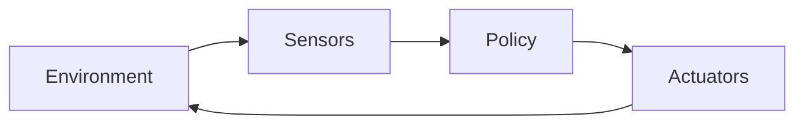
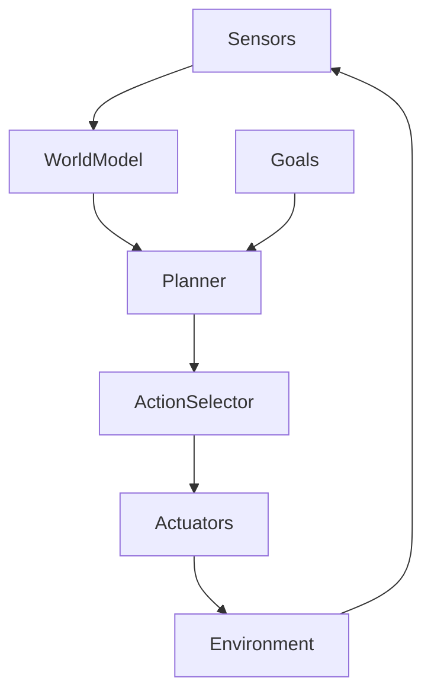
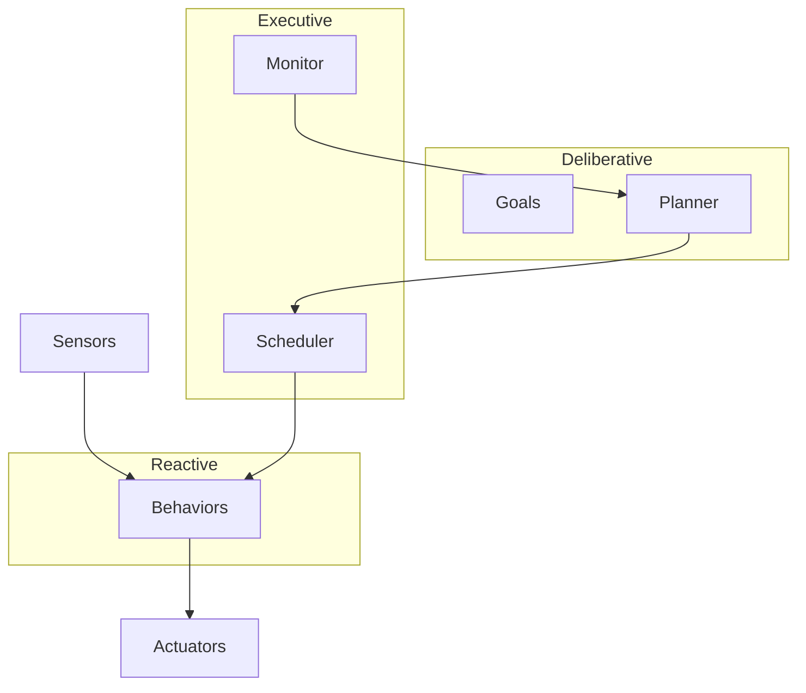

## Introduction: Why Classifying Agents Matters

As we move deeper into the study of agentic AI, we transition from understanding *how* agents interact with environments (as explored in Chapter 4) to understanding *what kinds* of agents exist and *how they are structured internally*. This chapter addresses a foundational question: **What makes one agent different from another?**

At first glance, all agents may appear similar. They perceive their environment, make decisions, and act. However, beneath this surface similarity lie profound differences in how agents are designed, how they reason (or fail to), how much they remember, how they adapt over time, and how suitable they are for different tasks. These differences are not cosmetic; they are architectural and conceptual. They determine whether an agent can plan ahead, learn from experience, operate in real time, or cope with complexity and uncertainty.

This chapter introduces a **taxonomy of agents**—a systematic way of classifying agents based on their internal mechanisms and behavioral capabilities—and explores the **architectures** that implement these agent types. Understanding agent taxonomy is essential for anyone designing, evaluating, or deploying agentic systems, because it provides a principled framework for choosing the *right kind of agent* for a given problem.

You will learn:

- How agents are classified into reactive, deliberative, hybrid, and learning categories  
- The internal architectures that give rise to these agent types  
- The strengths, weaknesses, and trade-offs of each approach  
- The kinds of environments and applications where each agent type excels or fails  

By the end of this chapter, you should be able not just to recognize different agent types, but to explain *why* an agent behaves the way it does, *how* its architecture enables that behavior, and *when* it should—or should not—be used.

---

## From Interaction Models to Agent Types: Building on Prior Foundations

Before diving into taxonomy, it is important to briefly reconnect this chapter with the material from Chapter 4. There, we examined **agent–environment interaction models**, focusing on perception, action, environment dynamics, observability, and feedback loops. Those models described *what* happens between an agent and its world.

Agent taxonomy, by contrast, focuses on *how the agent itself is organized internally*.

Both perspectives are inseparable. The internal structure of an agent determines:

- What kinds of perceptions it can process  
- Whether it reacts immediately or reasons deeply  
- Whether it can anticipate future outcomes  
- How it handles uncertainty and incomplete information  
- Whether it improves with experience  

In other words, **architecture shapes behavior**. Two agents may exist in identical environments but behave radically differently because their internal machinery—their architecture—is different.

As we explore agent categories in this chapter, keep in mind that they are not merely labels. Each category corresponds to a distinct philosophy of intelligence, rooted in decades of research across artificial intelligence, cognitive science, robotics, and neuroscience.

---

## What Is an Agent Architecture?

An **agent architecture** is the internal organization that determines how an agent processes percepts, maintains internal state, makes decisions, and selects actions. It is the blueprint that connects sensory inputs to behavioral outputs.

At a high level, an agent architecture answers several critical questions:

- Does the agent maintain memory or state?  
- Does it explicitly represent goals?  
- Does it reason about the future or only the present?  
- Can it modify its behavior over time?  
- How are perception, decision-making, and action coordinated?  

Architectures can be simple or extraordinarily complex. Some consist of little more than stimulus–response rules. Others incorporate symbolic reasoning, probabilistic inference, planning algorithms, learning mechanisms, and meta-control strategies.

Crucially, **architecture is not synonymous with intelligence level**. A simple agent can be highly effective in the right environment, while a sophisticated agent can fail catastrophically if misapplied. The goal of architecture design is not maximal complexity, but *appropriateness*.

---

## A Canonical Taxonomy of Agents

Over the history of agent-based AI research, several classification schemes have been proposed. In this chapter, we adopt a widely used and pedagogically useful taxonomy that divides agents into four broad categories:

- Reactive agents  
- Deliberative agents  
- Hybrid agents  
- Learning agents  

These categories are not mutually exclusive in practice, but they are conceptually distinct. Each emphasizes different mechanisms, assumptions, and trade-offs. They also form a rough progression from simplicity to sophistication, though not necessarily from weakness to strength.

Let us now explore each category in depth, beginning with the simplest and most historically early form: reactive agents.

---

## Reactive Agents: Immediate Action Without Internal Models

### The Core Idea of Reactivity

A **reactive agent** is an agent that selects actions based primarily—or exclusively—on its current percept, without constructing explicit internal representations of the world, without reasoning about the future, and without maintaining long-term memory of past states.

In its purest form, a reactive agent implements a direct mapping:

Percept → Action

This mapping may be encoded as:

- If–then rules  
- Finite-state machines  
- Behavior networks  
- Neural stimulus–response pathways  

The defining characteristic is not *simplicity*, but *lack of explicit deliberation*. The agent does not pause to think. It reacts.

This approach has deep roots in both biology and AI. Many animals exhibit highly effective reactive behavior, honed by evolution rather than explicit planning. In the 1980s and 1990s, researchers like Rodney Brooks famously argued that **intelligence does not require centralized reasoning**, and that complex behavior can emerge from the interaction of simple reactive components.

---

### Reactive Architectures: How They Are Structured

Reactive architectures typically consist of:

- Perception modules that continuously monitor the environment  
- A rule system or policy that maps percepts to actions  
- An action execution mechanism  

There is little or no separation between “thinking” and “acting.” Decisions are made in real time, often within tight time constraints.

A simplified reactive architecture can be visualized as follows:

In more advanced reactive systems, multiple behaviors may compete or cooperate, with arbitration mechanisms determining which action is executed. For example, a mobile robot may have separate behaviors for obstacle avoidance, goal following, and wall tracking, each responding to different stimuli.

---

### Why Reactive Agents Can Be Surprisingly Powerful

It is tempting to dismiss reactive agents as “too simple” for serious intelligence. This would be a mistake.

Reactive agents shine in environments that are:

- Highly dynamic  
- Time-critical  
- Fully or mostly observable  
- Governed by local interactions  

In such settings, the overhead of deliberation can be not just unnecessary, but harmful. A robot navigating a crowded hallway may need to react instantly to avoid collisions. A trading agent executing high-frequency trades cannot afford complex planning.

Reactive agents also offer:

- Low computational cost  
- Predictable behavior  
- Robustness to certain kinds of uncertainty  
- Ease of verification and debugging  

In safety-critical or resource-constrained systems, these advantages are often decisive.

---

### Limitations of Reactive Agents

The strengths of reactive agents come at a cost.

Because they lack internal models and planning capabilities, reactive agents:

- Cannot easily handle long-term goals  
- Are poor at tasks requiring foresight or delayed rewards  
- Struggle with environments that require memory  
- Cannot explain or justify their actions  

For example, a purely reactive navigation agent may oscillate between obstacles without ever reaching a destination, because it has no representation of the destination or the path to it.

Reactive agents also struggle in partially observable environments, where the correct action depends on history rather than current perception alone.

---

### Typical Use Cases for Reactive Agents

Reactive agents are well suited for:

- Low-level robotic control (e.g., obstacle avoidance, balance)  
- Reflex-like behaviors in virtual characters  
- Real-time control systems  
- Simple game AI behaviors  
- Certain embedded systems  

They are often used as components within larger systems, rather than as standalone intelligent agents.

---

## Deliberative Agents: Thinking Before Acting

### The Essence of Deliberation

A **deliberative agent** is an agent that maintains an explicit internal model of the world and uses that model to reason, plan, and make decisions.

Unlike reactive agents, deliberative agents do not respond directly to stimuli. Instead, they:

1. Perceive the environment  
2. Update an internal representation (a model)  
3. Reason about goals, states, and possible actions  
4. Select an action based on that reasoning  

This paradigm aligns closely with classical notions of intelligence: symbol manipulation, logic, planning, and problem-solving.

---

### Key Components of Deliberative Architectures

Deliberative architectures typically include:

- A world model: a representation of the environment and the agent’s state within it  
- A goal representation: desired states or outcomes  
- A planner or reasoner: logic or algorithms for choosing actions  
- A decision module: selects actions based on plans  

A high-level view is illustrated below:

The agent constructs a plan—a sequence of actions—that leads from the current state to a goal state, according to its internal model.

---

### Planning and Symbolic Reasoning

Planning lies at the heart of deliberative agents. Planners may use:

- State-space search  
- Logical inference  
- Constraint satisfaction  
- Temporal reasoning  

Classical AI planning algorithms such as STRIPS, A*, and heuristic search are emblematic of this approach.

For example, a deliberative agent tasked with cooking a meal might reason about ingredients, cooking steps, and timing, constructing a plan before executing it.

---

### Strengths of Deliberative Agents

Deliberative agents excel at tasks that require:

- Long-term reasoning  
- Explicit goals and subgoals  
- Complex dependencies  
- Explainable decision-making  

They can anticipate future consequences, compare alternative plans, and adapt their actions based on abstract reasoning.

In domains such as logistics, scheduling, strategic games, and scientific problem solving, deliberative agents are often indispensable.

---

### The Costs and Challenges of Deliberation

Despite their power, deliberative agents face significant challenges:

- Computational expense: planning can be slow or intractable  
- Model brittleness: incorrect models lead to poor decisions  
- Difficulty handling real-time constraints  
- Sensitivity to uncertainty and noise  

In fast-changing environments, a plan may become obsolete before it can be executed. This phenomenon, sometimes called the “planning–execution gap,” highlights a fundamental weakness of purely deliberative systems.

---

### When Deliberative Agents Are Appropriate

Deliberative agents are best suited for:

- Static or slowly changing environments  
- Tasks with clear objectives  
- Domains where reasoning time is acceptable  
- Problems requiring explanation or justification  

They are often found in offline planning systems, decision-support tools, and symbolic AI applications.

---

## Hybrid Agents: Combining Reaction and Reason

### The Motivation for Hybrid Architectures

The limitations of both reactive and deliberative agents motivated the development of **hybrid agents**, which combine reactive responsiveness with deliberative reasoning.

The central insight is simple but powerful: **different layers of intelligence operate at different timescales**.

- Low-level behaviors must be fast and reactive  
- High-level decision-making can afford to be slower and more deliberate  

Hybrid architectures attempt to integrate these layers seamlessly.

---

### Layered Architectures and Control Hierarchies

Most hybrid agents use a layered architecture, with:

- A reactive layer handling immediate responses  
- A deliberative layer handling planning and goal management  
- Sometimes an intermediate layer for coordination or execution monitoring  

A typical layered hybrid architecture looks like this:

The reactive layer ensures timely responses, while the deliberative layer provides strategic guidance.

---

### Benefits of Hybrid Agents

Hybrid agents address many of the weaknesses of pure architectures:

- They can react quickly to emergencies  
- They can pursue long-term goals  
- They can operate in dynamic environments  
- They are more robust to changes and uncertainty  

This makes hybrid architectures particularly attractive for robotics, autonomous vehicles, and complex simulation environments.

---

### Design Challenges in Hybrid Systems

Hybrid agents introduce their own complexities:

- Coordination between layers can be difficult  
- Conflicts between reactive impulses and planned actions must be resolved  
- System design becomes more complex  

Poorly designed hybrids may suffer from inconsistent behavior or unpredictable interactions between layers.

---

### Common Applications of Hybrid Agents

Hybrid architectures are widely used in:

- Mobile robotics  
- Autonomous drones and vehicles  
- Virtual agents in complex simulations  
- Industrial automation  

They represent a pragmatic compromise between simplicity and power.

---

## Learning Agents: Improving Through Experience

### What Makes an Agent a Learning Agent?

A **learning agent** is defined not by how it reasons or reacts in the moment, but by its ability to **improve its behavior over time based on experience**.

Learning agents incorporate mechanisms that allow them to:

- Modify their decision policies  
- Update internal models  
- Adapt to changes in the environment  

Learning is orthogonal to reactivity and deliberation. A learning agent may be reactive, deliberative, or hybrid.

---

### The Components of a Learning Agent

A canonical learning agent architecture includes:

- A performance element: selects actions  
- A learning element: improves performance  
- A critic: evaluates behavior  
- A problem generator: proposes exploratory actions  

This structure emphasizes the separation between behavior and improvement.

---

### Reinforcement Learning and Adaptive Behavior

Many modern learning agents rely on reinforcement learning, where agents learn from reward signals rather than explicit instruction.

Through trial and error, the agent discovers which actions lead to favorable outcomes. Over time, its policy improves.

This approach is especially powerful in environments where:

- Explicit models are unavailable  
- Hand-coded rules are infeasible  
- The environment is complex or stochastic  

---

### Strengths and Risks of Learning Agents

Learning agents offer remarkable adaptability, but also introduce risks:

- Learning can be slow or unstable  
- Behavior during learning may be suboptimal or unsafe  
- Learned policies may be opaque  

Nevertheless, learning agents dominate many modern AI successes, from game-playing systems to recommendation engines.

---

### When to Use Learning Agents

Learning agents are ideal when:

- The environment cannot be fully modeled  
- Long-term adaptation is required  
- Data and experience are available  

They are less suitable when predictable, verifiable behavior is required from the outset.

---

## Comparing Agent Types: Trade-Offs and Design Choices

Choosing an agent type is not about selecting the “best” architecture in absolute terms. It is about matching the agent to:

- The environment  
- The task  
- The constraints  

Reactive agents trade foresight for speed. Deliberative agents trade speed for foresight. Hybrid agents trade simplicity for robustness. Learning agents trade predictability for adaptability.

Understanding these trade-offs is a core skill in agentic AI design.

---

## Architectural Patterns Across Agent Types

Despite their differences, many agent architectures share common patterns:

- Separation of perception, decision, and action  
- Feedback loops  
- Modularity  

Recognizing these patterns helps designers reason about complexity and avoid ad hoc solutions.

---

## Practical Guidelines for Selecting an Agent Architecture

When deciding on an agent architecture, consider:

- How fast must the agent respond?  
- How complex is the environment?  
- Are goals static or dynamic?  
- Is learning required or risky?  
- Are explanations important?  

There is no universal answer, only informed choices.

---

## Summary and Key Takeaways

This chapter introduced a comprehensive taxonomy of agents and the architectures that support them.

You learned:

- Reactive agents prioritize immediate response over reasoning  
- Deliberative agents reason explicitly using internal models  
- Hybrid agents combine reaction and deliberation  
- Learning agents improve through experience  

Each agent type embodies a distinct philosophy of intelligence, with corresponding strengths and limitations. Mastery of agentic AI requires not only understanding how agents work, but choosing *which kind of agent* to build.

As we proceed to later chapters, these architectural concepts will serve as essential building blocks for more advanced agentic systems.

---

## Further Reading and Exploration

Readers interested in deepening their understanding may explore:

- Rodney Brooks, “Intelligence without Representation”  
- Russell and Norvig, *Artificial Intelligence: A Modern Approach*  
- Sutton and Barto, *Reinforcement Learning: An Introduction*  
- Research on BDI (Belief–Desire–Intention) architectures  

These works provide historical, theoretical, and practical perspectives on the concepts introduced here.


