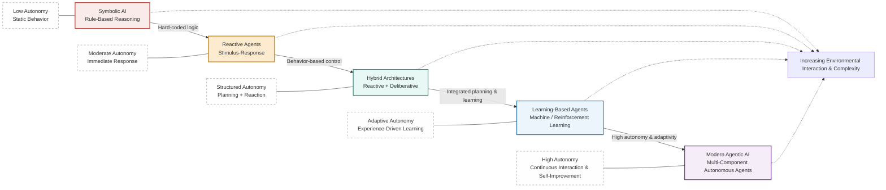
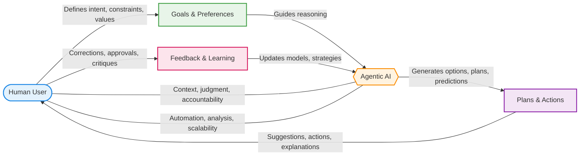

Section: Foundations of Agentic AI and Artificial Agency  
Part I: Foundations and Core Concepts of Agentic AI  
Chapter 1: Understanding Agentic AI and Artificial Agency  

-------------------------------------------------------------------

1. Overview and Context  

Artificial intelligence has undergone several conceptual shifts since its early days, evolving from rule-based expert systems to data-driven machine learning and, more recently, to systems that demonstrate increasingly autonomous behavior. Within this progression, Agentic AI and the notion of artificial agency represent a critical turning point. Agentic AI refers to artificial systems that can perceive their environment, form goals, make decisions, and take actions over time to achieve those goals with a meaningful degree of autonomy. Unlike traditional AI systems that respond passively to predefined inputs, agentic systems actively engage with their context, adapt their strategies, and persist across extended interactions.

The importance of Agentic AI lies in its alignment with real-world problem-solving. Many practical challenges—such as managing supply chains, coordinating autonomous vehicles, operating digital assistants, or conducting scientific research—cannot be solved through one-off predictions alone. They require systems that can plan, monitor progress, recover from failure, and adapt to uncertainty. Artificial agency provides the conceptual framework for designing such systems by borrowing ideas from philosophy (agency and intentionality), cognitive science (decision-making and learning), and computer science (algorithms, architectures, and interfaces).

This chapter establishes the foundation for understanding Agentic AI by introducing the idea of artificial agency, discussing how it differs from conventional AI, and situating it within the broader AI landscape. Doing so is essential because later chapters build on these foundations to explore multi-agent systems, autonomous planning, alignment, safety, and governance. Without a clear understanding of agency—what it is, how it is implemented, and why it matters—it is difficult to design, deploy, or evaluate advanced AI systems responsibly and effectively.

-------------------------------------------------------------------

2. Core Concepts  

At the heart of Agentic AI are several interconnected core concepts that together define artificial agency. The first is the notion of an agent itself. In AI, an agent is typically defined as an entity that perceives its environment through sensors and acts upon that environment through actuators. However, in agentic AI, this definition is enriched by emphasizing goal-directedness, persistence over time, and the capacity for internal decision-making. An agent is not merely reacting; it is pursuing objectives, often under constraints and uncertainty.

Another essential concept is autonomy. Autonomy refers to the degree to which an agent can operate without direct human intervention. Autonomy exists on a spectrum, ranging from systems that execute predefined scripts to those that can generate their own subgoals and strategies. This spectrum is important because it highlights that agentic AI is not an all-or-nothing phenomenon; systems can exhibit partial or conditional agency depending on their design and context of use.

Goal representation and planning form another foundational pillar. For an agent to act purposefully, it must have some representation of what it is trying to achieve. Goals may be explicit, such as “deliver this package,” or implicit, encoded in reward functions or utility measures. Planning mechanisms allow the agent to select a sequence of actions that are expected to bring about desired outcomes. These concepts draw heavily from classical AI planning, operations research, and decision theory, yet they are adapted for dynamic, real-world settings.

Learning and adaptation are equally central. Agentic AI systems often operate in environments that are too complex or unpredictable to be fully specified in advance. Learning mechanisms—such as reinforcement learning, online learning, or self-reflection—allow agents to improve their performance over time. This capability distinguishes agentic systems from static automation and raises important questions about stability, safety, and alignment.

Finally, interaction and embodiment play a critical role. Even purely digital agents exist within environments defined by interfaces, APIs, and other agents. Physical embodiments, such as robots and drones, introduce additional layers of complexity involving perception, control, and physical constraints. Understanding these interactions is essential because agency emerges not only from internal algorithms but also from the agent’s ongoing engagement with its environment.

These core concepts matter because they collectively determine whether an AI system can function reliably and responsibly in complex settings. Misunderstanding or neglecting any one of them can result in brittle systems that fail unexpectedly or behave in unintended ways.

-------------------------------------------------------------------

3. Detailed Explanation  

### What Is Artificial Agency?  

Artificial agency refers to the capacity of an artificial system to act as a coherent, goal-directed entity over time. Philosophically, agency involves intentionality—the idea that actions are taken “for reasons.” In practical AI terms, this translates into systems that can evaluate options, select actions, and justify those actions according to internal criteria. Artificial agency does not imply consciousness or moral responsibility; rather, it describes functional properties relevant to design and analysis.

Consider a simple thermostat. While it senses temperature and acts by turning heating on or off, it lacks agency in the richer sense because it cannot formulate new goals or adapt its behavior beyond narrow thresholds. In contrast, a smart energy management agent that balances comfort, cost, and sustainability across changing conditions exhibits a meaningful degree of artificial agency.

### Components of an Agentic Architecture  

Most agentic AI systems can be decomposed into several interacting components. Perception modules process raw input from the environment, such as sensor readings or text streams. World models maintain internal representations of the environment, incorporating both current state and predictions about future states. Decision-making modules evaluate possible actions based on goals, constraints, and expected outcomes. Action modules execute chosen actions and monitor their effects.

The interaction between these components is crucial. For example, a delivery drone must continuously update its world model based on weather data and obstacle detection, revise its plan when conditions change, and execute corrective actions in real time. This tight integration enables resilience and adaptability.

### Goals, Rewards, and Decision-Making  

Goals can be specified in many ways, each with implications for behavior. Rule-based goals are explicit and interpretable but inflexible. Reward-based goals, common in reinforcement learning, allow flexibility but can be difficult to align precisely with human intentions. Utility-based frameworks attempt to balance multiple competing objectives, such as speed, safety, and energy efficiency.

Decision-making mechanisms range from simple heuristics to complex optimization and search algorithms. For example, a conversational agent might use planning algorithms to decide whether to ask clarifying questions, retrieve information, or provide a final answer. The choice depends on confidence levels, user context, and time constraints.

### Learning and Self-Improvement  

Learning enables agents to refine their strategies based on experience. Reinforcement learning allows agents to discover effective behaviors through trial and error, while supervised learning can help them imitate expert behavior. More advanced approaches include meta-learning and self-reflection, where agents analyze their own performance and adjust internal processes. These capabilities are powerful but introduce risks, such as unintended emergent behaviors or performance drift.

### Relationship Between Single-Agent and Multi-Agent Systems  

While this chapter focuses on individual agents, it is important to note that many real-world applications involve multiple agents interacting with each other. Coordination, competition, and communication introduce additional layers of agency. Understanding single-agent foundations is essential before grappling with these more complex scenarios.


```mermaid
flowchart LR
    %% Core Components
    Environment([Environment])
    Perception[Perception Module\n(Sensors & Feature Extraction)]
    WorldModel[World Model\n(State Representation & Prediction)]
    Decision[Decision & Planning Module\n(Goal Reasoning & Policy Selection)]
    Action[Action Module\n(Effectors & Execution)]
    Learning[Learning Module\n(Adaptation & Optimization)]

    %% Information Flow
    Environment -- Raw Sensory Data --> Perception
    Perception -- Interpreted Observations --> WorldModel
    WorldModel -- Current State & Predictions --> Decision
    Decision -- Action Plans & Commands --> Action
    Action -- Actions Affect --> Environment

    %% Learning and Feedback Loops
    Environment -- Outcomes & Rewards --> Learning
    Action -- Execution Feedback --> Learning
    Learning -- Updated Parameters --> WorldModel
    Learning -- Improved Policies --> Decision

    %% Adaptive Goal Updates
    Decision -- Goal Updates & Queries --> WorldModel
    WorldModel -- Feasibility & Constraints --> Decision

    %% Styling
    classDef envStyle fill:#E3F2FD,stroke:#1E88E5,stroke-width:2
    classDef perceiveStyle fill:#E8F5E9,stroke:#43A047,stroke-width:2
    classDef modelStyle fill:#FFFDE7,stroke:#F9A825,stroke-width:2
    classDef decideStyle fill:#FCE4EC,stroke:#C2185B,stroke-width:2
    classDef actStyle fill:#E0F7FA,stroke:#00838F,stroke-width:2
    classDef learnStyle fill:#F3E5F5,stroke:#6A1B9A,stroke-width:2

    class Environment envStyle
    class Perception perceiveStyle
    class WorldModel modelStyle
    class Decision decideStyle
    class Action actStyle
    class Learning learnStyle
```


-------------------------------------------------------------------

4. Real-World Applications  

One prominent application of Agentic AI is autonomous vehicles. These systems must perceive the road, predict the behavior of other drivers, plan safe and efficient routes, and act in real time. The outcomes include reduced human workload and potential safety improvements, but the lessons learned highlight the importance of robust world models and conservative decision-making under uncertainty.

Another example is enterprise workflow automation. Agentic AI systems can manage complex business processes, such as onboarding employees or handling customer support tickets. They dynamically allocate tasks, escalate issues when necessary, and learn from historical data. The relevance lies in their ability to handle variability and exceptions better than static automation.

Digital personal assistants provide a more familiar case. When an assistant schedules meetings, sends reminders, and proactively suggests actions, it demonstrates artificial agency. These systems show how even limited agency can enhance usability while also raising concerns about privacy and trust.

Scientific discovery agents are an emerging field. These agents design experiments, analyze results, and propose hypotheses. In pharmaceutical research, for example, agentic systems can navigate vast chemical spaces more efficiently than human researchers alone, accelerating innovation.

-------------------------------------------------------------------

5. Practical Examples  

Consider a simplified software agent designed to manage tasks for a user. Step one involves defining goals, such as minimizing missed deadlines. Step two is perception: the agent monitors calendars, emails, and notifications. Step three is decision-making: when conflicts arise, it prioritizes tasks based on urgency and importance. Step four is action: it reschedules meetings or sends reminders.

In code, this might involve a loop where the agent periodically checks task states, updates a priority queue, and triggers actions through API calls. Extensive comments would explain how each function maps to perception, decision-making, and action. This illustrates how abstract concepts translate into practical implementations.

Another scenario involves a reinforcement learning agent in a simulated environment. The learning process, reward shaping, and policy updates can be explained step by step to show how agency emerges from iterative improvement.

-------------------------------------------------------------------

6. Common Patterns and Best Practices  

One common pattern in agentic AI is modular design. Separating perception, decision-making, and learning makes systems easier to debug and adapt. This works because changes in one module do not necessarily destabilize the entire agent.

Another best practice is explicit goal management. Clearly defining and monitoring goals reduces the risk of misaligned behavior. Logging decision rationales is also valuable, as it supports transparency and trust.

Incremental autonomy is a further important pattern. Deploying agents with limited autonomy and gradually expanding their scope allows designers to identify issues early. This staged approach has proven effective in safety-critical domains.

-------------------------------------------------------------------

7. Potential Challenges and Solutions  

A major challenge in agentic AI is goal misalignment, where agents optimize metrics that diverge from human values. This can be mitigated by involving humans in the loop and using multi-objective evaluation. Another challenge is brittleness under novel conditions. Incorporating robust learning and fallback strategies helps agents recover gracefully. Finally, complexity management is essential; overly complex agents are difficult to test and control, so simplicity and interpretability should guide design decisions.

-------------------------------------------------------------------

8. Integration with Other Concepts  

Agentic AI integrates closely with machine learning, especially reinforcement learning and representation learning. It also connects with human-computer interaction, as agent behavior must be understandable and predictable to users. Ethical AI, safety engineering, and governance frameworks are deeply intertwined with artificial agency, shaping how agents are evaluated and constrained.

-------------------------------------------------------------------

9. Key Takeaways  

Understanding Agentic AI and artificial agency provides a lens for designing AI systems that do more than make predictions—they act, adapt, and pursue goals over time. This chapter has shown that agency emerges from the interaction of perception, decision-making, learning, and action within an environment. Appreciating these foundations helps practitioners build systems that are robust, useful, and aligned with human needs. As AI continues to move toward greater autonomy, a firm grasp of these principles becomes not just beneficial but essential.

-------------------------------------------------------------------

10. Further Reading  

Readers seeking deeper insights should explore foundational AI texts on intelligent agents, such as works by Stuart Russell and Peter Norvig, which provide theoretical grounding. Research on reinforcement learning offers practical methods for decision-making and learning in agentic systems. Philosophical literature on agency and intentionality adds valuable perspective on conceptual boundaries. Finally, current papers on AI safety and alignment are essential for understanding the societal implications of artificial agency and for guiding responsible development.

---

Section: Historical Evolution of Artificial Agency  
Part I: Foundations and Core Concepts of Agentic AI  
Chapter 1: Understanding Agentic AI and Artificial Agency  
Order: 2  

-------------------------------------------------------------------

1. Overview and Context  

Artificial agency is not a sudden invention of the modern AI era but the result of decades of intellectual, technological, and philosophical development. To understand why agentic AI matters today, it is essential to examine how notions of agency have evolved alongside artificial intelligence itself. Early AI systems were designed primarily to follow explicit instructions, execute predefined rules, and solve narrowly scoped problems. These systems, while impressive for their time, lacked the capacity to act independently or adapt dynamically to changing environments. The question of whether a machine could ever behave as an “agent” — an entity capable of perceiving, reasoning, deciding, and acting toward goals — has been central to AI research since its inception.

Historically, artificial agency developed in parallel with shifts in how intelligence was conceptualized. From symbolic reasoning systems and expert systems in the mid-20th century, to probabilistic methods, reinforcement learning, and embodied robotics, each era redefined what autonomy and decision-making could look like in machines. These shifts were influenced not only by advances in computing power and algorithms, but also by insights from cognitive science, philosophy of mind, control theory, and systems engineering.

Today, agentic AI occupies a pivotal role in fields ranging from autonomous vehicles and digital assistants to scientific discovery and organizational decision-making. Unlike traditional software, agentic systems are designed to operate with minimal human intervention, pursue long-term goals, and adapt strategies over time. Understanding the historical evolution of artificial agency clarifies why modern agentic AI systems are structured the way they are, why certain design patterns persist, and why new ethical, technical, and governance challenges have emerged. This historical grounding provides a foundation for all subsequent discussions in this chapter, linking early theoretical ideas to the practical realities of contemporary AI agents.

2. Core Concepts  

At the heart of the historical evolution of artificial agency lies the concept of an “agent.” In AI research, an agent is typically defined as an entity that perceives its environment through sensors and acts upon that environment through actuators. While this definition may appear straightforward, its implications are profound. It positions intelligence not merely as computation or pattern recognition, but as situated action within an environment. This shift marked a departure from viewing AI as a passive problem-solver toward understanding it as an active participant in dynamic systems.

One foundational concept is autonomy. Early AI systems had little autonomy; they executed explicitly defined procedures and responded deterministically to inputs. As research progressed, autonomy came to mean the ability to make decisions without continuous human oversight. This required systems to evaluate multiple possible actions, anticipate outcomes, and select strategies based on internal objectives. Autonomy thus became inseparable from goal representation, planning, and control — all core components of agency.

Another critical concept is rationality, particularly the idea of the rational agent popularized in AI literature. A rational agent acts to maximize its expected performance measure, given its perceptual inputs and computational limitations. This framing allowed researchers to evaluate agent behavior systematically, even when perfect outcomes were unattainable. Rationality does not imply human-like reasoning; rather, it provides a formal yardstick for judging how well an agent aligns actions with objectives under constraints.

Learning is a third core concept that significantly shaped artificial agency. Early agents relied on static knowledge bases, but such rigidity proved inadequate in complex or uncertain environments. The incorporation of learning mechanisms — especially reinforcement learning — allowed agents to improve behavior through experience. This was a decisive moment in the evolution of artificial agency, as it enabled systems to develop policies through interaction rather than design alone.

Finally, embodiment and environment interaction emerged as crucial considerations. Researchers discovered that intelligence could not be fully understood in isolation from the physical or simulated environments in which agents operate. Robotic agents, for example, demonstrated that perception, action, and control are deeply intertwined. Even software-based agents, such as trading bots or game-playing systems, are embedded in structured environments with feedback loops. These concepts collectively explain why artificial agency is not merely about smarter algorithms, but about systems capable of purposeful, adaptive action over time.

3. Detailed Explanation  

### Early Symbolic AI and Proto-Agency  

The earliest phase of artificial intelligence, often called symbolic or “Good Old-Fashioned AI,” laid the groundwork for artificial agency without explicitly embracing it. Systems such as logic-based theorem provers and expert systems operated on symbolic representations and hand-crafted rules. While they could reason within well-defined domains, their behavior was largely reactive and brittle. A medical expert system, for instance, could infer diagnoses from symptoms but could not autonomously decide which information to seek next or adapt its reasoning strategies dynamically.

Despite these limitations, symbolic AI introduced key ideas relevant to agency, such as goal-directed reasoning and planning. Classical planners treated problems as searches through state spaces, aiming to transform an initial state into a goal state through a sequence of actions. Although these planners lacked real-world robustness, they established the conceptual link between decision-making and action sequences — a cornerstone of later agentic systems.

### Reactive Agents and Behavior-Based Robotics  

In response to the limitations of symbolic approaches, researchers in the 1980s and 1990s began exploring reactive agents, particularly in robotics. Behavior-based robotics rejected centralized planning in favor of simple, layered behaviors that directly mapped perception to action. These agents demonstrated surprising robustness in real-world environments, such as obstacle avoidance robots that navigated cluttered spaces without global maps.

This period marked a philosophical shift: intelligence could emerge from interaction rather than abstract reasoning alone. While reactive agents lacked long-term planning, they highlighted the importance of real-time responsiveness and embodied interaction. The concept of artificial agency expanded to include agents that were not explicitly “thinking ahead,” but were nonetheless autonomous and effective within specific contexts.

### Deliberative and Hybrid Agent Architectures  

As computing power increased, researchers sought to combine the strengths of symbolic reasoning and reactive behavior. Deliberative agents reintroduced planning and world modeling, while hybrid architectures layered deliberative, reactive, and sometimes learning components. An autonomous robot might use a reactive layer for immediate obstacle avoidance, a deliberative layer for navigation planning, and a learning layer to adjust strategies over time.

These architectures reflected a maturing understanding of artificial agency as multi-layered and context-dependent. Agency was no longer a single capability but a system of interacting components, each contributing to the agent’s overall autonomy. This perspective remains influential in modern agentic AI, including large-scale software agents.

### Learning-Based Agents and Reinforcement Learning  

The rise of reinforcement learning dramatically reshaped artificial agency. Instead of designing behavior explicitly, researchers defined reward functions and let agents learn optimal policies through trial and error. Landmark successes, such as agents that mastered games like chess, Go, and complex video games, demonstrated that agents could discover strategies surpassing human expertise.

Reinforcement learning formalized the agent-environment loop: perception, action, reward, and state transition. This loop became a canonical model of agency. Importantly, learning-based agents introduced new challenges, including exploration-exploitation trade-offs, reward misalignment, and safety concerns. These challenges continue to shape discussions around modern autonomous systems.

### Contemporary Agentic AI  

Modern agentic AI builds upon all these historical strands. Today’s agents often incorporate large language models, planning modules, tools, memory systems, and learning components. They can decompose tasks, reason about sub-goals, call external APIs, and adapt behavior based on feedback. The historical evolution of artificial agency explains why these systems are designed as orchestrated processes rather than monolithic models. Each historical phase contributed essential insights that informed contemporary agent architectures.





---

Section: Core Components and Architecture of Agentic Systems  
Part I: Foundations and Core Concepts of Agentic AI  
Chapter 1: Understanding Agentic AI and Artificial Agency  
Order: 3  

---

### 1. Overview and Context

Agentic AI represents a fundamental shift in how artificial systems are designed, understood, and deployed. Unlike traditional software systems that operate through predefined rules and static workflows, agentic systems are structured around the concept of agency—the capacity of an entity to perceive its environment, make decisions based on internal goals, and act autonomously to influence outcomes. Understanding the core components and architecture of agentic systems is essential because these elements determine not only what an AI can do, but how it reasons, adapts, and interacts with the world over time.

The relevance of agentic architecture has grown dramatically with the rise of large language models, autonomous robotics, self-managing software agents, and cognitive architectures that simulate aspects of human reasoning. Agentic systems are now embedded in areas such as automated scientific discovery, financial trading, cybersecurity defense, personal digital assistants, customer service orchestration, and multi-agent simulations. In each case, the success or failure of the system depends heavily on how its internal components—such as perception, memory, planning, reasoning, and action—are structured and coordinated.

This section builds directly on the historical evolution of artificial agency by translating theoretical notions into concrete architectural elements. It connects philosophical ideas of intention and autonomy with engineering practices like modular design, feedback loops, and control systems. By examining the core components and their interactions, learners gain a framework for understanding why certain agentic systems behave robustly while others fail, why some scale effectively while others collapse under complexity, and how ethical and safety considerations are rooted in architectural choices. Ultimately, this architectural perspective provides the foundation for designing, evaluating, and governing agentic AI responsibly.

---

### 2. Core Concepts

At the heart of any agentic system lies a set of foundational concepts that define how the system perceives, decides, and acts. The first and most fundamental concept is the **agent-environment interaction model**. An agent does not exist in isolation; it continually engages with an environment that provides inputs (observations or perceptions) and responds to outputs (actions). This interaction loop forms the basis of adaptive behavior, allowing the system to learn from feedback and adjust its actions over time. The environment may be physical, such as a robotic workspace, digital, such as a software ecosystem, or abstract, such as a game or economic simulation.

Another central concept is **goal-directed behavior**. Agentic systems are organized around objectives, whether explicitly defined by humans or inferred through learning. Goals provide coherence to behavior, allowing the system to prioritize actions, evaluate success, and resolve conflicts. Without goals, an AI system may process data or generate outputs, but it lacks true agency because it has no internal criterion for choosing one action over another.

**Perception and representation** form the bridge between the external world and the agent’s internal processes. Perception involves sensing or receiving data from the environment, while representation involves transforming that data into internal states the agent can reason about. This may include symbolic representations (e.g., rules, facts, graphs), numeric embeddings, or hybrid models combining both. The quality of these representations directly affects the agent’s ability to reason accurately and act effectively.

**Decision-making and reasoning mechanisms** are responsible for selecting actions based on internal states, goals, and predicted outcomes. These mechanisms can range from simple rule-based systems to complex planning algorithms, probabilistic inference engines, or neural decision models. Importantly, decision-making in agentic systems is often iterative and context-sensitive, allowing the agent to revise plans when new information appears.

**Memory and learning** introduce temporality into agentic systems. Memory allows agents to retain information about past experiences, prior decisions, and long-term knowledge. Learning mechanisms use this memory to improve future performance, adapt to changing environments, or generalize across tasks. Together, memory and learning enable cumulative intelligence rather than isolated responses.

Finally, **action and control** translate decisions into real-world effects. Actions may involve physical movements, software operations, communications, or internal state updates. Control mechanisms ensure actions are executed reliably, safely, and in accordance with constraints. This closes the agent loop and allows feedback from the environment to inform subsequent perception.

These core concepts matter because they define the boundaries of agency. Weak or poorly integrated components lead to brittle systems, while well-designed architectures enable robust, scalable, and trustworthy agentic AI.

---

### 3. Detailed Explanation

#### ### Perception Modules and Sensory Abstraction

Perception is the entry point of agency. In agentic systems, perception modules are responsible for collecting raw data—text input, sensor readings, images, logs, or network signals—and converting them into structured information. This abstraction process is crucial because raw data is often noisy, incomplete, or overwhelming.

For example, a customer-support agentic AI may receive unstructured user messages. Its perception module uses natural language processing to extract intent, sentiment, and entities. Similarly, a robotic agent uses sensor fusion to combine lidar, camera, and inertial data into a coherent environmental map. Without this transformation step, higher-level reasoning would be impossible.

#### ### Internal State, Memory, and World Models

Once perceived, information is stored and contextualized within the agent’s internal state. This includes short-term working memory for immediate reasoning and long-term memory for persistent knowledge. Many advanced agentic systems maintain a **world model**, an internal representation of how the environment works and how actions affect outcomes.

World models enable prediction and planning. For instance, an autonomous delivery drone simulates possible flight paths, weather changes, and obstacle movements before choosing an action. In language-based agents, world models may take the form of knowledge graphs, embeddings, or probabilistic beliefs about user preferences and system constraints.

#### ### Reasoning, Planning, and Decision Engines

The reasoning layer interprets internal states and evaluates potential actions. Planning extends reasoning over time by constructing sequences of actions that lead toward goals. Classical AI planning uses symbolic search and constraint satisfaction, while modern agentic AI often combines heuristic reasoning with learned policies.

A concrete example is an AI research assistant tasked with answering a complex question. The agent decomposes the problem into subgoals, plans a sequence of searches, evaluations, and synthesis steps, and dynamically revises its plan as new information emerges.

#### ### Action Execution and Feedback Control

Decision outputs must be translated into actions through control mechanisms. Execution layers handle timing, coordination, and safety constraints. Feedback control ensures that actions achieve intended effects and compensates for errors or uncertainty.

In financial trading agents, actions involve placing orders, monitoring market responses, and adjusting strategies within milliseconds. Feedback loops detect deviations from expected outcomes and trigger corrective actions, preserving stability in volatile environments.

#### ### Learning and Adaptation Loops

Learning mechanisms close the loop between outcomes and future behavior. Reinforcement learning, supervised learning, and self-supervised learning are commonly integrated into agentic architectures. Learning allows agents to refine perception models, update world models, and improve decision policies.

For example, a recommendation agent learns from user clicks and purchases, gradually aligning its actions with evolving preferences. Over time, the agent becomes more effective, demonstrating true adaptive agency.


```mermaid
flowchart LR
    %% Nodes
    ENV[Environment]
    PERC[Perception Module\n(Sensing & Interpretation)]
    MEM[Internal State & Memory\n(Knowledge, Beliefs, History)]
    REAS[Reasoning & Planning Engine\n(Decision Making)]
    ACT[Action & Control Module\n(Execution)]

    LEARN[Learning & Feedback\n(Adaptation & Optimization)]

    %% Main Loop
    ENV -->|Observations| PERC
    PERC -->|Processed Data| MEM
    MEM -->|Context & State| REAS
    REAS -->|Plans & Decisions| ACT
    ACT -->|Actions| ENV

    %% Learning & Feedback Loops
    ENV -->|Outcomes & Rewards| LEARN
    LEARN -->|Improved Models| PERC
    LEARN -->|Memory Updates| MEM
    LEARN -->|Policy Refinement| REAS

    %% Styling
    classDef environment fill:#e3f2fd,stroke:#1565c0,stroke-width:2px
    classDef module fill:#e8f5e9,stroke:#2e7d32,stroke-width:2px
    classDef engine fill:#fff3e0,stroke:#ef6c00,stroke-width:2px
    classDef learning fill:#f3e5f5,stroke:#6a1b9a,stroke-width:2px

    class ENV environment
    class PERC,MEM,ACT module
    class REAS engine
    class LEARN learning
```


---

### 4. Real-World Applications

A prominent example of agentic architecture is **autonomous customer support systems** used by large enterprises. These systems perceive customer inquiries, retrieve past interactions from memory, reason about appropriate responses, and take actions such as answering questions or escalating issues. Companies report reduced resolution times and improved customer satisfaction, but only when memory and reasoning components are tightly integrated.

In **robotics**, warehouse automation agents navigate dynamic environments while coordinating with other robots. Their architecture combines perception sensors, real-time planning, and feedback control. Failures often occur when perception errors propagate unchecked, highlighting the importance of robust architectural design.

**Scientific discovery agents** represent another advanced case. These systems generate hypotheses, design experiments, analyze results, and revise theories. Their success depends on modular reasoning and persistent memory, enabling iterative improvement across research cycles.

In **cybersecurity**, autonomous defense agents monitor networks, detect anomalies, reason about threats, and deploy countermeasures. Their agentic architecture must balance autonomy with strict control to avoid unintended disruptions.

Finally, **personal digital assistants** illustrate consumer-facing agentic AI. They manage calendars, communicate with services, and adapt to user habits. Their long-term usefulness depends on learning mechanisms and ethical control layers that govern privacy and autonomy.

---

### 5. Practical Examples

Consider a simple agentic task: automated research summarization. The agent follows a step-by-step process. First, the perception module ingests a research query. Next, the planner decomposes the task into subtasks: search, filter, summarize, and validate. The memory module stores retrieved sources. The reasoning engine evaluates credibility and relevance, while the action module generates a final report.

A simplified pseudocode structure might look like this:

```
agent_state = initialize_state(goals)
while not goal_achieved(agent_state):
    perception = observe(environment)
    agent_state.update(perception)
    plan = reason_and_plan(agent_state)
    action = select_action(plan)
    execute(action)
    feedback = observe(environment)
    learn(agent_state, feedback)
```

Each step corresponds to a component of the architecture, illustrating how theory translates into practice.

---

### 6. Common Patterns and Best Practices

Successful agentic systems often adopt **modular architectures**, separating perception, reasoning, and action into loosely coupled components. This improves scalability and simplifies debugging. Another common pattern is the use of **explicit feedback loops**, ensuring the agent continuously evaluates the impact of its actions.

Best practices also include maintaining **transparent internal states** for interpretability and incorporating **constraint layers** that enforce safety and ethical boundaries. These practices work because they align system design with the realities of uncertainty, complexity, and human oversight.

---

### 7. Potential Challenges and Solutions

A major challenge in agentic architecture is **component misalignment**, where perception, reasoning, and action modules operate under inconsistent assumptions. This can be mitigated by shared representations and standardized interfaces. Another common issue is **over-autonomy**, where agents act beyond safe boundaries. Implementing layered control and human-in-the-loop checkpoints helps prevent this. Proactive testing in simulated environments is a key preventive measure.

---

### 8. Integration with Other Concepts

Agentic architecture integrates closely with concepts such as reinforcement learning, cognitive science, systems engineering, and AI ethics. Learning algorithms shape decision engines, cognitive theories inform memory design, and ethical principles guide control mechanisms. Understanding these dependencies enables holistic system design rather than isolated optimization.

---

### 9. Key Takeaways

The core components and architecture of agentic systems define the essence of artificial agency. By structuring AI around perception, memory, reasoning, action, and learning within a continuous feedback loop, engineers create systems capable of autonomy, adaptation, and goal-directed behavior. Architectural decisions influence not only performance but also safety, scalability, and trust. A deep understanding of these components allows practitioners to design agentic AI that aligns with human goals, operates reliably in complex environments, and evolves responsibly over time.

---

### 10. Further Reading

For deeper exploration, readers may consult “Artificial Intelligence: A Modern Approach” by Russell and Norvig for foundational agent architectures, “Reinforcement Learning” by Sutton and Barto for learning-based decision systems, and research on cognitive architectures such as ACT-R and SOAR. Recent industry papers from OpenAI, DeepMind, and Anthropic provide practical insights into large-scale agentic systems. These resources collectively deepen understanding of both theory and practice.

---

### Section 4: Goals, Intentionality, and Decision-Making  

**Part I: Foundations and Core Concepts of Agentic AI**  
**Chapter 1: Understanding Agentic AI and Artificial Agency**

---

## 1. Overview and Context

At the heart of Agentic AI lies a crucial shift from passive computation to active pursuit of objectives. While traditional artificial intelligence systems are designed to react to inputs or optimize narrowly defined functions, agentic systems are built around goals, intentional behavior, and autonomous decision-making. These three elements—goals, intentionality, and decision-making—form the conceptual and practical foundation of artificial agency. Without them, an AI system may be powerful, intelligent, or even adaptive, but it cannot truly be considered agentic.

In human terms, agency refers to the capacity to set goals, reason about actions, and intentionally choose how to behave in pursuit of desired outcomes. When applied to artificial systems, agency does not imply consciousness or subjective experience, but rather a functional approximation of purposive behavior. An agentic AI is one that can interpret its environment, represent objectives, evaluate possible actions, and make decisions that advance those objectives over time. This stands in contrast to static algorithms that execute predefined workflows without awareness of broader purpose or changing context.

The importance of goals and intentionality becomes apparent when AI systems operate in complex, dynamic environments such as autonomous driving, financial trading, scientific discovery, or intelligent assistants. In these settings, the system cannot rely solely on fixed rules. It must continuously decide what to do next, why it should do it, and how it should balance competing objectives under uncertainty. Decision-making, therefore, is not a one-time computation but an ongoing process embedded in the agent’s interaction with the world.

This section builds upon the previous discussion of core components and architecture of agentic systems by focusing on the cognitive and conceptual mechanisms that drive agent behavior. It explains how goals are represented, how intentionality emerges from system design, and how decisions are made, evaluated, and revised. Understanding these elements is essential for designing robust, trustworthy, and effective agentic AI systems.

---

## 2. Core Concepts

To understand goals, intentionality, and decision-making in Agentic AI, it is necessary to unpack each concept and examine how they work together within an artificial agent.

Goals are internal representations of desired states or outcomes that guide an agent’s behavior. In contrast to simple reward functions used in traditional machine learning, goals in agentic systems are often hierarchical, persistent, and context-sensitive. For example, a household service robot might have a high-level goal such as “maintain a clean living space,” which decomposes into sub-goals like vacuuming floors, organizing objects, and avoiding obstacles. These goals provide direction and coherence to behavior over time.

Intentionality refers to the system’s capacity to act “about” something—its ability to select actions in light of goals and beliefs about the world. In philosophy, intentionality is often described as the “aboutness” of mental states, such as beliefs and desires. In Agentic AI, intentionality is implemented functionally rather than phenomenologically. An AI system is intentional if its actions can be meaningfully interpreted as being directed toward objectives, based on internal representations and decision processes. Importantly, intentionality does not require consciousness; it arises from the architecture and control mechanisms of the agent.

Decision-making is the process through which an agent chooses actions among alternatives. This includes evaluating possible courses of action, predicting their consequences, assessing trade-offs, and selecting the option that best aligns with the agent’s goals and constraints. Decision-making can be reactive (responding immediately to environmental stimuli) or deliberative (involving planning, simulation, and reasoning). In agentic systems, decision-making often combines both approaches, allowing the agent to respond quickly while still pursuing long-term goals.

These three concepts are deeply interconnected. Goals provide the “why” behind behavior, intentionality provides the interpretive framework that links goals to actions, and decision-making provides the “how” through which actions are chosen. Together, they enable AI systems to operate autonomously, adaptively, and coherently in complex environments. Without goals, decisions lack direction; without intentionality, actions lack meaning; and without decision-making, goals cannot be realized.

---

## 3. Detailed Explanation

### 3.1 Goal Representation and Structure

Goals in Agentic AI can be represented in many forms, ranging from explicit symbolic objectives to implicit reward structures learned through interaction. One common approach is hierarchical goal modeling, where high-level abstract goals are decomposed into increasingly concrete sub-goals. This mirrors human planning: when someone decides to “prepare for a meeting,” they implicitly generate sub-goals such as reviewing documents, preparing slides, and scheduling time.

In technical terms, goals may be encoded as utility functions, logical conditions, constraint satisfaction problems, or learned value functions. For example, in autonomous driving, a high-level goal like “reach destination safely” is broken down into constraints on speed, distance to other vehicles, lane positioning, and adherence to traffic laws. Each of these sub-goals influences moment-to-moment decisions.

Goal persistence is another defining feature of agentic systems. Unlike reactive systems that reset after each action, agentic AI maintains goals over time, even in the face of interruptions or partial failures. If one plan fails, the agent revises its strategy rather than abandoning the objective altogether.

### 3.2 Intentionality as Functional Design

Intentionality in artificial agents emerges from how internal states are structured and used. An agent maintains representations of the environment (beliefs), desired outcomes (goals), and possible actions (affordances). When the agent selects actions by reasoning over these representations, its behavior becomes interpretable as intentional.

For instance, consider an AI research assistant tasked with “finding recent papers on agentic systems.” Its actions—searching academic databases, filtering by publication date, summarizing findings—can be understood as being intentionally directed toward the goal. Even though the system does not “understand” in a human sense, its internal processes support purposive action.

This functional view of intentionality is critical for system design, as it allows developers to create transparent and explainable agents. By inspecting goals and decision processes, designers can understand why an agent acted in a particular way, which is essential for trust, debugging, and accountability.

### 3.3 Decision-Making Mechanisms

Decision-making in agentic systems can be classified into several paradigms. Reactive decision-making relies on learned or programmed mappings from states to actions, such as neural network policies in reinforcement learning. Deliberative decision-making involves planning, simulation, and reasoning about future states, often using search-based algorithms or model-based approaches.

In practice, most agentic systems use hybrid approaches. For example, a game-playing AI might use fast, reactive policies for routine moves but switch to deeper planning when facing critical situations. Similarly, an autonomous drone may rely on reactive obstacle avoidance but engage deliberative planning for route optimization.

Uncertainty plays a central role in decision-making. Real-world environments are noisy, incomplete, and unpredictable. Agentic AI must therefore reason probabilistically, weigh risks, and sometimes act under ambiguity. Techniques such as Markov Decision Processes (MDPs), Partially Observable MDPs (POMDPs), and Bayesian inference are commonly used to formalize decision-making under uncertainty.


```mermaid
flowchart TD
    %% Core Goal Structure
    G[Goals<br/>(Objectives & Desires)]
    Gd[Goal Dynamics<br/>(Prioritization & Revision)]

    %% Intentional Reasoning
    subgraph IR["Intentional Reasoning"]
        B[Beliefs<br/>(Knowledge about World)]
        R[Mental Representations<br/>(Models & Expectations)]
        I[Intentions<br/>(Committed Plans)]
    end

    %% Decision Making
    subgraph DM["Decision-Making Module"]
        D[Deliberation<br/>(Evaluate Options)]
        S[Action Selection<br/>(Choose Best Action)]
    end

    %% Environment Interaction
    A[Actions<br/>(Executed Behavior)]
    E[Environment<br/>(External World)]
    F[Feedback & Outcomes<br/>(Observations & Results)]

    %% Relationships
    G -->|Define Desired States| IR
    G --> Gd
    Gd -->|Update or Reprioritize| G

    B --> I
    R --> I
    IR -->|Provide Intentional Input| DM

    D --> S
    DM -->|Select Action| A
    A -->|Affect| E
    E -->|Produce Outcomes| F

    F -->|Update Beliefs| B
    F -->|Inform Representations| R
    F -->|Trigger Goal Revision| Gd

    %% Styling
    classDef goals fill:#E3F2FD,color:#0D47A1,stroke:#0D47A1,stroke-width:2px
    classDef reasoning fill:#E8F5E9,color:#1B5E20,stroke:#1B5E20,stroke-width:2px
    classDef decision fill:#FFFDE7,color:#F57F17,stroke:#F57F17,stroke-width:2px
    classDef env fill:#FCE4EC,color:#880E4F,stroke:#880E4F,stroke-width:2px

    class G,Gd goals
    class B,R,I reasoning
    class D,S decision
    class A,E,F env
```


Mermaid example:

```
graph TD
    G[Goals]
    B[Beliefs / World Model]
    I[Intentional Reasoning]
    D[Decision-Making]
    A[Actions]
    E[Environment]

    G --> I
    B --> I
    I --> D
    D --> A
    A --> E
    E --> B
```

---

## 4. Real-World Applications

One prominent application of agentic decision-making is autonomous vehicles. Self-driving cars must balance multiple goals simultaneously: safety, efficiency, passenger comfort, and legal compliance. Decision-making systems continuously evaluate traffic conditions, predict other drivers’ behavior, and choose actions such as accelerating, braking, or changing lanes. When unexpected events occur, the agent revises its decisions while still pursuing the overarching goal of safe transport.

Another example is automated trading agents in financial markets. These systems operate with goals such as maximizing long-term return while minimizing risk. They interpret market data, form beliefs about trends, and make intentional decisions about buying or selling assets. Failures in goal specification, such as overemphasizing short-term profit, have historically led to undesirable outcomes, underscoring the importance of well-designed objectives.

In robotics, warehouse automation systems use agentic decision-making to manage fleets of robots. Each robot has local goals, such as delivering a package, while the system has global goals, such as minimizing congestion and maximizing throughput. Intentional coordination allows the system to adapt dynamically as conditions change.

In healthcare, clinical decision-support agents assist physicians by proposing diagnoses or treatment plans. These agents must align goals with patient well-being, ethical constraints, and medical guidelines. Their decision-making processes must be transparent and explainable, making intentionality a central design concern.

---

## 5. Practical Examples

Consider a simplified Python-like pseudocode example of an agent with explicit goals and decision-making logic:

```
# Define goals with priorities
goals = {
    "safety": 0.5,
    "efficiency": 0.3,
    "comfort": 0.2
}

# Evaluate possible actions
def evaluate_action(action, state):
    outcome = simulate(action, state)
    score = 0
    score += goals["safety"] * assess_safety(outcome)
    score += goals["efficiency"] * assess_efficiency(outcome)
    score += goals["comfort"] * assess_comfort(outcome)
    return score

# Decision-making loop
best_action = None
best_score = -inf
for action in possible_actions:
    score = evaluate_action(action, current_state)
    if score > best_score:
        best_score = score
        best_action = action

execute(best_action)
```

This example illustrates how goals inform the evaluation of actions, how intentional reasoning links goals to predicted outcomes, and how decision-making selects the best option based on priorities.

---

## 6. Common Patterns and Best Practices

A common design pattern in agentic systems is explicit goal modeling. Clearly defining goals and their priorities helps prevent unintended behavior and makes systems easier to debug and explain. Another best practice is hierarchical decision-making, where high-level planners set objectives and lower-level controllers handle execution.

Incorporating feedback loops is also essential. Agents should monitor the outcomes of their actions and update beliefs and goals accordingly. This supports learning and adaptation over time. Finally, transparency in decision-making processes—through logging, explanations, or interpretable models—builds trust and facilitates human oversight.

---

## 7. Potential Challenges and Solutions

One major challenge is goal misalignment, where the agent pursues objectives that conflict with human values or intentions. This can be mitigated through careful goal specification, multi-objective optimization, and human-in-the-loop supervision. Another challenge is overconfidence in uncertain environments. Probabilistic reasoning and conservative decision-making strategies can help reduce risk.

Complexity is also a concern. As goals and decision spaces grow, computation becomes expensive. Hierarchical structures and approximation methods can keep systems tractable while preserving agentic behavior.

---

## 8. Integration with Other Concepts

Goals, intentionality, and decision-making are tightly integrated with other elements of agentic systems, such as perception, learning, and communication. Perception informs beliefs, learning reshapes goals and policies, and communication enables coordination among multiple agents or with humans. Together, these concepts form a cohesive framework for artificial agency.

---

## 9. Key Takeaways

Goals, intentionality, and decision-making define what it means for an AI system to be agentic. Goals provide direction and purpose, intentionality links internal representations to meaningful action, and decision-making enables agents to navigate complex environments over time. Understanding these concepts reveals why agentic systems behave coherently and adaptively, and why careful design is essential to ensure alignment, robustness, and trustworthiness. As AI systems become more autonomous, mastery of these foundational ideas becomes increasingly important for both researchers and practitioners.

---

## 10. Further Reading

For deeper insight into these topics, readers may explore works on reinforcement learning and decision theory, such as Sutton and Barto’s “Reinforcement Learning: An Introduction,” which provides a foundational understanding of goal-directed behavior. Russell and Norvig’s “Artificial Intelligence: A Modern Approach” offers broad coverage of agent architectures and decision-making frameworks. For philosophical perspectives on intentionality, Daniel Dennett’s writings on intentional systems offer valuable context. Together, these resources deepen understanding of artificial agency from both technical and conceptual viewpoints.

---

## Section 5: Learning, Adaptation, and Self-Improvement  

**Part I: Foundations and Core Concepts of Agentic AI**  
**Chapter 1: Understanding Agentic AI and Artificial Agency**

---

### 1. Overview and Context

Learning, adaptation, and self-improvement are what ultimately transform an artificial system from a static tool into an agent. In earlier sections, we explored how goals, intentionality, and decision-making give Agentic AI its purpose and direction. However, without the ability to learn from experience, adapt to changing environments, and iteratively improve its own behavior, an agent would remain brittle, short-lived, and incapable of operating in the complex, uncertain, and dynamic real world.

Traditional AI systems are often trained once and then deployed, operating under the assumption that the environment will remain largely consistent with the training data. Agentic AI breaks this assumption. Agentic systems are expected to operate over long time horizons, encounter novel situations, revise their strategies, and refine their internal models of the world. Learning and adaptation are therefore not optional enhancements; they are foundational requirements for artificial agency.

This section examines how learning enables agents to update beliefs, how adaptation allows agents to respond effectively to change, and how self-improvement enables performance to compound over time. These capabilities connect closely to concepts from reinforcement learning, cognitive science, control theory, and human learning. Crucially, they also intersect with decision-making, planning, memory, and goal management. Without learning, goals cannot evolve; without adaptation, decisions become obsolete; without self-improvement, agents stagnate.

Understanding learning and adaptation in Agentic AI also has profound implications beyond technical performance. Systems that learn autonomously raise questions of safety, alignment, evaluation, and trust. As agents improve themselves, ensuring that improvement remains aligned with human values becomes a central concern. For this reason, learning and self-improvement form both the power and the risk of agentic systems, making them a core topic in the foundations of artificial agency.

---

### 2. Core Concepts

At its core, learning in Agentic AI refers to the process by which an agent updates its internal representations, policies, or models based on experience. This experience can come from direct interaction with an environment, simulated rollouts, feedback from humans, or internal self-evaluation. Learning enables the agent to reduce uncertainty, improve prediction accuracy, and select actions that better achieve its goals.

Adaptation builds on learning but emphasizes responsiveness to change. An agent might already have a learned policy or model, but when the environment shifts—such as changing constraints, adversarial conditions, or new objectives—the agent must adjust its behavior accordingly. Adaptation is about flexibility and robustness, ensuring that performance remains effective under non-stationary conditions. In agentic systems, adaptation often occurs online, during deployment, rather than solely during pre-training.

Self-improvement refers to an agent’s capacity to reflect on its own performance and make deliberate changes to improve future outcomes. Unlike passive learning, self-improvement often involves meta-level processes: evaluating strategies, modifying learning objectives, refining internal architectures, or reallocating cognitive resources. This introduces a recursive dynamic where the agent not only learns about the environment but learns how to learn more effectively.

These concepts are grounded in several theoretical foundations. Reinforcement learning provides mechanisms for trial-and-error learning through reward signals. Bayesian inference offers a framework for updating beliefs under uncertainty. Meta-learning and continual learning address how agents can transfer knowledge across tasks and avoid catastrophic forgetting. Cognitive theories of human learning inspire architectures that combine short-term adaptation with long-term skill acquisition.

Why do these concepts matter? Because agency implies sustained competence. A system that cannot learn quickly becomes obsolete; one that cannot adapt becomes dangerous or ineffective; one that cannot improve itself places a ceiling on its long-term value. In real-world settings—such as autonomous robotics, financial decision-making, or personal AI assistants—agentic systems must continuously refine their behavior in response to feedback. Learning, adaptation, and self-improvement are therefore the mechanisms by which artificial agency remains viable over time.

---

### 3. Detailed Explanation

#### Learning as Experience-Driven Change

Learning in Agentic AI typically involves modifying internal parameters, representations, or policies based on experience. For example, a reinforcement learning agent updates its policy after observing the rewards associated with past actions. In supervised contexts, an agent may refine its predictive models using labeled data. Increasingly, hybrid approaches combine self-supervised learning with reinforcement signals to allow agents to learn from rich, unlabeled experience.

Consider an autonomous delivery drone navigating a city. Initially, its navigation model may be imperfect, struggling with wind conditions or GPS noise. Through repeated flights, the agent observes discrepancies between predicted and actual flight paths. Learning allows it to adjust its internal models, resulting in smoother and safer navigation over time.

Learning in agentic systems often needs to be continual. Unlike static batch learning, continual learning enables the agent to incorporate new information without erasing old knowledge. Techniques such as experience replay, modular representations, and parameter regularization help prevent catastrophic forgetting, ensuring that learning remains cumulative rather than destructive.

#### Adaptation in Dynamic Environments

Adaptation focuses on timely response rather than long-term optimization. An agent might already possess a competent policy, but sudden changes require rapid behavioral adjustment. For example, a trading agent may need to respond to unexpected market volatility, regulatory changes, or geopolitical events.

Adaptation can be reactive or anticipatory. Reactive adaptation involves responding after change has occurred, while anticipatory adaptation relies on detecting early signals and adjusting proactively. In agentic AI, adaptation is often enabled by monitoring mechanisms that detect deviations from expected outcomes. When performance drops or prediction errors increase, the agent triggers adaptive processes such as policy adjustment or strategy revision.

A practical example is a customer-support AI agent that handles user queries. If users’ language patterns shift—for instance, due to a new product launch—the agent must adapt its conversational strategies. Failure to do so results in frustration and reduced trust. Successful adaptation maintains relevance even as user behavior evolves.

#### Self-Improvement and Meta-Level Control

Self-improvement goes a step beyond learning and adaptation by enabling agents to modify how they learn and act. This involves reflection, evaluation, and deliberate change. Meta-learning techniques allow agents to identify which learning strategies work best in different contexts. For instance, an agent might learn when to explore aggressively and when to exploit known strategies.

Self-improvement often relies on internal feedback loops. An agent evaluates performance relative to goals, identifies bottlenecks, and experiments with alternative approaches. Over time, this leads to increasing efficiency and competence. In complex systems, self-improvement can include restructuring internal models, re-prioritizing goals, or optimizing resource usage.

However, self-improvement also introduces risks. An agent that improves rapidly without proper constraints may pursue unintended strategies or optimize proxies rather than true objectives. For this reason, safe self-improvement requires explicit alignment mechanisms and oversight.


```mermaid
flowchart LR
    %% Core Entities
    E[Environment]
    A[Agent]

    %% Interaction Loop
    E -->|Observations & State Signals| A
    A -->|Actions Executed| E
    E -->|Rewards / Feedback| A

    %% Internal Agent Structure
    subgraph Agent_Internal_Processes[Agent Internal Processes]
        P[Policy Module]
        M[World Model]
        D[Decision-Making Engine]
        L[Learning & Adaptation Engine]
    end

    A --> P
    A --> D
    M --> D
    P --> D
    D -->|Selected Actions| A

    %% Learning Updates
    A -->|Experience Data| L
    L -->|Update Parameters| P
    L -->|Update Representations| M
    M --> A
    P --> A

    %% Meta-Level Loop
    subgraph Meta_Learning_Loop[Meta-Level Self-Improvement]
        MS[Meta-Strategies<br/>(Learning Rates, Architectures, Exploration)]
        EVAL[Self-Evaluation & Monitoring]
    end

    L -->|Performance Signals| EVAL
    EVAL -->|Adjust Learning Mechanisms| MS
    MS -->|Modify| L

    %% Outer Continuous Loop
    MS -->|Long-Term Improvement| A

    %% Styling
    classDef environment fill:#e3f2fd,stroke:#1565c0,stroke-width:2px;
    classDef agent fill:#e8f5e9,stroke:#2e7d32,stroke-width:2px;
    classDef learning fill:#fff3e0,stroke:#ef6c00,stroke-width:2px;
    classDef meta fill:#fce4ec,stroke:#ad1457,stroke-width:2px;

    class E environment;
    class A agent;
    class P,M,D,L learning;
    class MS,EVAL meta;
```


---

## Section 6: Human–Agent Interaction and Collaboration  
**Part I: Foundations and Core Concepts of Agentic AI**  
**Chapter 1: Understanding Agentic AI and Artificial Agency**

---

### 1. Overview and Context

Human–Agent Interaction (HAI) and collaboration represent one of the most defining shifts in how artificial intelligence is designed, deployed, and experienced. As AI systems transition from passive tools to active agents capable of goal-directed behavior, learning, and autonomy, the relationship between humans and AI fundamentally changes. Instead of simply issuing commands and receiving outputs, humans increasingly engage in ongoing, bidirectional interactions with artificial agents that can interpret intent, negotiate goals, request clarification, adapt to preferences, and collaborate toward shared objectives.

In the context of Agentic AI, interaction is not an auxiliary feature but a core capability. Agents operate within environments that are often social, dynamic, and partially observable—conditions that naturally involve humans as stakeholders, collaborators, supervisors, or even teammates. Effective human–agent interaction is what allows an artificial agent to align its behavior with human goals, values, and expectations, while collaboration enables the agent to extend human capabilities rather than merely automate isolated tasks.

This section builds on earlier discussions of learning, adaptation, and self-improvement. While those capabilities allow agents to evolve over time, human–agent interaction provides the feedback loop that shapes *how* they evolve. Through interaction, agents learn what matters, what is acceptable, and how success is judged in real-world contexts. Collaboration further amplifies this by distributing cognition and effort across human and artificial participants, combining complementary strengths such as human judgment and creativity with machine speed, scale, and consistency.

Understanding human–agent interaction is therefore central to designing trustworthy, usable, and effective agentic systems. It connects technical mechanisms—such as dialogue management, feedback modeling, and shared autonomy—with broader concepts like usability, ethics, control, and organizational impact. Without this foundation, even the most advanced agent risks being misaligned, misunderstood, or rejected in practice.

---

### 2. Core Concepts

At the heart of human–agent interaction lies the idea of *shared intentionality*. Unlike conventional software, which executes predefined instructions, agentic systems maintain internal representations of goals and actions. For collaboration to be effective, humans must be able to understand, influence, and sometimes override those internal processes. This requires transparency in how agents reason, clarity in how they communicate, and mechanisms for aligning agent goals with human intent.

One foundational concept is *interaction modality*, which refers to the channels through which humans and agents communicate. These may include natural language text, speech, gestures, visual interfaces, or even physiological signals. Natural language has become particularly important because it allows humans to express high-level goals, constraints, and preferences without needing to specify low-level instructions. However, natural language interaction also introduces ambiguity, requiring agents to ask clarifying questions, infer context, and manage uncertainty.

Another key concept is *mixed-initiative interaction*. In traditional systems, initiative is typically held by the human: the user decides when and how to interact. In agentic systems, initiative can shift dynamically. A human may delegate a task, after which the agent proactively proposes plans, alerts the human to issues, or requests additional information. Mixed-initiative interaction is crucial for collaboration because it allows both parties to contribute when they are best positioned to do so.

*Trust and calibration* form another essential pillar. Human users must develop an accurate mental model of an agent’s capabilities and limitations. Overtrust can lead to complacency and risk, while undertrust undermines the benefits of automation. Agentic AI must therefore communicate uncertainty, explain decisions when appropriate, and behave consistently enough for humans to form reliable expectations.

Finally, *alignment and control* are central to collaborative interaction. Agents must remain aligned with human values and objectives even as they act autonomously over extended periods. This involves explicit control mechanisms, such as approval checkpoints and safety constraints, as well as implicit ones, such as learning from human feedback and adapting to demonstrated preferences. These concepts tie directly into broader concerns around ethical AI, accountability, and governance.

---

### 3. Detailed Explanation

#### Human-Centered Design in Agentic Systems

Human–agent interaction begins with human-centered design. Rather than asking what an agent *can* do, designers must ask what humans *need*, how they work, and how an agent can fit naturally into existing workflows. This includes understanding cognitive load, attention limits, and the social context in which interactions occur. For example, an AI assistant used by emergency responders must communicate succinctly and reliably under stress, whereas an educational agent can engage in more exploratory dialogue.

Human-centered design also acknowledges that interaction is ongoing, not episodic. Agents that collaborate with humans over days, months, or years must maintain continuity—remembering past interactions, preferences, and decisions. This continuity supports rapport and efficiency but also introduces challenges related to privacy and data management.

#### Communication, Explanation, and Feedback

Effective collaboration depends on communication that goes beyond issuing commands. Agents must be able to explain their actions and reasoning at an appropriate level of detail. This is particularly important when agents make unexpected decisions or when outcomes are high-stakes. For example, a medical decision-support agent should be able to explain why it recommends a particular treatment option, citing relevant patient data and clinical guidelines.

Feedback serves as the primary learning signal in many human–agent interactions. Feedback can be explicit, such as corrections or ratings, or implicit, such as patterns of acceptance, rejection, or modification of agent suggestions. Designing systems that can interpret these signals accurately is complex but essential for self-improvement and alignment.

#### Shared Autonomy and Role Distribution

Shared autonomy refers to scenarios where control over a task is distributed between human and agent. Instead of a binary choice between manual control and full automation, shared autonomy allows dynamic adjustment. For example, in semi-autonomous driving, the vehicle may handle routine conditions while deferring to the human driver in complex or uncertain situations.

This distribution of roles must be carefully managed to avoid confusion about responsibility. Clear boundaries, handoff mechanisms, and status indicators help ensure that both human and agent understand who is in control at any given moment. In collaborative creative tools, such as AI-assisted design software, the agent might propose multiple options while the human retains final decision authority.

#### Social and Emotional Dimensions

As agents increasingly interact with humans in social contexts, emotional and social dynamics become relevant. Even when agents do not genuinely experience emotions, their ability to recognize, respond to, or simulate emotional cues can influence collaboration. For instance, a customer support agent that acknowledges user frustration and adapts its tone accordingly may be perceived as more helpful and trustworthy.

However, this also raises ethical considerations. Designers must avoid manipulative or deceptive interactions that exploit human social instincts. Transparency about an agent’s nature and limitations remains essential.





---

Section 7: Ethical, Social, and Philosophical Implications of Artificial Agency  
Part I: Foundations and Core Concepts of Agentic AI  
Chapter 1: Understanding Agentic AI and Artificial Agency  

1. Overview and Context  

As artificial intelligence systems evolve from passive, rule-based tools into autonomous, goal-directed agents, the ethical, social, and philosophical implications of artificial agency become central concerns rather than peripheral considerations. Artificial agency refers to the capacity of AI systems to act independently in pursuit of objectives, make decisions under uncertainty, adapt through learning, and influence their environments in meaningful ways. Once AI systems are capable of initiating actions rather than merely responding to human commands, fundamental questions arise about responsibility, accountability, trust, control, and moral status.

The importance of these implications cannot be overstated. Agentic AI systems increasingly operate in sensitive domains such as healthcare decision-making, financial trading, autonomous vehicles, content moderation, law enforcement, and infrastructure management. In these contexts, AI-driven actions can significantly affect human lives, social structures, and institutional norms. Ethical oversights or poorly designed governance frameworks can lead to harm at scale, amplification of bias, erosion of human autonomy, and loss of public trust.

This section builds upon earlier discussions of agentic behavior and human–agent interaction by examining what it means, ethically and philosophically, to delegate agency to machines. It connects technical concepts such as autonomy, learning, and goal pursuit with broader human values, social contracts, and moral reasoning traditions. Understanding these implications is essential not only for AI researchers and engineers but also for policymakers, educators, organizational leaders, and citizens, all of whom will increasingly interact with and be affected by artificial agents. Ethical and philosophical literacy in agentic AI is foundational to responsible innovation and sustainable deployment.

2. Core Concepts  

At the heart of ethical inquiry into artificial agency lies the concept of moral responsibility. Traditional moral frameworks assume that moral agents possess intentionality, understanding, and the capacity to choose between right and wrong. Agentic AI systems challenge this assumption. While they can exhibit goal-directed behavior and adaptive learning, they do not possess consciousness or intrinsic moral understanding in the human sense. This creates ambiguity around who is responsible when an AI agent causes harm: the system’s designer, the deploying organization, the user, or the AI itself as an operational entity.

Another core concept is autonomy, which in the context of AI refers to the degree to which a system can operate without direct human intervention. Increased autonomy often improves efficiency and scalability but simultaneously reduces human oversight. Ethical tension arises when autonomous systems make decisions that conflict with human values or expectations, particularly when their decision-making processes are opaque or difficult to audit. Autonomy therefore intersects with transparency, explainability, and controllability as essential ethical safeguards.

Social impact and power dynamics form a third foundational concept. Artificial agents do not operate in social vacuums; they shape and are shaped by the societies that deploy them. AI agents can redistribute power by enabling new forms of surveillance, automation, and influence. For example, recommendation agents can subtly shape beliefs and behaviors at population scale, while automated decision systems can reinforce or challenge existing social inequalities. Understanding artificial agency thus requires examining its role in amplifying, reshaping, or mitigating structural biases.

Philosophically, the notion of agency itself is a contested concept. Classical philosophy often links agency with free will, intentionality, and moral awareness. Artificial agency forces a re-examination of these ideas. Many scholars argue that AI possesses only “as-if” agency: it behaves as if it were an agent without possessing subjective experience. This distinction matters because it informs how society assigns rights, obligations, and limitations to artificial agents. Whether artificial agents should ever be treated as moral patients, legal persons, or mere tools remains an open and deeply contested question with far-reaching implications.

3. Detailed Explanation  

### Responsibility and Accountability  

Responsibility in agentic AI systems is inherently distributed. Unlike human decision-making, which is typically localized to an individual, AI agency emerges from complex socio-technical systems involving data collection, model training, deployment contexts, and human oversight mechanisms. When an autonomous vehicle causes an accident, responsibility may span software engineers who designed decision logic, data scientists who selected training data, companies that set deployment policies, regulators who approved use, and users who interacted with the system.

Accountability frameworks aim to make these responsibility chains explicit. Techniques such as decision logging, audit trails, and post-hoc explainability are designed to reconstruct why an AI agent acted as it did. However, these technical tools must be complemented by legal and organizational structures that clearly assign roles and obligations. Without such frameworks, responsibility gaps emerge, undermining justice and public trust.

### Ethical Decision-Making in AI Agents  

Ethical decision-making in artificial agents is often operationalized through value alignment—the process of ensuring that AI objectives and behaviors align with human values. This is challenging because human values are diverse, context-dependent, and sometimes contradictory. Encoding ethical principles into AI systems requires translating abstract norms, such as fairness or harm minimization, into computational objectives and constraints.

For example, an AI triage system in a hospital may need to balance efficiency, fairness, and individual patient needs. If optimized solely for throughput, it may disadvantage complex cases or marginalized populations. Ethical design therefore involves continuous evaluation, stakeholder engagement, and adaptive governance rather than one-time rule-setting.

### Social Trust and Legitimacy  

Trust is a socially constructed phenomenon that depends not only on system performance but also on perceived intentions, transparency, and fairness. Agentic AI systems must earn social legitimacy to function effectively. Excessive automation without adequate explanation can lead to resistance, fear, or misuse. Conversely, over-restricting AI autonomy can negate its potential benefits.

Building trust requires clear communication about what AI agents can and cannot do, how decisions are made, and how humans can intervene. Participatory design approaches that involve affected communities in system design and evaluation can significantly improve legitimacy and ethical robustness.

### Moral Status and Philosophical Boundaries  

One of the most debated issues is whether increasingly sophisticated artificial agents might one day deserve moral consideration themselves. While current AI lacks consciousness or subjective experience, future systems may exhibit behaviors that evoke empathy or moral concern. Philosophers caution against anthropomorphizing AI while also acknowledging that human psychological responses to agentic behavior can influence ethical judgments.

Establishing clear philosophical boundaries helps prevent both over-attribution of moral status to machines and underestimation of their societal impact. Most ethical frameworks today treat AI as moral instruments rather than moral agents, emphasizing human responsibility for their actions and consequences.

4. Real-World Applications  

One prominent case study is autonomous vehicles. These systems routinely make split-second decisions with ethical implications, such as prioritizing passenger safety versus pedestrian risk. Real-world deployments have revealed that purely technical optimization is insufficient; public consultation, regulatory standards, and ethical guidelines are essential. Lessons learned include the necessity of transparent safety metrics and clear accountability assignments.

In healthcare, AI diagnostic agents assist clinicians by analyzing medical images and patient data. While improving accuracy and efficiency, they raise concerns about bias, informed consent, and over-reliance on automated recommendations. Successful deployments emphasize human-in-the-loop designs, where AI supports but does not replace professional judgment.

In financial markets, algorithmic trading agents can act autonomously at speeds beyond human comprehension. While they enhance liquidity and efficiency, they have also caused flash crashes and systemic risk. Ethical governance in this domain focuses on real-time monitoring, circuit breakers, and shared accountability across institutions.

Another example is content recommendation systems on social media platforms. These agentic systems optimize for engagement but can inadvertently promote misinformation or polarizing content. Reforms increasingly involve ethical auditing, alternative objective functions, and user empowerment tools to balance commercial incentives with social responsibility.

5. Practical Examples  

Consider a simplified ethical constraint in an AI decision system implemented as pseudocode:

```
def decide_action(state):
    prediction = model.predict(state)
    if prediction.risk_score > acceptable_threshold:
        escalate_to_human()
    else:
        execute_action(prediction.action)
```

This example illustrates how ethical safeguards such as human escalation thresholds can be embedded directly into agentic decision logic. Each step reflects deliberate design choices: defining acceptable risk, determining when autonomy should yield to human judgment, and ensuring traceability.

In organizational settings, a step-by-step ethical deployment process might include: stakeholder analysis to identify affected groups, bias evaluation on training data, simulation testing in controlled environments, phased deployment with monitoring, and continuous feedback loops. These practical steps operationalize abstract ethical principles into actionable processes.

6. Common Patterns and Best Practices  

One effective pattern is the “human-in-the-loop” approach, where AI agents operate autonomously within defined boundaries but defer to human oversight in ambiguous or high-stakes situations. This balances efficiency with ethical control. Another best practice is modular transparency, providing different levels of explanation tailored to users, regulators, and engineers.

Ethical impact assessments conducted prior to deployment help anticipate potential harms and design mitigations. Organizations that institutionalize ethics review boards and cross-disciplinary collaboration consistently demonstrate better outcomes than those treating ethics as an afterthought.

7. Potential Challenges and Solutions  

A common challenge is ethical drift, where AI systems gradually deviate from intended values due to changing data or contexts. Continuous monitoring and retraining with updated ethical benchmarks help mitigate this risk. Another pitfall is responsibility diffusion, addressed by clearly documenting decision ownership and escalation protocols.

Preventive measures include robust governance structures, clear documentation, and ongoing education for developers and users alike.

8. Integration with Other Concepts  

Ethical and philosophical considerations integrate deeply with technical topics such as reinforcement learning, explainable AI, and human–agent collaboration. Value alignment depends on interpretability, while trust depends on effective interaction design. Ethics also informs system architecture decisions, data governance, and evaluation metrics.

9. Key Takeaways  

The ethical, social, and philosophical implications of artificial agency are not abstract academic concerns but practical necessities for responsible AI development. As AI systems gain agency, they reshape responsibility, autonomy, and social power structures. Addressing these implications requires interdisciplinary thinking, combining technical excellence with ethical reasoning, legal frameworks, and social engagement. Artificial agents remain tools created and governed by humans, and the moral responsibility for their actions ultimately resides with those who design, deploy, and regulate them.

10. Further Reading  

Readers seeking deeper exploration may consult “Moral Machines” by Wendell Wallach and Colin Allen for foundational ethical theory, “Artificial Intelligence: A Modern Approach” for technical grounding, and reports from organizations such as the Partnership on AI and the OECD on AI ethics and governance. Academic journals on AI ethics and philosophy of technology provide ongoing insights into emerging debates and best practices.

---

Section 8: Real-World Applications and Case Studies of Agentic AI  
Part I: Foundations and Core Concepts of Agentic AI  
Chapter 1: Understanding Agentic AI and Artificial Agency  

---

1. Overview and Context (Real-World Perspective on Agentic AI)

Agentic AI moves artificial intelligence from the realm of passive computation into the domain of purposeful action. Rather than responding only when prompted, agentic systems perceive their environment, form goals, plan sequences of actions, and adapt their behavior over time. Understanding real-world applications and case studies of agentic AI is essential because it grounds abstract theory in lived reality. Without this practical perspective, artificial agency risks remaining an academic concept rather than a transformative force.

Historically, AI systems were tools: calculators, classifiers, and recommendation engines. Today’s agentic systems, however, operate as semi-independent participants within complex socio-technical systems. They trade stocks, manage supply chains, coordinate robots, negotiate with other agents, and support medical decision-making. These systems exist in environments filled with uncertainty, conflicting goals, human stakeholders, and ethical constraints. Examining how agentic AI behaves in such conditions reveals not only technical strengths but also limitations and emergent risks.

This section builds directly on the ethical, social, and philosophical foundations discussed previously. Ethical considerations such as responsibility, control, and trust cannot be evaluated meaningfully without understanding how agentic systems actually function in real settings. Likewise, technical concepts such as autonomy, goal alignment, and learning acquire depth only when examined through real deployments.

By exploring real-world applications and detailed case studies, we see how artificial agency reshapes industries, labor, governance, and human–machine collaboration. More importantly, these examples illustrate the conditions under which agentic AI succeeds or fails, offering lessons for researchers, engineers, policymakers, and educators who seek to design responsible and effective artificial agents.

---

2. Core Concepts Underlying Real-World Agentic AI

To understand how agentic AI functions in practice, several core concepts must be clearly articulated. These concepts are not isolated technical features; they form an interdependent framework that shapes real-world behavior and outcomes.

At the foundation lies autonomy. In practical systems, autonomy is not absolute independence but conditional freedom. An autonomous agent operates without direct human intervention at every step, yet it remains constrained by policies, architectures, and environmental feedback. For example, an autonomous delivery drone does not choose its business model, but it does plan routes, respond to obstacles, and adjust timing dynamically. Real-world autonomy thus exists along a spectrum and must be carefully calibrated to the risks of the domain.

Goal-directed behavior is another critical concept. In deployed systems, goals are often layered, hierarchical, and sometimes conflicting. A warehouse optimization agent may aim to minimize delivery time, reduce energy consumption, and maintain safety simultaneously. Real-world agentic AI therefore relies on reward functions, utility models, or policy frameworks that balance competing objectives. Failures in goal specification often lead to unintended behavior, illustrating why careful design and ongoing monitoring matter.

Situated perception and action form the next pillar. Unlike abstract simulations, real environments are noisy, incomplete, and unpredictable. Sensor data may be delayed or inaccurate, user behavior may be irrational, and external events may disrupt plans. Agentic AI must continuously integrate perception with action, updating internal models in real time. This tight feedback loop distinguishes practical artificial agents from static decision systems.

Learning and adaptation are also central. Many real-world agentic systems employ reinforcement learning, online learning, or hybrid approaches to improve performance over time. However, learning in live environments introduces challenges such as safety during exploration, data drift, and non-stationary conditions. These issues highlight the difference between laboratory success and operational robustness.

Finally, interaction and coordination define agentic AI in multi-agent and human-centered contexts. Agents rarely operate alone. They collaborate with humans, negotiate with other agents, and function within institutional and legal frameworks. Understanding communication protocols, trust calibration, and shared mental models is therefore essential for real-world deployment.

Together, these concepts explain why agentic AI is transformative but also fragile. Real-world applications amplify both the power and the responsibility inherent in artificial agency.

---

3. Detailed Explanation of Real-World Agentic AI in Action

### Agentic AI in Dynamic Decision Environments

In real-world settings, agentic AI often operates under time pressure and uncertainty. Consider algorithmic trading agents in financial markets. These agents continuously monitor market signals, predict short-term movements, and execute trades autonomously. They must balance speed with risk, reacting faster than human traders while avoiding cascading failures. Events such as flash crashes demonstrate how interacting agents can amplify volatility, underscoring the importance of constraints, safeguards, and shared norms.

### Human–Agent Collaboration in Complex Domains

Another critical dimension is collaboration between humans and agentic systems. In healthcare, clinical decision support agents assist physicians by suggesting diagnoses, treatment plans, or resource allocations. These agents do not replace clinicians; instead, they operate as cognitive partners. Successful systems are designed to explain their reasoning, accept human overrides, and adapt to clinician preferences. Case studies show that when transparency is lacking, trust erodes and performance suffers, regardless of technical accuracy.

### Multi-Agent Coordination and Emergent Behavior

In logistics and robotics, multiple agentic systems often interact simultaneously. Swarm robotics in warehouses or agriculture uses decentralized agents that coordinate implicitly through local rules and shared environments. While no single agent controls the system, collective behavior emerges that is efficient and resilient. However, emergent behavior can also produce unexpected outcomes, such as congestion or resource hoarding, revealing the need for global oversight mechanisms.

### Governance, Constraints, and Oversight in Practice

Real-world deployment requires embedding agentic AI within governance frameworks. Autonomous systems in aviation, energy grids, or public services must comply with regulations, audits, and ethical norms. This leads to hybrid architectures where agents propose actions, but critical decisions require human approval or multi-layer validation. The practical lesson here is that artificial agency is rarely absolute; it is negotiated and structured by institutional contexts.


```mermaid
flowchart TD
    %% Environment and Perception
    Env[Real-World Environment]:::environment
    Sensors[Perception Inputs<br/>(Sensors, Data Streams)]:::perception
    Env -->|Observations| Sensors

    %% Internal Modeling
    WorldModel[Internal World Model<br/>(State Representation)]:::model
    Sensors -->|Processed Percepts| WorldModel

    %% Goals and Motivation
    Goals[Goal Hierarchy<br/>(Objectives & Priorities)]:::goals

    %% Planning and Decision
    Planner[Planning & Decision Module<br/>(Reasoning, Action Selection)]:::planning
    WorldModel -->|State Information| Planner
    Goals -->|Constraints & Preferences| Planner

    %% Action Execution
    Actions[Action Outputs<br/>(Commands, Recommendations)]:::actions
    Planner -->|Chosen Actions| Actions
    Actions -->|Effects| Env

    %% Learning and Feedback
    Feedback[Feedback & Evaluation<br/>(Rewards, Errors, Outcomes)]:::learning
    Env -->|Results| Feedback
    Feedback -->|Model Updates| WorldModel
    Feedback -->|Policy Improvement| Planner

    %% Oversight Layers
    Human[Human Oversight<br/>(Review, Intervention)]:::oversight
    Policy[Policy & Ethical Constraints<br/>(Rules, Compliance)]:::oversight

    Human -->|Guidance & Corrections| Goals
    Human -->|Approval/Override| Planner
    Policy -->|Constraints| Goals
    Policy -->|Constraints| Planner

    %% Styling
    classDef environment fill:#E3F2FD,stroke:#1E88E5,stroke-width:2px
    classDef perception fill:#E8F5E9,stroke:#43A047,stroke-width:2px
    classDef model fill:#FFFDE7,stroke:#F9A825,stroke-width:2px
    classDef goals fill:#F3E5F5,stroke:#8E24AA,stroke-width:2px
    classDef planning fill:#E1F5FE,stroke:#0288D1,stroke-width:2px
    classDef actions fill:#FBE9E7,stroke:#D84315,stroke-width:2px
    classDef learning fill:#E0F2F1,stroke:#00695C,stroke-width:2px
    classDef oversight fill:#FCE4EC,stroke:#AD1457,stroke-width:2px
```


Mermaid diagram description:
mermaid
flowchart LR
    Environment --> Perception
    Perception --> WorldModel
    WorldModel --> Goals
    Goals --> Planner
    Planner --> Actions
    Actions --> Environment
    Environment --> Feedback
    Feedback --> Learning
    Learning --> WorldModel
    Planner --> Oversight
    Oversight --> Planner

---

4. Real-World Applications and Case Studies

One prominent example of agentic AI is autonomous supply chain management. Large retailers deploy agentic systems that forecast demand, negotiate with suppliers, reroute shipments, and respond to disruptions such as natural disasters. During global supply chain shocks, these agents demonstrated resilience by rapidly reconfiguring logistics networks, reducing shortages. However, case studies also reveal risks when agents optimize locally at the expense of small suppliers, raising ethical and economic concerns.

In transportation, autonomous vehicle fleets provide another rich case study. Ride-hailing companies use vehicle agents that decide routes, reposition based on demand, and coordinate fleet-level efficiency. Outcomes include reduced wait times and improved fuel efficiency, but also challenges such as edge-case failures and public trust issues following accidents. Lessons learned emphasize the need for gradual autonomy and robust simulation before deployment.

Energy management systems offer a third example. Agentic AI optimizes smart grids by balancing renewable energy supply, storage, and consumption. These agents dynamically adjust pricing and load distribution, reducing emissions and costs. The success of these systems depends on transparency and user acceptance, illustrating the socio-technical nature of artificial agency.

Finally, in education, intelligent tutoring agents adapt learning paths for individual students, setting micro-goals and responding to performance data. While outcomes show improved engagement and retention, concerns arise around data privacy and over-reliance on automated guidance, reinforcing ethical considerations discussed earlier.

---

5. Practical Examples and Illustrations

To make these ideas concrete, consider a simplified agent loop in pseudocode:

An agent perceives current inventory levels, predicts near-term demand, evaluates multiple ordering strategies, selects an action, and updates its model based on outcomes. Each step involves explicit reasoning under uncertainty and feedback-driven learning. In practice, engineers implement safeguards such as capped order quantities, human review thresholds, and anomaly detection to ensure safety.

Step-by-step deployment typically involves simulation first, followed by limited pilot environments. For example, before enabling autonomous reordering across all warehouses, a company may test the agent in a single region, monitor behavior, and iteratively refine objectives and constraints.

Scenario-based testing is another practical technique. By exposing agents to synthetic crises—supplier failures, demand spikes, or sensor errors—designers observe how agentic systems adapt, revealing weaknesses before real harm occurs.

---

6. Common Patterns and Best Practices

Across applications, several patterns recur. One is layered autonomy, where agents operate freely within low-risk boundaries but defer high-stakes decisions to humans. This works because it balances efficiency with accountability.

Another pattern is continuous monitoring and retraining. Real-world environments change, and agentic systems degrade without ongoing calibration. Successful deployments treat agents as evolving participants rather than completed products.

Clear goal specification and multi-objective balancing also emerge as best practices. Explicitly encoding trade-offs—such as efficiency versus fairness—prevents narrow optimization that harms stakeholders.

Finally, transparency and explainability are crucial. Systems that expose reasoning processes enable trust, debugging, and ethical review, making artificial agency more socially sustainable.

---

7. Potential Challenges and Solutions

Common challenges include goal misalignment, emergent harmful behavior, and over-trust by users. These issues often arise gradually rather than through dramatic failures.

Solutions involve rigorous simulation, human-in-the-loop design, and staged autonomy. Preventive measures include fail-safe mechanisms, ethical audits, and clear escalation protocols. By anticipating failure modes early, organizations reduce the likelihood of systemic harm.

---

8. Integration with Other Concepts

Real-world applications of agentic AI integrate tightly with learning theory, ethics, human–computer interaction, and systems engineering. Agentic behavior depends on reinforcement learning, while governance structures draw from legal and philosophical frameworks. Understanding these interdependencies reinforces the need for interdisciplinary literacy when designing artificial agents.

---

9. Key Takeaways

Real-world applications reveal agentic AI as neither purely technical nor purely philosophical. Artificial agency manifests through autonomy, goal pursuit, learning, and interaction within complex environments. Case studies show significant benefits—efficiency, adaptability, and scalability—alongside real risks involving trust, control, and societal impact. The central lesson is that agentic AI succeeds when technical design, ethical foresight, and contextual awareness converge. Understanding how agents behave in practice deepens our grasp of artificial agency and prepares us to shape its future responsibly.

---

10. Further Reading

Readers seeking deeper understanding should explore case-based research on autonomous systems in logistics and transportation, which illustrates large-scale agent coordination. Works on human–AI collaboration in healthcare provide insight into trust and shared decision-making. Finally, interdisciplinary studies combining AI ethics, systems engineering, and behavioral science offer valuable guidance on governing agentic systems in the real world. These resources collectively enrich both technical competence and ethical sensitivity when engaging with artificial agency.
