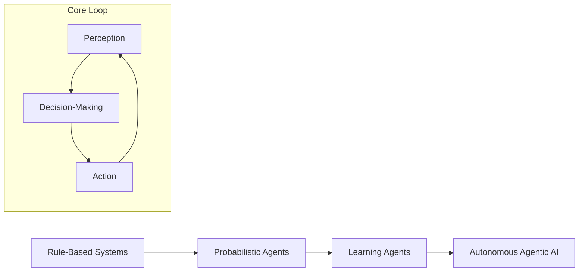
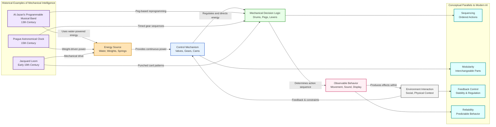
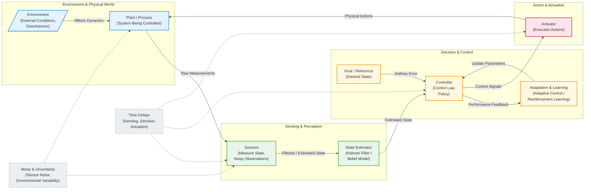
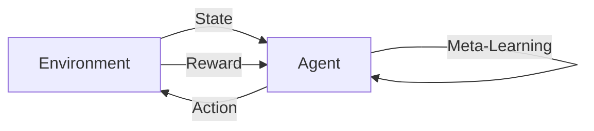
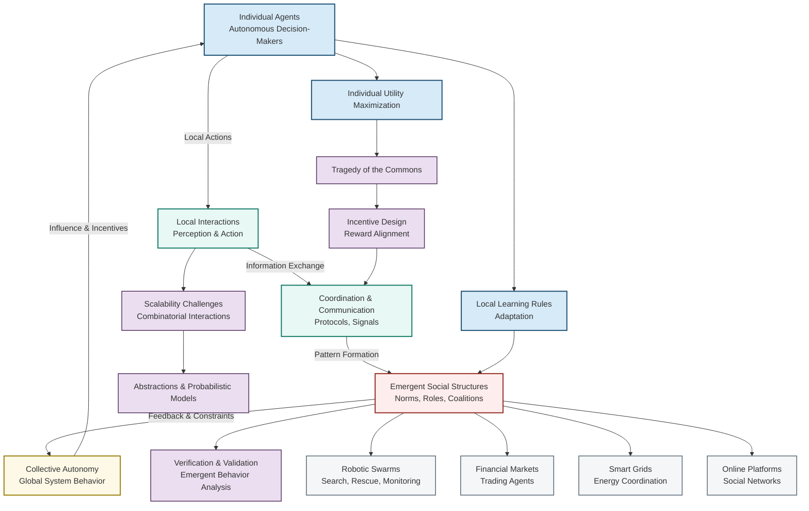

## Overview and Context

The concepts of agency, autonomy, and intelligence form the philosophical and technical backbone of what we now describe as **agentic artificial intelligence**. To understand modern autonomous systems—ranging from self-driving vehicles and adaptive recommendation engines to AI copilots and autonomous research agents—it is essential to trace how these ideas evolved over time and how they interrelate. This section situates agentic AI within a broader historical, cognitive, and computational context, emphasizing why these ideas matter and how they shape contemporary AI design.

Historically, the idea of an “agent” originates not from computer science but from philosophy and psychology, where it described an entity capable of intentional action. In philosophy, agency was closely tied to free will, moral responsibility, and intentionality. In psychology, it referred to the ability of individuals to act independently and make choices. These human-centered ideas later migrated into economics, organizational theory, and eventually artificial intelligence, where they took on formal computational meaning.

The rise of digital computing in the mid-20th century transformed agency from an abstract human attribute into a design goal for machines. As researchers attempted to build systems that could reason, plan, and act, they needed a way to describe entities that perceived their environment, made decisions, and executed actions—thus formalizing the notion of an intelligent agent. Autonomy emerged as a differentiating factor: how much control does an agent have over its actions, and how dependent is it on external intervention? Intelligence, in turn, became a measure of how effectively the agent could achieve its goals across varied and uncertain environments.

Understanding these conceptual foundations is essential because modern AI systems are no longer static tools. They increasingly operate as semi-independent entities embedded in dynamic environments, interacting with humans, other agents, and complex systems. This section lays the groundwork for understanding how agentic AI evolved and why agency, autonomy, and intelligence remain central to its design and evaluation.

## Core Concepts

At the heart of agentic AI lie three deeply interconnected concepts: **agency**, **autonomy**, and **intelligence**. While often used interchangeably in popular discourse, they represent distinct but overlapping ideas with important theoretical and practical implications.

Agency refers to the capacity of an entity to act in an environment in pursuit of goals. An agent perceives its surroundings through sensors, processes information, and acts through effectors. Crucially, agency does not require consciousness or intent in the human sense; in AI, agency is functional. A thermostat, for example, exhibits minimal agency by sensing temperature and turning heating on or off to maintain a set point. More advanced agents, such as autonomous robots or AI assistants, exhibit richer forms of agency involving planning, learning, and adaptation.

Autonomy describes the degree to which an agent operates independently of external control. An autonomous agent can make decisions without continuous human supervision, adapting its behavior based on environmental feedback. Autonomy exists on a spectrum. At one extreme are fully scripted systems that only follow predefined rules. At the other are learning agents that modify their policies over time. Importantly, autonomy is contextual; an AI system may be highly autonomous in routine situations but constrained or overridden in safety-critical scenarios.

Intelligence, in the context of agents, refers to the ability to achieve goals efficiently across a range of environments. This definition, popularized by AI researcher Stuart Russell, emphasizes adaptability and performance rather than human-like cognition. Intelligence encompasses perception, reasoning, learning, decision-making, and action selection. An intelligent agent is not merely reactive; it can anticipate future states, evaluate alternatives, and choose actions that optimize long-term outcomes.

These concepts matter because they determine how AI systems are designed, evaluated, and governed. An agent with high autonomy but limited intelligence may act unpredictably, while an intelligent agent with no autonomy is little more than a sophisticated tool. Balancing agency, autonomy, and intelligence is the central challenge of agentic AI, shaping both technical architectures and ethical frameworks.

## Detailed Explanation

### Key Components

The historical evolution of intelligent agents can be understood through the gradual formalization of their core components: perception, decision-making, action, and learning.

Early computational agents, such as those described in Alan Turing’s mid-20th-century work, were primarily symbolic. They operated on explicitly defined rules and representations, making decisions through logical inference. These systems had agency in a limited sense—they could act according to rules—but their autonomy was constrained, and their intelligence was brittle. They performed well in narrowly defined domains but failed when conditions changed.

The introduction of probabilistic reasoning and decision theory in the late 20th century expanded the scope of agency. Markov decision processes (MDPs) provided a mathematical framework for modeling sequential decision-making under uncertainty. Within this framework, an agent’s intelligence could be quantified by how well it maximized expected reward, and autonomy could be increased by allowing the agent to update its policy through learning.

Learning mechanisms, particularly reinforcement learning, marked a turning point. Agents were no longer limited to predefined behaviors; they could improve through interaction with their environment. This development blurred the line between autonomy and intelligence, as learning agents required less human intervention while achieving increasingly complex goals.

### Implementation Details

From an implementation perspective, agency is realized through architectural choices. The classical perception–decision–action loop is central to agent design. Sensors feed environmental data into a processing unit, which uses a policy or model to decide on an action. That action then affects the environment, creating new data for the next cycle.

Autonomy is implemented by reducing reliance on hard-coded rules and increasing reliance on adaptive models. For example, a robotic vacuum cleaner with preset movement patterns has limited autonomy. Introducing mapping algorithms, obstacle detection, and learning-based navigation increases its autonomy by allowing it to adapt to unfamiliar spaces.

Intelligence is implemented through algorithms that support generalization and optimization. Machine learning models, particularly deep neural networks, enable agents to recognize complex patterns, while planning algorithms allow them to reason about future consequences. In modern systems, hybrid approaches often combine symbolic reasoning with learned models to balance interpretability and performance.

### Technical Considerations

As agents become more autonomous and intelligent, technical challenges increase. One major issue is **partial observability**, where agents must act without full knowledge of the environment. Techniques such as belief state tracking and probabilistic inference help agents maintain internal representations of uncertainty.

Another challenge is **alignment**, ensuring that an agent’s goals remain consistent with human values and intentions. Historically, agency was celebrated for its independence, but in AI systems, unchecked autonomy can lead to undesirable outcomes. This has led to the development of constraint mechanisms, reward shaping, and human-in-the-loop designs that modulate autonomy without eliminating it.

Scalability is also critical. Early agents operated in simple, discrete environments. Modern agentic systems must function in high-dimensional, continuous spaces, requiring efficient algorithms and substantial computational resources. These considerations highlight why agency, autonomy, and intelligence must be designed together rather than in isolation.

```mermaid
flowchart LR
    %% Timeline section
    subgraph Timeline["Evolution of Intelligent Agents Over Time"]
        direction LR

        RBS["Rule-Based Systems\n(Expert Systems)"]
        KBS["Knowledge-Based Systems"]
        MA["Model-Based Agents"]
        GOAL["Goal-Based Agents"]
        UA["Utility-Based Agents"]
        MLA["Machine Learning Agents"]
        RL["Reinforcement Learning Agents"]
        AA["Autonomous Intelligent Agents"]

        RBS -->|Increased knowledge representation| KBS
        KBS -->|Internal state & environment models| MA
        MA -->|Explicit goals| GOAL
        GOAL -->|Utility optimization| UA
        UA -->|Data-driven learning| MLA
        MLA -->|Trial-and-error & rewards| RL
        RL -->|High autonomy & adaptability| AA
    end

    %% Perception-Decision-Action Loop
    subgraph PDA["Perception–Decision–Action Loop (Core of All Agents)"]
        direction LR
        ENV["Environment"]
        PER["Perception\n(Sensors)"]
        DEC["Decision Making\n(Reasoning / Learning / Planning)"]
        ACT["Action\n(Actuators)"]

        ENV -->|Observations| PER
        PER -->|Processed information| DEC
        DEC -->|Chosen actions| ACT
        ACT -->|Alters environment| ENV
    end

    %% Relationship between evolution and loop
    RBS -.->|Simple fixed rules| DEC
    MLA -.->|Learned models| DEC
    RL -.->|Policy optimization| DEC
    AA -.->|Continuous feedback & self-improvement| PDA

    %% Styling
    classDef early fill:#f9f,stroke:#333,stroke-width:1px
    classDef middle fill:#bbf,stroke:#333,stroke-width:1px
    classDef advanced fill:#bfb,stroke:#333,stroke-width:1px
    classDef loop fill:#ffe4b5,stroke:#333,stroke-width:1px

    class RBS,KBS early
    class MA,GOAL,UA middle
    class MLA,RL,AA advanced
    class ENV,PER,DEC,ACT loop
```







## Real-World Applications

One illustrative case study is autonomous driving. Early driver assistance systems, such as cruise control, exhibited minimal agency and no real autonomy. Modern self-driving systems, however, integrate perception (camera and lidar data), decision-making (route planning and obstacle avoidance), and learning (improving performance through simulation and real-world data). These systems demonstrate high agency and partial autonomy, though they are often constrained for safety reasons. Lessons learned include the importance of gradual autonomy and robust fallback mechanisms.

Another example is algorithmic trading agents in financial markets. These agents sense market conditions, execute trades, and adapt strategies based on performance. High-frequency trading systems, in particular, exhibit extreme agency and autonomy, operating at timescales beyond human intervention. This has led to both increased efficiency and systemic risks, highlighting the need for regulatory oversight.

In healthcare, clinical decision support systems act as semi-autonomous agents. They analyze patient data, suggest diagnoses or treatments, and learn from outcomes. While they do not replace physicians, they augment human agency, illustrating a collaborative model where autonomy is deliberately limited to maintain trust and accountability.

Customer service chatbots provide another case. Early scripted bots had limited agency and intelligence. Modern conversational agents use natural language models to interpret user intent, learn from interactions, and handle a wide variety of tasks. Their success underscores how incremental increases in autonomy and intelligence can dramatically enhance usability.

## Practical Examples

To illustrate agency and autonomy in practice, consider a simple reinforcement learning agent implemented in Python:

```python
import random

actions = ["left", "right"]
Q = {"left": 0.0, "right": 0.0}
learning_rate = 0.1
reward = {"left": -1, "right": 1}

for episode in range(100):
    action = random.choice(actions)
    Q[action] += learning_rate * (reward[action] - Q[action])

print(Q)
```

In this example, the agent has agency because it selects actions and receives feedback from the environment. It has limited autonomy because its action selection is random, but it exhibits rudimentary intelligence by updating its policy to favor higher rewards over time.

A more applied scenario is a recommendation agent that adapts content for users. Such an agent perceives user behavior, decides which item to recommend, and learns from engagement metrics. Step by step, the agent becomes more autonomous as it requires less manual tuning and more intelligent as it improves user satisfaction.

## Common Patterns and Best Practices

Effective agentic AI systems often follow certain patterns. One common practice is **incremental autonomy**, where systems are deployed with limited autonomy and gradually expanded as confidence and reliability grow. This reduces risk and facilitates human trust.

Another best practice is **modular design**, separating perception, decision-making, and learning components. This allows developers to improve intelligence without increasing autonomy excessively or to impose constraints without reducing overall performance.

Human-in-the-loop mechanisms are also widely used. By allowing humans to intervene or provide feedback, designers can harness human judgment while retaining the efficiency of autonomous agents. These patterns work because they acknowledge that agency and autonomy are not binary but adjustable properties.

## Potential Challenges and Solutions

A major challenge in agentic AI is unintended behavior arising from misaligned objectives. Agents may optimize for proxy measures that diverge from human goals. Addressing this requires careful reward design, ongoing monitoring, and the inclusion of ethical constraints.

Another challenge is over-automation, where excessive autonomy reduces human oversight. Solutions include transparency mechanisms, explainable decision-making, and fail-safe controls that allow humans to reclaim control when needed.

## Integration with Other Concepts

Agency, autonomy, and intelligence intersect with topics such as ethics, governance, and human–AI interaction. Concepts like accountability depend on how autonomous an agent is, while usability depends on how its agency complements human workflows. These foundations also connect to multi-agent systems, where interactions between agents introduce coordination and competition dynamics.

## Key Takeaways

The historical evolution of intelligent agents reveals a gradual but profound shift from rigid, rule-based systems to adaptive, autonomous, and intelligent entities. Agency provides the basic capacity to act, autonomy determines the degree of independence, and intelligence measures effectiveness across contexts. Together, these concepts shape how AI systems are built, deployed, and regulated. Understanding their origins and interrelationships allows practitioners to design agentic AI that is powerful yet controlled, adaptable yet aligned with human values.

## Further Reading

Readers seeking deeper insight may explore Stuart Russell and Peter Norvig’s “Artificial Intelligence: A Modern Approach” for foundational definitions of agents and intelligence. Norbert Wiener’s work on cybernetics provides historical context for feedback and control. For philosophical perspectives, Daniel Dennett’s writings on intentional systems offer valuable insights into agency. Finally, contemporary research on reinforcement learning and autonomous systems illustrates how these concepts are applied in modern AI practice.

---

## Overview and Context

Long before the advent of digital computers and modern artificial intelligence, humans were already deeply fascinated by the idea of creating machines that could act, respond, and even “think” on their own. The roots of what we now call agentic AI can be traced back thousands of years to early automata, mechanical devices, and philosophical speculations about intelligence and autonomy. These pre-digital efforts laid the conceptual and technical groundwork for the emergence of intelligent agents by exploring how purposeful behavior could be embodied in artifacts rather than living beings.

Understanding early automata and mechanical intelligence is crucial because these systems represented the first attempts to encode agency into non-biological entities. Although they lacked computation in the modern sense, they demonstrated that complex, goal-directed behavior could emerge from carefully designed mechanisms. This distinction is important: intelligence was not yet seen as software or algorithms but as a property that could arise from physical structure, motion, and causal chains. In many ways, these early systems anticipated later debates in artificial intelligence around embodiment, autonomy, and control.

This section explores how ancient myths, medieval engineering, Renaissance mechanics, and early modern philosophy collectively shaped the idea of autonomous agents. From water-powered statues that performed repetitive actions to clockwork machines that simulated animals and humans, these inventions challenged prevailing beliefs about life, intention, and intelligence. They also forced thinkers to ask foundational questions: What does it mean to act autonomously? Can intelligence be decomposed into rules and mechanisms? Where is the boundary between tool and agent?

By examining these pre-digital roots, we gain perspective on why modern agentic AI places so much emphasis on autonomy, feedback, and environment interaction. The story of early automata is not merely historical curiosity; it reveals the enduring human desire to create systems that operate independently yet purposefully within the world.

## Core Concepts

At the heart of early automata and mechanical intelligence lies the concept of agency, defined as the capacity of an entity to act within an environment in a way that appears goal-directed. In pre-digital systems, agency was implemented through physical mechanisms rather than symbolic computation. Gears, levers, cams, flowing water, and weights acted as the “decision logic” of these machines, determining when and how actions occurred. While these devices could not learn or reason abstractly, they embodied a rudimentary form of autonomy by operating without continuous human intervention.

Another foundational concept is determinism. Early mechanical systems were entirely deterministic: given a particular configuration and initial conditions, the machine’s behavior was fixed. Yet this determinism was not seen as a limitation but as a feature. Engineers sought to design mechanisms that reliably produced desired behaviors, mirroring how natural laws govern physical processes. This perspective heavily influenced later computational approaches to intelligence, where algorithms were similarly deterministic until the introduction of probabilistic and learning-based methods.

Embodiment is a third critical concept. Intelligence in pre-digital systems was inseparable from the physical form of the machine. The structure of the device dictated its capabilities, constraints, and interactions with the environment. This contrasts with modern software-centric views of AI but resonates strongly with contemporary research in robotics and embodied cognition, which argues that intelligence emerges from the interaction between body, control system, and environment.

Finally, these systems raised philosophical questions about the nature of mind and machine. Thinkers such as Aristotle, René Descartes, and later Julien Offray de La Mettrie debated whether life and intelligence could be fully explained mechanically. These debates shaped early AI thought by motivating the idea that cognition might be reducible to mechanistic processes—a premise that underlies much of modern artificial intelligence research.

## Detailed Explanation

### Key Components

Early automata typically consisted of three primary components: an energy source, a control mechanism, and an output or behavior. The energy source could be gravity (weights), flowing water, compressed air, or human winding. This energy powered the system and allowed it to operate over time.

The control mechanism was the most intellectually significant component. In many automata, this took the form of cams or rotating drums with pegs, which encoded sequences of actions. As the drum rotated, pegs would engage levers at specific times, triggering movements such as raising an arm, opening a mouth, or striking a bell. This mechanical sequencing is strikingly similar to later punched cards and even modern instruction sets.

The output layer consisted of the observable behavior: movement, sound, or interaction with the environment. Whether it was a mechanical bird flapping its wings or a figure writing letters, the output gave the illusion of intentional action. This illusion was powerful enough to inspire awe and sometimes fear, suggesting that humans were witnessing the emergence of artificial life.

### Implementation Details

One of the most famous early examples is the automata described by Hero of Alexandria in the first century CE. Hero’s designs used water pressure and air flow to create self-opening temple doors and automated theatrical scenes. These devices operated according to pre-defined sequences, demonstrating how complex behaviors could be orchestrated without human control once initiated.

In the medieval Islamic world, engineers such as the Banū Mūsā brothers and Al-Jazari expanded these ideas significantly. Al-Jazari’s “Book of Knowledge of Ingenious Mechanical Devices” detailed elaborate machines, including programmable musical automata. These devices could be reconfigured to change their behavior, foreshadowing the idea of reprogrammability—a cornerstone of modern AI systems.

During the Renaissance, European clockmakers created increasingly sophisticated automata driven by advances in precision engineering. Mechanical clocks themselves can be seen as autonomous agents: once set, they maintained timekeeping independently, responding to physical regularities. The regular oscillation of the balance wheel acted as a primitive feedback mechanism, correcting deviations and maintaining stability.

### Technical Considerations

Despite their sophistication, early automata faced significant limitations. They lacked sensory feedback beyond simple mechanical triggers, meaning they could not adapt to unexpected changes in their environment. Their “intelligence” was brittle, breaking down when conditions deviated from those anticipated by the designer.

Yet these limitations were instructive. They highlighted the importance of feedback loops, adaptability, and perception—concepts that later became central to cybernetics and AI. The absence of learning in early automata underscored the need for systems that could modify their behavior over time, leading eventually to the development of adaptive and learning agents.




---

## Overview and Context

Cybernetics and control theory represent one of the most profound intellectual bridges between early mechanical ingenuity and modern agentic artificial intelligence. Emerging in the mid-20th century, these disciplines were among the first to formally study how systems—biological, mechanical, and social—can regulate their behavior, adapt to changing environments, and pursue goals autonomously. At their core lies a deceptively simple yet revolutionary idea: intelligent behavior can emerge from feedback, not from explicit instruction alone.

The historical context of cybernetics is inseparable from the aftermath of World War II, when scientists and engineers sought to understand and formalize complex systems such as anti-aircraft guns, radar systems, and communication networks. Figures like Norbert Wiener, W. Ross Ashby, and Claude Shannon recognized that similar principles governed machines, animals, and organizations. This realization shattered the rigid boundary between living intelligence and mechanical systems, suggesting that autonomy and purpose could be engineered rather than exclusively evolved.

For the foundations of agentic AI, cybernetics and control theory provide a conceptual grammar: they explain how an agent can observe its environment, compare observations against desired states, act to minimize discrepancies, and refine its behavior over time. These ideas predate machine learning and neural networks, yet they remain deeply embedded in modern AI—for example, in reinforcement learning, adaptive robotics, and self-regulating software systems.

Understanding cybernetics is essential not merely as historical background but as a lens for grasping why intelligent agents behave robustly under uncertainty. It reveals that autonomy is not about perfect foresight or unlimited computation, but about continuous interaction with the world. Feedback, adaptation, and self-regulation are the mechanisms that allow agents to survive, learn, and improve. This section explores these foundations, tracing how early control systems evolved into the conceptual ancestors of today’s autonomous AI agents.

## Core Concepts

Cybernetics and control theory revolve around understanding systems that act purposefully in dynamic environments. The defining feature of such systems is feedback—the process through which a system senses the effects of its actions and uses that information to adjust future behavior. Unlike open-loop systems, which behave the same way regardless of outcome, feedback-driven systems are inherently adaptive.

Feedback can be broadly categorized into negative and positive feedback. Negative feedback counteracts deviations from a desired state, promoting stability. For example, a thermostat measures room temperature and turns heating on or off to maintain a set point. Positive feedback, in contrast, amplifies deviations, leading to growth or runaway effects, as seen in population booms or certain market dynamics. In intelligent agents, negative feedback is particularly critical because it enables goal-directed, stable behavior in unpredictable environments.

Control theory formalizes these ideas mathematically. A controller receives input from sensors, compares it to a reference value (the goal), and produces an output that influences the system or environment. The controlled entity—often called the “plant”—responds, and its new state is fed back into the controller. This closed-loop architecture is the backbone of autonomous behavior.

Adaptation extends feedback by allowing the system itself to change its parameters over time. While a basic controller follows fixed rules, an adaptive system can modify its control strategy based on experience. W. Ross Ashby’s concept of “ultrastability” described systems that could reorganize internally to maintain essential variables within viable limits. This idea directly anticipates learning agents in AI, which adjust policies or models to improve performance.

Self-regulation is the emergent property resulting from effective feedback and adaptation. A self-regulating system maintains coherence and functionality despite disturbances. Importantly, self-regulation does not require centralized intelligence. Even simple components, when properly organized, can produce sophisticated regulation. This insight profoundly influenced later developments in distributed AI, swarm intelligence, and multi-agent systems.

Together, these core concepts matter because they shift intelligence from being an internal, symbolic process to being relational and dynamic. Intelligence becomes something an agent does through continuous control and adaptation, not merely something it possesses. Modern agentic AI inherits this worldview, embedding cybernetic principles into algorithms that learn, plan, and act in real time.

## Detailed Explanation

### Key Components

A cybernetic system is composed of several fundamental components that interact continuously. First are sensors, which provide information about the system’s internal state or external environment. Sensors translate raw physical phenomena—temperature, velocity, position, or even abstract metrics like network latency—into signals usable by the controller.

Next is the controller itself, the decision-making element that determines how the system should act. In classical control systems, controllers are often mathematical functions such as proportional-integral-derivative (PID) controllers. These compute corrective actions based on current error, accumulated past error, and predicted future error. In agentic AI, controllers may be much more complex, incorporating learning models, symbolic reasoning, or probabilistic inference.

The actuator is the component that executes the controller’s decisions. Actuators change the system or environment in concrete ways—moving a robotic arm, adjusting fuel flow in an engine, or modifying parameters in a software system. The plant, or controlled process, is the portion of the system whose behavior needs regulation.

Crucially, feedback channels connect the plant back to the sensors, closing the loop. Without this loop, the system cannot correct mistakes or adapt to unexpected changes. This closed-loop structure is what transforms a passive machine into an active, autonomous agent.




---

## Overview and Context

Classical Artificial Intelligence (AI), often referred to as symbolic AI or Good Old-Fashioned Artificial Intelligence (GOFAI), represents one of the earliest and most influential paradigms in the historical evolution of intelligent agents and autonomy. Emerging primarily from the 1950s through the 1980s, classical AI was grounded in the belief that intelligence can be understood, modeled, and implemented through explicit symbols, logical rules, and structured representations of knowledge. Unlike modern data-driven or connectionist approaches such as deep learning, classical AI focused on reasoning, planning, and problem-solving through symbolic manipulation.

In the context of agentic AI, classical symbolic paradigms are especially significant because they introduced the foundational concepts of agency: perception, reasoning, goal representation, decision-making, and action selection. Early researchers sought to formalize how an agent could observe its environment, reason about its state using logic, select actions that maximize goal achievement, and adapt its behavior over time. These ideas were deeply influenced by earlier work in logic, cognitive psychology, philosophy of mind, and cybernetics, and they laid the groundwork for later developments in autonomous systems.

Understanding classical AI is crucial not only for historical completeness but also for conceptual clarity. Many modern agentic systems—such as autonomous planners, rule-based decision engines, and hybrid neuro-symbolic architectures—still rely heavily on symbolic reasoning components. Moreover, debates about explainability, transparency, and alignment in AI often return to symbolic approaches precisely because their internal reasoning processes are interpretable by design.

This section explores the core concepts, mechanisms, and applications of classical AI and symbolic agent paradigms, examining how early notions of intelligence and autonomy were formalized, implemented, and deployed, as well as how they continue to influence modern AI systems and agent architectures.

## Core Concepts

At the heart of classical artificial intelligence lies the assumption that intelligent behavior arises from the manipulation of symbols according to formal rules. A symbol, in this context, is an abstract representation of an object, concept, or relationship in the world. For example, the concept of “room,” “door,” or “goal achieved” can be encoded symbolically and manipulated using logic-based operations. This symbolic stance assumes that the world can be sufficiently modeled using discrete, well-defined entities and relations.

One of the most central theoretical foundations of classical AI is formal logic, particularly first-order predicate logic. Logic provides a precise language for representing knowledge and a set of inference rules for reasoning about that knowledge. Using logical expressions, an agent can deduce new facts, verify the consistency of beliefs, and determine whether certain goals are achievable. This logical framing directly influenced the development of knowledge-based systems, theorem provers, and expert systems.

Another key concept is the physical symbol system hypothesis, proposed by Allen Newell and Herbert A. Simon. This hypothesis asserts that a physical symbol system has the necessary and sufficient means for general intelligent action. In essence, it claims that any system capable of manipulating symbols in structured ways can exhibit intelligence. This idea profoundly shaped early AI research and agent design, providing philosophical justification for building intelligent agents as symbol-processing machines.

Classical AI agents are typically designed around explicit representations of goals, plans, and actions. Goals define desired states of the world, plans specify sequences of actions to achieve those goals, and actions are defined by their preconditions and effects. This structure enables agents to reason about future consequences and select actions rationally. Planning algorithms such as STRIPS, means–ends analysis, and state-space search emerged from this framework and became canonical techniques in symbolic AI.

Finally, classical agent paradigms emphasize deliberative reasoning over reactive behavior. Agents are expected to pause, think, generate plans, and reason before acting. While this can be computationally expensive, it allows for highly structured, explainable, and controllable behavior—qualities that remain valuable in safety-critical and knowledge-intensive domains.

## Detailed Explanation

### Key Components

A classical symbolic agent can be decomposed into several key components that work together to produce intelligent behavior. The first of these is the knowledge base, which stores symbolic representations of facts, rules, and relationships about the environment. Knowledge bases are often implemented using logical assertions, semantic networks, or frame-based representations. For example, a medical diagnosis system may store symptoms, diseases, and causal relationships as symbolic facts.

The inference engine is the reasoning mechanism that operates on the knowledge base. It applies logical rules to derive new information, answer queries, or make decisions. Techniques such as forward chaining and backward chaining allow an agent to reason either from known facts to conclusions or from goals back to required conditions. This reasoning process is central to the agent’s ability to make justified decisions rather than arbitrary ones.

A third critical component is the planner. Planning systems generate sequences of actions that transform the current state of the environment into a goal state. Classical planners rely on explicit action models, defining preconditions that must be satisfied before an action can occur and effects that describe how the action changes the world. This explicit modeling enables agents to simulate future states mentally before acting.

Finally, the perception and action modules serve as interfaces between the symbolic reasoning system and the real or simulated environment. Perception translates environmental inputs into symbolic representations, while actions execute decisions in the world. In many early systems, the environment was simplified or fully observable, allowing researchers to focus on reasoning rather than uncertainty.

### Implementation Details

Implementing symbolic agents typically involves defining a formal language for knowledge representation, selecting an inference mechanism, and constructing a control loop that governs perception, reasoning, and action. Languages such as Lisp and Prolog were historically favored because of their natural alignment with symbolic processing and logical inference.

For instance, Prolog allows developers to encode knowledge as sets of facts and rules. Queries to the system trigger automatic logical inference, making it ideal for expert systems and diagnostic agents. Lisp, on the other hand, provided flexible data structures for representing symbolic expressions and facilitated rapid prototyping of AI algorithms.

A typical agent control loop in classical AI follows a sense–think–act cycle. The agent first senses its environment and updates its symbolic state representation. It then deliberates, using its inference engine and planner to select an appropriate action. Finally, it executes the action and repeats the cycle. While conceptually simple, this loop embodies the fundamental idea of rational agency.

### Technical Considerations

One of the major technical challenges in classical AI is computational complexity. Logical inference and planning can be computationally expensive, especially as the size of the knowledge base and the complexity of the environment increase. Many classical systems struggled with scalability and real-time responsiveness, limiting their applicability in dynamic or uncertain environments.

Another consideration is the knowledge engineering bottleneck. Building and maintaining large symbolic knowledge bases requires extensive human effort. Experts must articulate tacit knowledge in formal terms, which is often difficult and error-prone. This limitation became one of the driving factors behind the shift toward machine learning approaches.

Despite these challenges, symbolic systems offer unmatched transparency and controllability. Every decision can be traced back to explicit rules and facts, making it easier to debug systems, verify correctness, and ensure compliance with ethical or legal constraints.

```mermaid
flowchart LR
    %% Environment and Interface
    Environment[(Environment<br/>External World)]
    Environment -->|Sensory Data / Percepts| Sensors[Perception Module<br/>Feature Extraction]

    %% Internal Symbolic Processing
    Sensors -->|Symbolic Observations| Perception[Symbol Interpreter<br/>State Abstraction]
    Perception --> KnowledgeBase[(Knowledge Base<br/>Facts, Rules, Models)]

    KnowledgeBase -->|Queries & Facts| InferenceEngine[Inference Engine<br/>Logical Reasoning]
    InferenceEngine -->|Derived Beliefs| BeliefState[Belief State<br/>Current World Model]

    %% Goal and Planning
    BeliefState --> Planner[Planner<br/>Goal Decomposition]
    Goals[[Goals<br/>Desires / Objectives]] --> Planner
    Planner -->|Plan / Action Sequence| PlanLibrary[Plan Representation<br/>STRIPS / HTN]

    %% Action Selection and Execution
    PlanLibrary --> ActionSelection[Action Selection<br/>Policy / Scheduler]
    ActionSelection -->|Chosen Action| Actuators[Actuators<br/>Execution Interface]
    Actuators -->|Actions| Environment

    %% Feedback Loop
    ActionSelection -->|Execution Feedback| BeliefState

    %% Styling
    style Environment fill:#E3F2FD,stroke:#1E88E5,stroke-width:2
    style Sensors fill:#E8F5E9,stroke:#43A047,stroke-width:2
    style Perception fill:#E8F5E9,stroke:#2E7D32,stroke-width:2
    style KnowledgeBase fill:#FFFDE7,stroke:#F9A825,stroke-width:2
    style InferenceEngine fill:#FFFDE7,stroke:#F57F17,stroke-width:2
    style BeliefState fill:#FFF3E0,stroke:#EF6C00,stroke-width:2
    style Planner fill:#F3E5F5,stroke:#8E24AA,stroke-width:2
    style PlanLibrary fill:#F3E5F5,stroke:#6A1B9A,stroke-width:2
    style ActionSelection fill:#E1F5FE,stroke:#0288D1,stroke-width:2
    style Actuators fill:#E1F5FE,stroke:#01579B,stroke-width:2
    style Goals fill:#FCE4EC,stroke:#C2185B,stroke-width:2
```




---

## Overview and Context

Reactive and behavior-based agents represent a pivotal shift in the historical evolution of intelligent agents, marking a departure from the symbolic, deliberative assumptions of classical AI toward a paradigm rooted in direct perception–action coupling, embodiment, and situated intelligence. Whereas Classical AI assumed that intelligence arises primarily from internal representations, explicit reasoning, and abstract planning, researchers in the late 1980s and 1990s began to question whether such approaches could scale effectively to real-world, dynamic, and uncertain environments. This skepticism gave rise to reactive and behavior-based systems—agents designed to respond directly to their environments without relying on complex symbolic models or long-term planning.

The emergence of this paradigm was deeply influenced by insights from biology, neuroscience, robotics, and cognitive science. Observations of insects, animals, and humans revealed that intelligent behavior often arises not from elaborate internal reasoning, but from simple interactions between an embodied organism and its environment. This idea challenged the Cartesian separation between mind and body and introduced a new conception of intelligence as something inherently situated, physical, and adaptive.

Reactive agents operate under the principle that the environment itself can serve as its own best model. Instead of constructing detailed internal world representations, these agents rely on continuous sensory input and predefined behaviors that map perceptions directly to actions. Behavior-based agents extend this idea by organizing multiple reactive behaviors into layered or competing structures, enabling more complex and robust forms of autonomy.

This section situates reactive and behavior-based agents within the broader foundations of agentic AI by examining how embodiment, environmental feedback, and decentralized control contribute to autonomy. Understanding this paradigm is crucial because many modern AI systems—especially in robotics, autonomous vehicles, and adaptive systems—still rely heavily on reactive principles. Moreover, contemporary ideas such as embodied cognition, swarm intelligence, and even reinforcement learning owe conceptual debts to this earlier shift toward situated intelligence.

## Core Concepts

At the heart of reactive and behavior-based agents lies a redefinition of intelligence itself. Instead of viewing intelligence as the ability to reason abstractly or solve symbolic problems, this paradigm defines intelligence as the capacity to generate appropriate behavior in response to environmental conditions. This reframing has profound implications for how agents are designed, evaluated, and deployed.

One foundational concept is embodiment. Embodiment asserts that an agent’s physical instantiation—its sensors, actuators, and morphology—is not merely a vessel for intelligence, but a fundamental component of cognition. The shape of a robot’s body, the placement of its sensors, and the constraints of its actuators directly influence what behaviors are possible and how the agent interacts with the world. For example, a wheeled robot and a legged robot encountering the same terrain will perceive and act differently, even if they share identical control software.

Another core idea is situatedness. Reactive agents do not operate in abstract problem spaces but are embedded in real environments characterized by noise, uncertainty, and constant change. Their intelligence emerges from continuous interaction with the environment rather than from detached internal computation. This view aligns with ecological psychology, particularly James J. Gibson’s theory of affordances, which emphasizes how the environment offers action possibilities directly perceivable by an agent.

Behavior-based control provides the organizational framework for these agents. Instead of a centralized controller or planner, behavior-based agents consist of multiple behaviors—such as obstacle avoidance, goal seeking, or wall following—that operate concurrently. These behaviors may cooperate, compete, or subsume one another. Rodney Brooks’ subsumption architecture is a canonical example, demonstrating how complex behavior can emerge from layered, simple rules without global planning.

These concepts matter because they address fundamental limitations of classical AI. Symbolic systems struggled with real-time responsiveness, brittleness in unpredictable environments, and the computational cost of maintaining accurate world models. Reactive and behavior-based agents offer robustness, scalability, and adaptability by leveraging the environment itself and minimizing internal complexity. They also provide a more biologically plausible model of intelligence, influencing interdisciplinary research well beyond AI.

## Detailed Explanation

### Key Components

Reactive and behavior-based agents are composed of tightly coupled sensing, processing, and acting components. Sensors continuously collect data from the environment, such as distance measurements, visual input, or tactile feedback. This sensory information is processed through relatively simple mechanisms—often rule-based or mathematical mappings—that directly trigger actions.

Behaviors are the fundamental building blocks. Each behavior is designed to achieve a specific local objective, such as avoiding collisions or moving toward light. Importantly, behaviors operate in parallel rather than sequentially. This parallelism allows agents to respond rapidly to environmental changes without waiting for a central decision-making process.

Coordination mechanisms resolve conflicts among behaviors. For instance, obstacle avoidance might override goal-seeking when a collision is imminent. Priority schemes, inhibition, or arbitration mechanisms are commonly used. In subsumption architecture, higher-priority behaviors can suppress lower-level ones, ensuring safety-critical actions dominate when necessary.

### Implementation Details

Implementing reactive agents typically involves designing perception–action loops that map sensor inputs directly to actuator commands. These loops are often implemented using simple control laws, finite state machines, or condition–action rules. For example, a robot might increase its turning rate proportionally to how close it is to an obstacle detected by infrared sensors.

Behavior-based systems require additional design effort to define individual behaviors and their interactions. Developers must decide how behaviors are activated, how conflicts are resolved, and how behaviors are layered. While this approach avoids complex planning algorithms, it demands careful tuning and extensive testing in real or simulated environments.

Learning can be incorporated, although early reactive systems were largely hand-designed. Modern implementations may integrate reinforcement learning to adjust behavior parameters based on experience, while still maintaining the reactive structure.

### Technical Considerations

Reactive agents excel in real-time performance because they avoid computationally expensive reasoning. However, their simplicity can limit long-term planning and abstract reasoning. As a result, they are best suited for tasks where immediate responsiveness and robustness are more critical than optimal global solutions.

Another technical consideration is scalability. While adding new behaviors is conceptually straightforward, interactions among behaviors can become complex and difficult to predict. Debugging emergent behavior requires extensive experimentation and careful observation.


```mermaid
flowchart LR
    %% Sensor Inputs
    Sensors[Sensor Inputs\n(Lidar, Camera, Bump, GPS)]:::sensor

    %% Parallel Behaviors
    subgraph Behaviors[Behavior-Based Layer\nParallel Reactive Behaviors]
        direction TB
        B1[Obstacle Avoidance\n• Detect proximity\n• Turn away]:::behavior
        B2[Goal Seeking\n• Navigate toward target\n• Adjust heading]:::behavior
        B3[Exploration\n• Random walk\n• Coverage maximization]:::behavior
    end

    %% Arbitration
    Arbitration[Behavior Arbitration\n(Priority / Suppression)]:::arbitration

    %% Actuation
    Actuators[Actuators\n(Motors, Wheels, Arms)]:::actuator

    %% Connections
    Sensors -->|Percepts| B1
    Sensors -->|Percepts| B2
    Sensors -->|Percepts| B3

    B1 -->|Proposed Action| Arbitration
    B2 -->|Proposed Action| Arbitration
    B3 -->|Proposed Action| Arbitration

    Arbitration -->|Selected Command| Actuators

    %% Styling
    classDef sensor fill:#cce5ff,stroke:#004085,stroke-width:2px
    classDef behavior fill:#e2f0d9,stroke:#2f6b2f,stroke-width:2px
    classDef arbitration fill:#fff3cd,stroke:#856404,stroke-width:2px
    classDef actuator fill:#f8d7da,stroke:#721c24,stroke-width:2px

    %% Layout hint
    Sensors:::sensor
    Behaviors:::behavior
    Arbitration:::arbitration
    Actuators:::actuator
```

---

## Overview and Context

The emergence of learning agents marks one of the most significant inflection points in the historical evolution of intelligent agents and autonomy. While reactive and behavior-based agents demonstrated that intelligent behavior could emerge without symbolic reasoning or explicit world models, they were fundamentally limited by their static nature. Once designed and deployed, such agents could not fundamentally improve themselves through experience. Learning agents address this limitation by embedding mechanisms that allow agents to adapt their behavior over time based on interaction with their environment. This shift transformed agents from engineered artifacts into systems that can progressively acquire competence, robustness, and autonomy.

Learning agents are especially important because real-world environments are rarely static, perfectly known, or fully predictable. From robots operating in dynamic physical spaces to software agents navigating complex digital ecosystems, the ability to learn enables systems to cope with uncertainty, change, and incomplete information. Historically, the rise of learning agents coincided with growing dissatisfaction with hand-coded behaviors and rules, as well as advances in computational power, data availability, and theoretical foundations such as probability theory and optimization.

Within the broader landscape of agentic AI, learning agents serve as a bridge between early reactive systems and modern adaptive autonomous systems. Reinforcement Learning (RL), in particular, introduced a principled framework for learning via trial and error, inspired by behavioral psychology and control theory. Over time, learning agents evolved beyond simple reward-based adaptation toward richer forms of autonomy that integrate perception, memory, planning, and meta-learning.

This section situates learning agents within the historical and conceptual progression of intelligent systems. It examines why learning became essential, how reinforcement learning formalized adaptation, and how these ideas expanded into modern adaptive autonomy—where agents not only learn actions but also reshape goals, strategies, and internal representations in response to long-term experience.

## Core Concepts

At the heart of learning agents lies the idea that intelligence is not fully pre-specified at design time but is instead partially acquired through interaction. Unlike purely reactive agents, which map percepts directly to actions using fixed rules or behaviors, learning agents modify their internal decision-making mechanisms based on feedback from the environment. This feedback can be explicit, such as numerical rewards, or implicit, such as success or failure in achieving tasks.

The canonical model of a learning agent consists of four interacting components: a performance element that selects actions, a learning element that improves the performance element, a critic that provides evaluative feedback, and a problem generator that encourages exploration. This architecture highlights a fundamental tension between exploitation (using what the agent already knows to perform well) and exploration (trying new actions to gather information). Balancing these two forces is one of the central challenges in agent learning.

Reinforcement learning provides the most influential theoretical foundation for learning agents. In RL, an agent interacts with an environment defined by states, actions, transitions, and rewards. The agent’s goal is to learn a policy—a mapping from states to actions—that maximizes cumulative reward over time. Importantly, reinforcement learning does not require labeled examples of correct behavior. Instead, learning emerges from delayed and sometimes sparse feedback, making RL particularly suitable for autonomous settings.

Beyond basic reinforcement learning, learning agents also incorporate concepts such as value estimation, policy optimization, temporal credit assignment, and function approximation. Early RL methods relied on tabular representations, which limited scalability. Later developments introduced neural networks and other function approximators, enabling agents to operate in high-dimensional and continuous spaces.

As learning agents matured, researchers recognized that autonomy involves more than reward maximization. Adaptive autonomy extends learning to higher levels, including learning representations, learning when and how to learn, adjusting goals, and even modifying the agent’s own architecture. This evolution reflects a shift from isolated learning problems toward lifelong learning, where agents continuously adapt across tasks and environments.

## Detailed Explanation

### Key Components

Learning agents are composed of several tightly coupled components, each serving a distinct role in the learning process. The performance element is responsible for selecting actions based on current knowledge and perceptual input. In early learning agents, this might take the form of a lookup table or a simple neural network. In more advanced systems, it can involve deep neural architectures that integrate vision, language, and memory.

The learning element modifies the performance element. For example, in reinforcement learning, this involves updating value estimates or policy parameters based on received rewards. These updates are guided by learning rules derived from optimization principles, such as gradient descent or dynamic programming. The critic evaluates the agent’s behavior by comparing expected outcomes with actual outcomes, generating error signals that drive learning.

Equally important is the problem generator, which proposes exploratory actions that may not be immediately rewarding but are valuable for acquiring new knowledge. Without this component, agents risk converging prematurely to suboptimal behaviors. This idea reflects insights from psychology and evolutionary biology, where exploration is essential for long-term adaptation.

### Implementation Details

To illustrate how learning agents are implemented, consider a simple reinforcement learning scenario: a mobile robot learning to navigate a maze. The robot’s sensors provide information about walls and open spaces, forming the state. Its actions include moving forward, turning left, or turning right. Each time the robot reaches the goal, it receives a positive reward; collisions or delays incur penalties.

Using a Q-learning algorithm, the robot maintains a Q-value for each state–action pair, representing the expected future reward. Initially, these values are arbitrary. As the robot explores the maze, it updates the Q-values using the reward signal and a learning rate that controls how quickly new information overrides old estimates. Over time, the robot converges on a navigation policy that efficiently reaches the goal.

More complex learning agents employ policy-gradient methods, where the agent directly learns parameters of a stochastic policy. These methods are particularly useful in continuous action spaces, such as robotic control or autonomous driving. Deep reinforcement learning extends this approach by using deep neural networks to approximate value functions or policies, enabling agents to process raw sensory inputs like images or audio.

### Technical Considerations

Learning agents raise several technical challenges that shape their design and historical development. One major issue is sample efficiency: many RL algorithms require vast numbers of interactions to learn effective behavior. This limitation spurred research into model-based learning, where agents learn internal models of the environment to simulate experiences and accelerate learning.

Another concern is stability and convergence. Learning dynamics can be unstable, especially when combining function approximation, off-policy learning, and bootstrapping. Historically, these challenges delayed the adoption of learning agents in safety-critical domains. Advances in algorithm design, regularization techniques, and computational hardware gradually mitigated these issues.


```mermaid
flowchart TD
    %% Core Reinforcement Learning Loop
    A[Agent] -->|selects action a_t via Policy π| B[Environment]
    B -->|returns next state s_{t+1}| C[State Observation]
    B -->|returns reward r_t| D[Reward Signal]

    C --> E[Policy / Action Selection]
    D --> F[Value / Reward Evaluation]
    E --> A
    F --> G[Learning Update]

    G -->|updates policy π and value function V/Q| A

    %% Internal Components of the Agent
    subgraph Agent_Internal[Agent Internal Mechanisms]
        E
        F
        G
        H[Internal Model / Value Function]
    end

    G --> H
    H --> E
    H --> F

    %% Adaptive Autonomy Extensions
    subgraph Meta_Learning[Adaptive Autonomy & Meta-Learning Layer]
        M1[Meta-Learner]
        M2[Goal & Objective Adaptation]
        M3[Strategy / Policy Modulation]
    end

    H --> M1
    M1 -->|adjusts learning rates,\nrepresentations| G
    M2 -->|modifies reward structure\nor goals| D
    M3 -->|biases or reshapes policy| E

    %% Feedback between environment and goals
    B -->|long-term performance feedback| M2

    %% Styling
    classDef agentStyle fill:#cce5ff,stroke:#004085,stroke-width:2px
    classDef envStyle fill:#e2e3e5,stroke:#383d41,stroke-width:2px
    classDef learnStyle fill:#d4edda,stroke:#155724,stroke-width:2px
    classDef metaStyle fill:#f8d7da,stroke:#721c24,stroke-width:2px

    class A,Agent_Internal agentStyle
    class B,C,D envStyle
    class E,F,G,H learnStyle
    class M1,M2,M3 metaStyle
```




## Real-World Applications

One of the earliest real-world applications of learning agents was in game playing. Systems like TD-Gammon in the 1990s demonstrated that reinforcement learning could achieve near-human performance in backgammon by learning from self-play. This success challenged the dominance of handcrafted heuristics and showed the power of experience-driven adaptation.

In robotics, learning agents have enabled machines to acquire motor skills that are difficult to program explicitly. For instance, robotic arms can learn to grasp objects of varying shapes through trial and error, refining control policies based on tactile and visual feedback. These systems adapt to wear-and-tear, sensor noise, and changing environments, illustrating the practical value of learning-based autonomy.

Another prominent domain is recommendation systems. Learning agents model user interaction as a sequential decision problem, where actions correspond to content recommendations and rewards reflect user engagement. Over time, the agent adapts to individual preferences, demonstrating a form of personalized autonomy rooted in reinforcement learning.

Autonomous driving represents a more recent and complex case study. Learning agents are used to learn driving policies in simulated environments, handling tasks such as lane keeping, obstacle avoidance, and merging. These agents combine reinforcement learning with supervised learning and rule-based constraints, reflecting the integration of learning agents into hybrid autonomous systems.

## Practical Examples

Below is a simplified example of a reinforcement learning agent using Q-learning, illustrating how learning agents are instantiated in practice:

```python
import random

## Initialize Q-table
Q = {}
actions = ['left', 'right', 'forward']

def get_q(state, action):
    return Q.get((state, action), 0.0)

def choose_action(state, epsilon=0.1):
    if random.random() < epsilon:
        return random.choice(actions)
    return max(actions, key=lambda a: get_q(state, a))

def update_q(state, action, reward, next_state, alpha=0.5, gamma=0.9):
    best_next = max(get_q(next_state, a) for a in actions)
    Q[(state, action)] = get_q(state, action) + alpha * (reward + gamma * best_next - get_q(state, action))
```

In this example, the agent balances exploration and exploitation through an epsilon-greedy strategy, updating its knowledge after each interaction. While simplistic, this pattern underlies many more advanced learning agents.

## Common Patterns and Best Practices

Effective learning agents often follow recognizable design patterns. One key practice is scaffolding learning through curricula, where agents are exposed to progressively more complex tasks. This mirrors human learning and improves convergence and stability.

Another pattern involves combining learning with prior knowledge. Rather than starting from scratch, agents may leverage pre-trained models or structured inductive biases, accelerating learning and improving generalization. Logging and monitoring internal learning signals is also crucial, allowing developers to diagnose failures and unintended behaviors.

Finally, robust learning agents are often embedded within hybrid architectures that combine reactive behaviors, deliberative planning, and learning components. This integration reflects the historical lesson that no single paradigm suffices for all aspects of intelligence.

## Potential Challenges and Solutions

Learning agents face challenges such as reward misalignment, where agents optimize metrics that do not reflect true objectives. This can lead to unintended behavior. Addressing this requires careful reward design, monitoring, and sometimes human-in-the-loop feedback.

Another challenge is catastrophic forgetting in lifelong learning scenarios. Techniques such as experience replay, regularization, and modular architectures help preserve prior knowledge while acquiring new skills.

## Integration with Other Concepts

Learning agents integrate naturally with concepts such as planning, representation learning, and multi-agent systems. In multi-agent settings, learning agents must adapt not only to environments but also to other learning agents, leading to co-evolutionary dynamics. Learning also complements deliberative planning by enabling agents to refine models and heuristics through experience.

## Key Takeaways

Learning agents represent a crucial evolutionary step in the development of intelligent systems. By enabling adaptation through experience, they overcome the rigidity of earlier reactive and behavior-based agents. Reinforcement learning provides a powerful and general framework for understanding how agents can learn from interaction, while adaptive autonomy extends these ideas toward lifelong, self-directed intelligence. Historically and practically, learning agents have reshaped AI, enabling systems that improve over time, respond to uncertainty, and operate with increasing independence.

## Further Reading

For deeper historical and technical insight, Sutton and Barto’s “Reinforcement Learning: An Introduction” remains foundational, offering both theory and practical algorithms. Brooks’ writings on embodied intelligence provide useful context for understanding why learning agents emerged in reaction to classical AI. More recent surveys on deep reinforcement learning and lifelong learning explore how these ideas continue to evolve toward increasingly autonomous agents.

---

## Overview and Context

The transition from isolated intelligent agents to **multi-agent systems (MAS)** represents a profound shift in the historical evolution of artificial intelligence and autonomy. Early intelligent agents were largely conceived as standalone entities—single programs operating within a bounded environment, perceiving inputs, and acting according to predefined or learned rules. While such agents were instrumental in demonstrating the feasibility of machine autonomy, they failed to capture a defining feature of real-world intelligence: the inherently social nature of intelligent behavior. Humans, animals, and even biological cells rarely operate in isolation; instead, they coexist, cooperate, compete, and co-adapt within complex populations. Multi-agent systems emerged as a response to this gap, extending the concept of autonomy from the individual to the collective level.

Within this context, **social autonomy** refers to the capacity of agents not only to act independently but also to regulate their behavior in response to other agents, shared goals, social norms, and collective constraints. This idea marks an important inflection point in the development of agentic AI. It shifts attention away from purely internal decision-making mechanisms and toward interaction, coordination, communication, and the emergent properties that arise when many autonomous agents operate together. Such systems often exhibit behaviors that were never explicitly programmed, including self-organization, role specialization, and the spontaneous formation of hierarchies or institutions.

The study of multi-agent systems sits at the intersection of several disciplines, including computer science, game theory, economics, sociology, robotics, and cognitive science. Historically, MAS research grew alongside the realization that centralized control becomes impractical or undesirable in complex, distributed environments such as the internet, financial markets, or robotic swarms. As AI systems increasingly shape social, economic, and political processes, understanding how autonomous agents behave collectively—and how social autonomy emerges from local interactions—has become both a theoretical necessity and a practical imperative.

## Core Concepts

At the heart of multi-agent systems lies the idea that **intelligence can be distributed**. Rather than relying on a single, monolithic decision-maker with full knowledge and control, MAS consist of multiple agents, each possessing partial information, limited capabilities, and individual objectives. These agents interact within a shared environment and with one another, giving rise to system-level behavior that cannot be reduced to any single agent’s design. This phenomenon is commonly referred to as **emergence**, a foundational concept in complex systems theory.

A key distinction between single-agent and multi-agent autonomy is the presence of **interdependence**. In a MAS, an agent’s success often depends not only on its own choices but also on the actions of others. This interdependence introduces strategic reasoning, requiring agents to anticipate, model, or learn the behaviors of other agents. Game theory provides a mathematical framework for analyzing such situations, offering concepts like Nash equilibrium, cooperation, defection, and bargaining. However, unlike traditional game-theoretic models, many multi-agent systems are dynamic, open-ended, and involve learning agents whose strategies evolve over time.

Another core concept is **coordination**. Coordination refers to the mechanisms by which agents align their actions to avoid conflict and achieve shared or compatible goals. Coordination can emerge implicitly, through environmental cues and local interactions, or explicitly, through communication and negotiation protocols. For example, traffic flow at an intersection may be coordinated through traffic lights (explicit, centralized control) or through social conventions and signaling among drivers (implicit, decentralized coordination). In artificial systems, both forms are studied and implemented.

Closely related is the concept of **social norms and institutions**. As multi-agent systems scale in size and complexity, simple pairwise interactions are often insufficient to ensure stability and efficiency. Norms—shared rules or expectations about acceptable behavior—help constrain agent actions and reduce uncertainty. In many MAS, norms emerge organically as agents learn which behaviors are rewarded or punished by the collective. In other cases, norms are designed and imposed to guide agent behavior, raising important questions about governance, enforcement, and adaptability.

Together, these concepts underpin the emergence of social autonomy: the idea that agents are not only autonomous individuals but participants in a social system that shapes, limits, and amplifies their autonomy.

## Detailed Explanation

### Key Components

A multi-agent system is typically defined by several interrelated components. First are the **agents themselves**, each characterized by autonomy, reactivity, proactiveness, and social ability. Autonomy refers to an agent’s capacity to make decisions without direct external control. Reactivity allows agents to respond to environmental changes, while proactiveness enables them to pursue long-term goals. Social ability distinguishes MAS agents from simpler entities, as it encompasses communication, cooperation, and negotiation.

Second is the **environment**, which may be physical (as in robotic swarms), virtual (as in online simulations or markets), or hybrid. The environment mediates agent interactions, provides resources, and imposes constraints. Importantly, agents often modify their environment, creating feedback loops that shape future interactions. For instance, digital agents trading in a marketplace influence prices, which then affect subsequent trading strategies.

Third are the **interaction mechanisms**. These include communication protocols, shared representations, and coordination strategies. Interactions can be competitive, cooperative, or mixed, and the nature of these interactions strongly influences emergent outcomes. In cooperative systems, agents may share information and divide labor. In competitive systems, agents may withhold information or engage in strategic deception.

### Implementation Details

Implementing a multi-agent system requires careful design choices about communication, decision-making, and learning. One common approach is **decentralized control**, where no single agent has global authority. Instead, control is distributed across agents, each following local rules. Decentralization improves scalability and robustness—if one agent fails, the system can often continue functioning—but it also complicates predictability and verification.

Communication among agents can be synchronous or asynchronous, direct or indirect. Direct communication involves explicit message passing, often using standardized agent communication languages. Indirect communication, inspired by biological systems, includes mechanisms such as **stigmergy**, where agents communicate by modifying the environment. Ants leaving pheromone trails are a classic biological example that has inspired algorithms for routing and optimization.

Learning in MAS may occur at the individual or collective level. Agents may employ reinforcement learning to adapt their strategies based on local rewards, but the presence of other learning agents creates a non-stationary environment. What appears optimal today may become suboptimal tomorrow as others adapt, leading to complex dynamics such as cycles, convergence, or chaotic behavior.




---

## Overview and Context

The transition from isolated intelligent agents to interconnected, adaptive, and ethically aware systems marks one of the most significant milestones in the history of artificial intelligence. Early intelligent agents were primarily symbolic, rule-based entities designed to operate in narrowly defined environments. They perceived inputs, applied fixed logic or handcrafted heuristics, and produced outputs with little capacity for adaptation or collaboration. While these early systems demonstrated that machines could exhibit goal-directed behavior, they struggled with uncertainty, scale, and the dynamic complexity of real-world environments.

As computational power increased and data became abundant, the foundations of intelligent agents expanded beyond symbolic reasoning toward learning-driven approaches. This shift enabled agents to move from static autonomy to adaptive autonomy, where behavior could evolve through experience. The emergence of deep learning, robotics, and networked systems fundamentally transformed what agents could do, how they learned, and how they interacted with both humans and other agents. Instead of acting alone, agents began to participate in multi-agent systems, sharing information, coordinating actions, and sometimes competing for resources or objectives.

This section situates modern intelligent agents within their historical trajectory, explaining how advances in neural computation, embodied intelligence, and ethical reasoning reshaped autonomy. Understanding this evolution provides essential context for contemporary discussions around agentic AI, including concerns about safety, trust, accountability, and social impact. By connecting early agent models to today’s deep-learning-driven, robotic, and ethically autonomous systems, we gain a clearer picture of how intelligence, autonomy, and responsibility co-evolved—and why future agents must be designed not only to be capable, but also aligned with human values.

## Core Concepts

At the heart of modern intelligent agents lies the idea of autonomy—the capacity to perceive an environment, make decisions, and act toward goals without continuous human intervention. Historically, autonomy was limited by rigid representations of knowledge and manually encoded rules. Early agents excelled in controlled settings such as chess or theorem proving but failed in open, unpredictable environments. This limitation motivated a gradual shift toward learning-based paradigms that allowed agents to generalize from data rather than relying solely on predefined logic.

Deep learning emerged as a transformative force in this evolution. Inspired loosely by biological neural networks, deep learning models enabled agents to extract hierarchical representations from raw sensory inputs such as images, audio, and text. For intelligent agents, this meant perception could become robust and scalable. An agent navigating a physical environment, for example, no longer needed handcrafted vision rules; instead, it could learn directly from millions of labeled or self-supervised examples. This perceptual competence laid the groundwork for agents capable of operating in complex, real-world domains.

Robotics added another critical dimension: embodiment. Unlike purely digital agents, robotic agents must contend with physical constraints, uncertainty in sensors and actuators, and safety concerns in shared human spaces. Embodiment forced a rethinking of autonomy, because actions now had irreversible physical consequences. The tight coupling between perception, decision-making, and action highlighted the importance of real-time learning, feedback loops, and robust control mechanisms.

As agents became more capable and embedded in society, ethical autonomy emerged as a pressing concern. Ethical autonomy refers to an agent’s ability to reason about the consequences of its actions, adhere to social norms, and align its behavior with moral and legal constraints. This concept extends beyond technical performance to questions of responsibility, fairness, transparency, and trust. Modern intelligent agents are no longer judged solely by their efficiency, but also by how safely and ethically they operate within human-centered environments.

Together, deep learning, robotics, and ethical reasoning define the core conceptual pillars of contemporary agentic AI. They matter because they transform autonomous agents from isolated computational tools into socially embedded actors with real-world impact.

## Detailed Explanation

### Key Components

Modern intelligent agents integrate several key components that evolved over decades of AI research. The first is perception, which has shifted from symbolic feature extraction to data-driven representation learning. Convolutional and transformer-based neural networks allow agents to interpret complex sensory inputs with high accuracy. This capability is essential for operating in unstructured environments such as city streets, homes, or online social platforms.

Decision-making represents the second component. Early decision systems relied on search and rule-based planning. Modern agents increasingly employ reinforcement learning, where an agent learns optimal policies through trial and error by interacting with an environment. This approach enables agents to adapt their strategies over time, balancing exploration and exploitation in pursuit of long-term goals.

The third component is action and control, particularly prominent in robotics. Control systems translate high-level decisions into low-level motor commands while maintaining stability and safety. Advances in model predictive control and learning-based controllers allow robotic agents to perform delicate tasks such as grasping objects or navigating uneven terrain.

Finally, ethical and social constraints form a newer but increasingly central component. These constraints may be encoded as rules, learned preferences, or oversight mechanisms that guide agent behavior. While still an active area of research, ethical components are essential for deploying intelligent agents in sensitive domains such as healthcare, finance, and public infrastructure.

### Implementation Details

Implementing modern intelligent agents requires blending multiple computational paradigms. Deep learning models handle perception and representation, while classical planning or reinforcement learning governs decision-making. In practice, hybrid architectures are common. For example, a self-driving car may use deep neural networks for visual perception, rule-based systems for traffic law compliance, and reinforcement learning for adaptive driving strategies.

Training such agents often involves simulation environments where agents can safely explore millions of scenarios. Robotics researchers frequently use simulated worlds to pretrain agents before transferring them to physical systems, a process known as sim-to-real transfer. This approach reduces cost and risk while accelerating learning.

Ethical considerations are implemented through constraints, reward shaping, or external oversight systems. For instance, an agent’s reward function may penalize unsafe behavior, or a supervisory module may override actions that violate predefined safety thresholds. While not perfect, these mechanisms represent early steps toward embedding ethical autonomy within intelligent systems.

### Technical Considerations

Several technical challenges arise when scaling intelligent agents. Data efficiency remains a concern, as deep learning models often require vast amounts of training data. Robustness is another critical issue; agents must perform reliably under noisy inputs and adversarial conditions. Interpretability also plays a role, especially for ethically autonomous agents, where understanding and explaining decisions can be as important as making them correctly.

Coordination in multi-agent systems introduces additional complexity. Agents must communicate, negotiate, and sometimes compete, which requires mechanisms for shared representations, consensus-building, and conflict resolution. Advances in decentralized learning and game theory have provided tools to address these challenges, but practical deployment remains difficult.


```mermaid
graph TD

A[Early Rule-Based Agents<br/>• Hand-coded rules<br/>• Symbolic logic] --> B[Learning-Based Agents<br/>• Machine learning<br/>• Data-driven adaptation]
B --> C[Deep Learning & Perception<br/>• Neural networks<br/>• Vision & speech]
C --> D[Robotic Embodiment<br/>• Physical interaction<br/>• Sensors & actuators]
D --> E[Multi-Agent Systems<br/>• Coordination<br/>• Cooperation & competition]
E --> F[Ethical & Socially Aligned Autonomy<br/>• Safety<br/>• Fairness & trust]

%% Real-World Applications
subgraph RWA[Real-World Applications]
    AD[Autonomous Driving<br/>• Object detection<br/>• RL decision-making<br/>• Ethical safety]
    HC[Healthcare Agents<br/>• Diagnosis support<br/>• Surgical robotics<br/>• Human oversight]
    SM[Smart Manufacturing<br/>• Multi-robot coordination<br/>• Adaptive production]
    PA[Digital Personal Assistants<br/>• Recommendations<br/>• Privacy & fairness]
end

C --> AD
D --> HC
E --> SM
F --> PA

%% Practical Mechanisms
subgraph PM[Practical Mechanisms]
    RL[Reinforcement Learning Loop<br/>• State<br/>• Action<br/>• Reward]
    SIM[Simulation Before Deployment]
    HIL[Human-in-the-Loop Control]
end

B --> RL
RL --> SIM
SIM --> HIL
HIL --> F

%% Challenges and Solutions
subgraph CS[Challenges & Solutions]
    CH1[Challenges<br/>• Bias<br/>• Uncertainty<br/>• Novel environments]
    SO1[Solutions<br/>• Diverse data<br/>• Safety constraints<br/>• Audits]
end

CH1 --> SO1
SO1 --> F

%% Integration with Other Concepts
subgraph IOC[Integration with Other Concepts]
    XAI[Explainable AI]
    HAI[Human–AI Interaction]
    GOV[Governance & Policy]
end

XAI --> F
HAI --> F
GOV --> F

%% Styling
classDef early fill:#E3F2FD,stroke:#1565C0,stroke-width:2px
classDef learn fill:#E8F5E9,stroke:#2E7D32,stroke-width:2px
classDef deep fill:#FFFDE7,stroke:#F9A825,stroke-width:2px
classDef robot fill:#FCE4EC,stroke:#AD1457,stroke-width:2px
classDef multi fill:#E0F2F1,stroke:#00695C,stroke-width:2px
classDef ethical fill:#F3E5F5,stroke:#6A1B9A,stroke-width:3px

class A early
class B learn
class C deep
class D robot
class E multi
class F ethical

class AD,HC,SM,PA fill:#FFFFFF,stroke:#424242,stroke-width:1.5px
class RL,SIM,HIL fill:#FAFAFA,stroke:#616161,stroke-dasharray: 5 5
class CH1,SO1 fill:#FFF3E0,stroke:#EF6C00
class XAI,HAI,GOV fill:#E1F5FE,stroke:#0277BD
```
