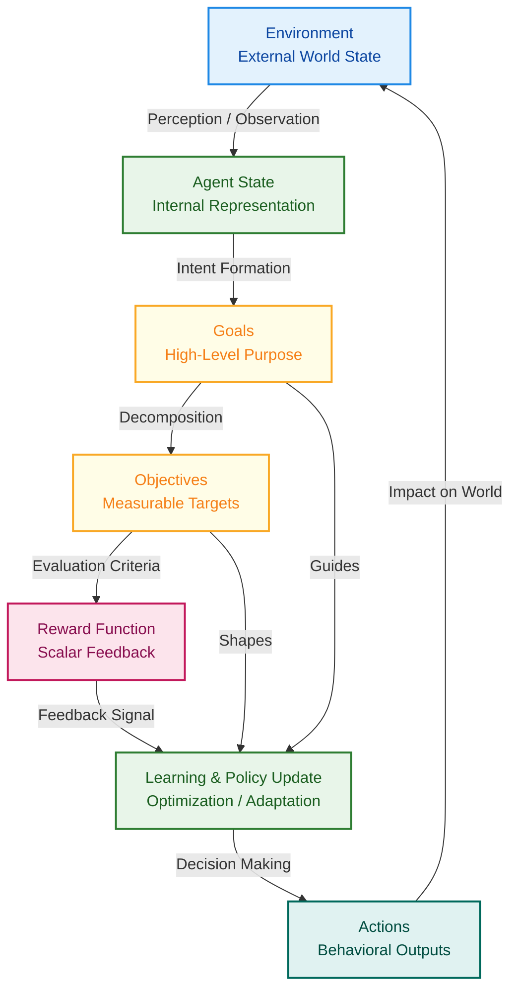
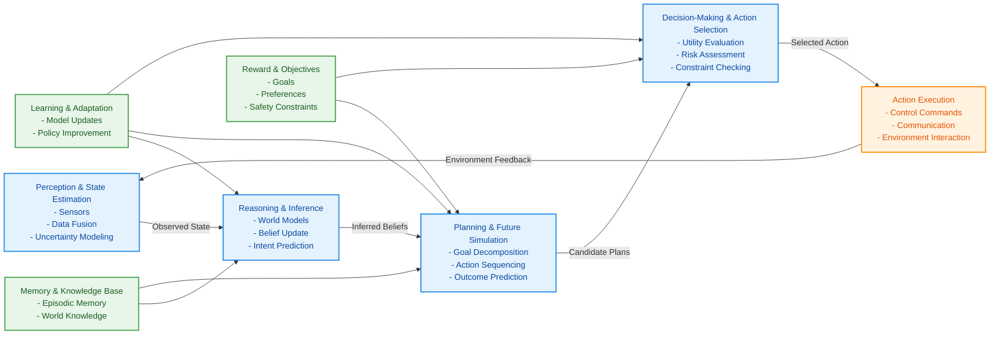
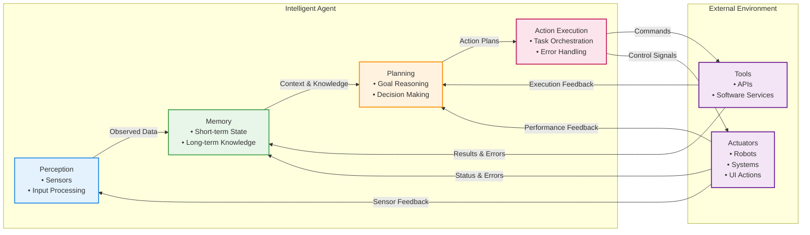
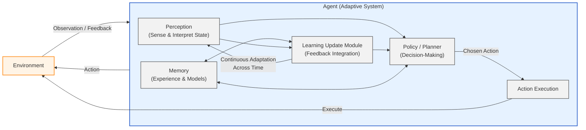

### Section: Agentic AI Systems: Architectural Overview and Design Philosophy  
### Part I: Foundations and Core Concepts of Agentic AI  
### Chapter 3: Core Components of Agentic AI Systems  
### Order: 1  

---

## 1. Overview and Context  

Agentic AI systems represent a significant evolution in artificial intelligence design, moving beyond static models that merely respond to inputs toward autonomous systems capable of initiating actions, reasoning over time, and pursuing goals independently. To understand agentic AI, it is essential to examine its core components—the functional building blocks that allow such systems to perceive their environments, reason about goals, act upon decisions, and adapt based on feedback. These components collectively define not only how agentic systems operate, but why they are fundamentally different from traditional AI architectures.

The concept of an “agent” originates from fields such as philosophy, economics, and cognitive science, where an agent is an entity that perceives its environment and acts upon it to achieve specific objectives. In artificial intelligence, this concept has matured into systems that combine perception, reasoning, planning, learning, and action in an integrated feedback loop. Agentic AI systems are especially relevant today due to the growth of large language models, multimodal perception systems, and scalable computing infrastructure, which together make it feasible to deploy autonomous agents in real-world environments.

Understanding the core components of agentic AI is critical for designers, researchers, and practitioners because architectural choices directly influence autonomy, safety, scalability, and effectiveness. Poorly designed components can lead to brittle behavior, excessive resource consumption, or unsafe actions, while well-integrated components enable robust, adaptable, and trustworthy agents. This chapter situates these components within the broader landscape of AI architectures and connects them to adjacent topics such as reinforcement learning, cognitive architectures, and human-in-the-loop systems. By examining these components in depth, readers gain the conceptual tools required to design, evaluate, and evolve agentic systems effectively.

---

## 2. Core Concepts  

At the heart of any agentic AI system lies a collection of interdependent conceptual elements that govern how the agent perceives, decides, acts, and learns. While different implementations emphasize different components, most agentic systems share a common structure rooted in the perception–cognition–action loop. This loop is foundational in both biological and artificial intelligence, reflecting how intelligent behavior emerges from continuous interaction with an environment.

One core concept is **agency**, which refers to the capacity of the system to act autonomously in pursuit of goals. Unlike reactive systems that operate only when explicitly triggered, agentic systems proactively initiate actions based on internally represented objectives. This requires explicit goal representations, mechanisms for prioritizing competing objectives, and criteria for evaluating progress. Agency is not binary but exists on a spectrum, ranging from simple rule-based autonomy to highly adaptive, self-directed behavior.

Another foundational concept is **environmental perception**, the process by which an agent gathers information about the world. This can include sensory inputs such as text, images, audio, telemetry, or structured data streams. In modern agentic AI, perception often relies on pretrained models—such as language or vision models—that transform raw inputs into semantically meaningful representations. Effective perception is crucial because all downstream reasoning depends on the accuracy, relevance, and timeliness of perceived data.

**Reasoning and decision-making** form the cognitive core of agentic systems. Reasoning involves interpreting perceptual inputs, maintaining internal state, anticipating consequences, and selecting actions. This may be achieved through symbolic logic, probabilistic models, neural networks, or hybrid approaches. Decision-making mechanisms encode trade-offs, constraints, and preferences, enabling the agent to choose among possible actions under uncertainty. These mechanisms matter because they determine how an agent handles ambiguity, risk, and competing priorities.

A closely related concept is **planning**, which involves generating sequences of actions that lead from the current state to a desired goal. Planning distinguishes agentic systems from purely reactive ones by enabling foresight and structured behavior over time. Planning may be short-term and reactive or long-term and strategic, depending on system complexity.

Finally, **learning and adaptation** allow agentic systems to improve performance over time. Through feedback from the environment or users, agents can update models, policies, or heuristics. This capacity for change is critical in dynamic environments where static behavior quickly becomes obsolete. Together, these concepts form a cohesive theoretical foundation for the components discussed in the next section.

---

## 3. Detailed Explanation  

### Perception and Environment Interface  

Perception serves as the gateway between an agent and the external world. In agentic AI systems, the environment interface abstracts raw data sources into structured inputs that the agent can reason about. This interface often includes sensors, APIs, and data pipelines that transform real-world signals into machine-readable formats.

For example, a customer support agent operating in an enterprise setting may perceive its environment through incoming emails, chat messages, CRM records, and user metadata. These inputs must be normalized and contextualized—identifying intent, sentiment, and urgency—before reasoning can occur. In more complex systems, perception may also include temporal awareness, such as recognizing trends or changes over time.

A key challenge in perception is balancing completeness with efficiency. Overloading the agent with irrelevant data can impair reasoning, while insufficient input may lead to poor decisions. Effective perception modules incorporate filtering, summarization, and prioritization strategies to ensure that the agent focuses on what matters most.

### Memory and Knowledge Representation  

Memory is a defining component of agentic AI, enabling continuity, context retention, and learning. Unlike stateless models, agentic systems require multiple forms of memory, such as short-term working memory for immediate reasoning, long-term episodic memory for past experiences, and semantic memory for general knowledge.

For instance, an autonomous research agent may store previous hypotheses, tested queries, and evaluation results. By recalling past attempts, the agent avoids redundant work and refines future strategies. Memory representations can be symbolic, vector-based, or hybrid, depending on the system’s reasoning approach.

The design of memory systems influences scalability and interpretability. Persistent memory enables long-horizon tasks but raises challenges around retrieval accuracy and data governance. Designers must carefully define what information is stored, how it is indexed, and when it is forgotten.

### Reasoning and Decision-Making Engine  

The reasoning engine interprets perceived inputs and memory to select appropriate actions. In modern agentic AI, this often involves large language models augmented with domain-specific rules, tools, or planners. Reasoning can be deductive, inductive, or abductive, depending on task requirements.

Consider a logistics optimization agent tasked with rerouting deliveries after a disruption. The agent must reason about constraints such as delivery deadlines, vehicle capacity, and traffic conditions. It may simulate multiple scenarios, evaluate trade-offs, and select a plan that optimizes cost and reliability. This process illustrates how reasoning intertwines with planning and evaluation components.

Decision-making mechanisms often incorporate scoring functions, utility metrics, or risk assessments. These ensure that actions align with organizational goals and ethical constraints, highlighting the importance of explicit decision criteria in agentic design.

### Action and Tool Execution  

Action components translate decisions into concrete outcomes. This may involve generating text, invoking APIs, controlling robots, or updating databases. The action layer must be reliable, auditable, and reversible where possible, as errors can have real-world consequences.

For example, an AI agent managing cloud infrastructure might act by scaling resources, deploying updates, or rolling back changes. Each action has side effects that must be anticipated and monitored. Well-designed action modules include validation steps, logging, and rollback mechanisms to enhance safety and transparency.

### Feedback and Learning Loops  

Feedback closes the agentic loop by informing the agent about the consequences of its actions. Feedback may be explicit, such as user ratings, or implicit, such as observed task outcomes. Learning mechanisms use this feedback to adjust internal models, improve decision thresholds, or refine strategies.

A personalized learning assistant, for instance, may adapt its recommendations based on student performance and engagement metrics. Over time, the agent becomes better aligned with individual needs, demonstrating the value of continuous adaptation.


```mermaid
flowchart LR
    %% Main Agentic AI Loop
    ENV[Environment<br/>• Real world or simulated context<br/>• Provides stimuli & constraints] -->|Observations / Data| PER[Perception Module<br/>• Sensors / Data Ingestion<br/>• Feature Extraction<br/>• Interpretation]

    PER -->|Structured Information| MEM[Memory & Knowledge<br/>• Short-term Memory (Context)<br/>• Long-term Knowledge Base<br/>• Learned Representations]

    MEM -->|Relevant Context & Knowledge| REA[Reasoning & Planning Engine<br/>• Goal Analysis<br/>• Decision Making<br/>• Strategy & Plan Generation]

    REA -->|Planned Actions| ACT[Action & Tool Execution<br/>• API Calls<br/>• Tool Use<br/>• Actuation]

    ACT -->|Actions & Effects| ENV

    %% Feedback / Learning Loop
    ENV -.->|Outcomes & Rewards| LEARN[Feedback & Learning Mechanism<br/>• Performance Evaluation<br/>• Error Analysis<br/>• Model Updates]

    LEARN -->|Knowledge Updates| MEM
    LEARN -->|Policy & Strategy Refinement| REA

    %% Styling
    classDef environment fill:#E3F2FD,stroke:#1E88E5,stroke-width:2px;
    classDef perception fill:#E8F5E9,stroke:#43A047,stroke-width:2px;
    classDef memory fill:#FFFDE7,stroke:#F9A825,stroke-width:2px;
    classDef reasoning fill:#F3E5F5,stroke:#8E24AA,stroke-width:2px;
    classDef action fill:#FBE9E7,stroke:#E53935,stroke-width:2px;
    classDef learning fill:#E0F7FA,stroke:#00838F,stroke-width:2px,stroke-dasharray: 5 5;

    class ENV environment
    class PER perception
    class MEM memory
    class REA reasoning
    class ACT action
    class LEARN learning
```


---

## 4. Real-World Applications  

One prominent application of agentic AI is in **enterprise workflow automation**. Modern digital workers can autonomously triage emails, schedule meetings, and generate reports. In one case study from a global consulting firm, an agentic system reduced administrative workload by continuously monitoring project updates, synthesizing action items, and proactively assigning tasks. The outcome was faster project cycles and improved employee satisfaction, demonstrating the value of autonomous coordination.

In **healthcare**, agentic AI systems assist clinicians by monitoring patient data and flagging anomalies. A hospital deployment involved an agent that tracked vital signs, lab results, and clinical notes, alerting staff to potential complications. Lessons learned included the importance of explainability and conservative action thresholds to build trust and ensure patient safety.

Another example is **software engineering agents** that autonomously debug codebases. These agents observe test failures, reason about potential causes, and attempt fixes using version control tools. Organizations using such systems report faster issue resolution and improved code quality, although human oversight remains essential.

In **financial trading**, agentic systems analyze market conditions, simulate strategies, and execute trades within predefined risk limits. A case study from a quantitative hedge fund showed how agentic architectures improved adaptability during volatile markets by adjusting strategies in real time.

Finally, **educational tutoring systems** leverage agentic AI to personalize learning pathways. By perceiving student interactions, reasoning about knowledge gaps, and adapting content delivery, these agents improve learning outcomes and engagement.

---

## 5. Practical Examples  

Consider a simplified Python-based agent using a language model and tools:

```python
# Define the agent's goal and available tools
goal = "Summarize key risks in the quarterly report"
tools = ["document_search", "risk_classifier"]

# Step 1: Perception - read input document
report_text = document_search("Q3_report.pdf")

# Step 2: Reasoning - identify risk-related sections
risks = risk_classifier(report_text)

# Step 3: Action - generate summary
summary = llm.generate(
    prompt=f"Summarize the following risks for executives: {risks}"
)

# Step 4: Feedback - log outcome for future improvement
memory.store({"task": goal, "output": summary})
```

In this scenario, each step reflects a core component: perception gathers data, reasoning processes it, action produces output, and memory retains experience. Such modular design enables scalability and maintainability.

Another practical scenario involves a customer service agent that escalates issues when confidence is low. By defining thresholds and feedback mechanisms, designers ensure responsible autonomy while retaining human oversight.

---

## 6. Common Patterns and Best Practices  

One effective pattern is **modular decomposition**, where perception, reasoning, and action are separated into distinct components. This improves debugging, scalability, and adaptability. Another best practice is **explicit goal and constraint representation**, which prevents agents from pursuing undesirable behaviors due to ambiguous objectives.

Designers should also implement **human-in-the-loop checkpoints** for high-stakes actions. This hybrid approach balances efficiency with safety. Additionally, **logging and observability** are critical for understanding agent behavior and diagnosing failures. By making internal states and decisions inspectable, teams can continuously refine system performance.

Finally, incremental autonomy—gradually expanding agent responsibilities—allows organizations to build trust and identify issues early.

---

## 7. Potential Challenges and Solutions  

Common challenges include brittle reasoning, uncontrolled autonomy, and memory overload. Agents may fail in edge cases if reasoning models are insufficiently robust. To address this, designers can combine symbolic constraints with learned models.

Another issue is action misalignment, where agents act in technically correct but contextually inappropriate ways. Preventive measures include constraint checks, simulation environments, and approval workflows. Memory-related challenges, such as storing irrelevant data, can be mitigated through retention policies and relevance scoring.

---

## 8. Integration with Other Concepts  

Agentic AI systems integrate closely with reinforcement learning, where feedback informs policy updates. They also intersect with multi-agent systems, enabling coordination and negotiation among agents. Additionally, alignment and AI safety frameworks provide ethical and governance foundations, ensuring that agentic behavior aligns with human values and institutional norms.

---

## 9. Key Takeaways  

The core components of agentic AI systems—perception, memory, reasoning, action, and learning—form an interconnected architecture that enables autonomy and adaptability. Unlike traditional AI models, agentic systems operate as continuous loops, integrating context over time and acting proactively toward goals. Thoughtful design of each component is critical, as weaknesses in one area can undermine overall system performance. By understanding how these components interact, practitioners gain the ability to build AI systems that are not only powerful but also reliable, interpretable, and aligned with human intent.

---

## 10. Further Reading  

Readers seeking deeper insight should explore “Artificial Intelligence: A Modern Approach” by Russell and Norvig for foundational agent concepts. Research on cognitive architectures such as SOAR and ACT-R provides historical context for integrated reasoning systems. Recent papers on autonomous agents built on large language models offer practical implementation insights. Finally, resources on AI alignment and safety are essential for understanding responsible deployment of agentic systems.

---

Section: Perception, Inputs, and Environment Modeling  
Part I: Foundations and Core Concepts of Agentic AI  
Chapter 3: Core Components of Agentic AI Systems  
Order: 2  

---

### 1. Overview and Context  

One of the defining characteristics that separates agentic AI systems from traditional software or reactive machine learning models is their ability to perceive, interpret, and model the environment in which they operate. Perception, inputs, and environment modeling together form the sensory and contextual foundation of agentic intelligence. Without these capabilities, an AI agent would lack situational awareness, operate blindly, and fail to adapt to changes over time. In essence, perception is how an agent “experiences” the world, inputs are the raw and structured data streams that feed that experience, and environment modeling is how the agent builds an internal representation of reality to reason, plan, and act.

Historically, AI systems relied heavily on fixed inputs and predefined contexts. A classification model, for example, takes a static input and returns an output without any ongoing awareness of its surroundings. Agentic AI systems, by contrast, exist in dynamic environments where inputs may be noisy, incomplete, delayed, or contradictory. A goal-seeking AI assistant, an autonomous robot, or a trading agent must constantly incorporate new information, reassess the environment, and revise its internal understanding accordingly. This makes perception and environment modeling not supplementary features, but central components of intelligent behavior.

These concepts are deeply connected to broader ideas in cognitive science, robotics, control theory, and reinforcement learning. Humans and animals continuously sense their environment, filter irrelevant signals, build mental models of cause and effect, and use those models to make decisions. Agentic AI systems draw inspiration from these biological processes while implementing them through computational architectures. Understanding how agents perceive and model their environment is therefore essential for designing systems that are robust, adaptive, and capable of long-term autonomy.

---

### 2. Core Concepts  

At the heart of perception in agentic AI lies the transformation of raw data into meaningful representations. Inputs may arrive in many forms, such as text, numerical streams, images, audio signals, sensor readings, or structured database entries. On their own, these inputs are often uninterpretable or insufficient for decision-making. Perception involves filtering, preprocessing, and interpreting these signals to extract actionable information. This process answers the fundamental question: “What is happening around me right now?”

Environment modeling extends perception by giving the agent memory, structure, and predictive power. Rather than reacting only to the most recent input, an agent builds an internal model that captures the state of the environment, its dynamics, and its constraints. This model may include representations of physical space, temporal sequences, other agents, causal relationships, or abstract states such as market conditions or user intent. The quality of this internal model directly affects the agent’s ability to plan, anticipate outcomes, and recover from unexpected events.

Another essential concept is partial observability. In most real-world scenarios, an agent cannot perceive the full state of its environment. Sensors are limited, data may be delayed, and important variables may be hidden. Agentic AI systems must therefore reason under uncertainty, combining perception with inference to estimate the most likely state of the world. Techniques such as probabilistic modeling, belief states, and Bayesian inference are often used to address this challenge.

The temporal dimension is equally critical. Environments evolve over time, and perception is not a one-time event but a continuous process. Agentic systems must integrate past observations with current inputs to identify trends, detect changes, and recognize patterns. This temporal awareness allows agents to distinguish between transient noise and meaningful shifts in the environment, enabling more stable and reliable behavior.

Finally, perception and environment modeling are tightly coupled with action. Actions taken by the agent often modify the environment, which in turn affects future inputs. This perception-action loop is foundational to agentic AI. Instead of treating inputs as independent events, the agent understands that its own behavior influences what it will perceive next. Designing this loop effectively is critical for achieving coherent and purposeful autonomy.

---

### 3. Detailed Explanation  

### Perception Pipelines and Input Processing  

Perception in agentic AI begins with input acquisition. Inputs can be continuous or discrete, structured or unstructured. For example, a robotic agent may receive camera images and lidar data, while a digital assistant receives user messages, system logs, and API responses. The first challenge is to preprocess these inputs into a usable form. This may include normalization, noise reduction, feature extraction, and semantic interpretation.

Consider a conversational agent operating in a customer support environment. Raw user inputs arrive as text messages that may contain spelling errors, informal language, or ambiguous intent. The perception pipeline might include language detection, tokenization, embedding generation, intent classification, and entity extraction. Each step reduces complexity and increases semantic clarity. By the end of the pipeline, the agent no longer sees raw text, but structured signals such as “user intent: refund request” or “entity: order ID.”

### Environment Representation and State Modeling  

Once inputs are perceived, the agent constructs an internal representation of the environment. This representation, often referred to as the state, encapsulates what the agent believes to be true about the world at a given time. The state may include explicit variables, such as position or inventory levels, as well as inferred variables, such as trustworthiness of information or likelihood of certain outcomes.

Different agentic systems use different modeling approaches. Some rely on symbolic representations, such as graphs or rule-based systems, which emphasize interpretability and explicit relationships. Others use learned representations, such as neural embeddings, which capture complex patterns but may be opaque. Hybrid approaches are increasingly common, combining symbolic structure with learned components to balance flexibility and explainability.

### Dynamics and Prediction  

Environment modeling is not static. Agents must understand how the environment changes in response to actions and external forces. This requires modeling dynamics, which describe how the current state transitions to future states. In reinforcement learning, this is often formalized as a transition function. In real-world systems, dynamics may be learned from data or approximated through heuristics.

For instance, a supply chain optimization agent must predict how ordering decisions will affect inventory levels, delivery times, and costs. These predictions depend on historical data, known constraints, and stochastic factors such as demand variability. Accurate environment modeling enables the agent to simulate future scenarios and choose actions that optimize long-term outcomes.

### Uncertainty and Belief Management  

Real-world environments are uncertain, and agentic AI systems must explicitly manage that uncertainty. Rather than maintaining a single definitive state, agents may maintain a belief distribution over possible states. This approach allows them to weigh different hypotheses and update beliefs as new evidence arrives.

A self-driving car provides a clear example. Sensors may give conflicting signals about the position of nearby objects. The agent must reconcile these signals, estimate probabilities, and act cautiously when uncertainty is high. Environment modeling under uncertainty is essential for safety-critical applications and is increasingly relevant in domains such as finance, healthcare, and autonomous decision-making.


```mermaid
flowchart TD
    %% Nodes
    ENV[External Environment]
    SENSORS[Input Sensors & Data Streams\n(Cameras, Sensors, Logs, Text)]
    PERCEPT[Perception Pipeline]
    PRE[Preprocessing\n(Cleaning, Filtering)]
    INTERP[Interpretation\n(Feature Extraction, Signal Detection)]
    STATE[Internal Environment Model /\nState Representation]
    PRED[Prediction & Reasoning Module\n(Forecasting, Planning, Inference)]
    ACT[Action Output\n(Commands, Decisions)]
    
    %% Connections
    ENV -->|Physical & Digital Signals| SENSORS
    SENSORS -->|Raw Inputs| PERCEPT
    PERCEPT --> PRE
    PRE --> INTERP
    INTERP -->|Perceived State| STATE
    STATE -->|Current Beliefs & Context| PRED
    PRED -->|Chosen Actions| ACT
    ACT -->|Affects| ENV
    
    %% Feedback Loops
    STATE -->|Model Updates| PERCEPT
    PRED -->|Expected Outcomes| STATE
    
    %% Styling
    classDef envStyle fill:#E3F2FD,stroke:#1E88E5,stroke-width:2px
    classDef sensorStyle fill:#F1F8E9,stroke:#7CB342,stroke-width:2px
    classDef processStyle fill:#FFFDE7,stroke:#FBC02D,stroke-width:2px
    classDef stateStyle fill:#E8F5E9,stroke:#43A047,stroke-width:2px
    classDef reasonStyle fill:#FCE4EC,stroke:#D81B60,stroke-width:2px
    classDef actionStyle fill:#EDE7F6,stroke:#5E35B1,stroke-width:2px
    
    class ENV envStyle
    class SENSORS sensorStyle
    class PERCEPT,PRE,INTERP processStyle
    class STATE stateStyle
    class PRED reasonStyle
    class ACT actionStyle
```


---

Section: Goals, Objectives, and Reward Structures  
Part I: Foundations and Core Concepts of Agentic AI  
Chapter 3: Core Components of Agentic AI Systems  

---

## 1. Overview and Context  

At the heart of every agentic AI system lies a fundamental question: *why does the agent act the way it does?* While perception and environment modeling explain how an agent understands the world, goals, objectives, and reward structures explain *what the agent is trying to achieve* and *how success or failure is evaluated*. This section explores these motivational components in depth, showing how they transform an AI system from a passive observer into an active, purposeful decision-maker.

Traditional software systems typically follow fixed instructions encoded by human developers. Even many machine learning models are designed merely to predict outcomes or classify inputs without pursuing long-term purposes. Agentic AI systems, however, are defined by their ability to pursue goals over time, make trade-offs, adapt their strategies, and learn from feedback. Goals provide direction, objectives break down that direction into achievable targets, and reward structures translate abstract success criteria into measurable signals that guide learning and behavior.

In earlier sections, we discussed perception, inputs, and environment modeling as the agent’s means of understanding the world. Goals and reward mechanisms are the complementary components that guide action within that world. Without explicit goals, an agent has no basis for prioritizing one action over another. Without well-designed reward structures, even a clearly defined goal can lead to unintended or harmful behaviors. Together, these elements form the motivational backbone of agentic AI systems, linking cognition, planning, learning, and action into a coherent loop.

Understanding goals, objectives, and rewards is critical not only for building effective AI agents, but also for ensuring alignment with human intentions, ethical constraints, and real-world requirements. Misaligned goals or poorly specified rewards are a common source of system failures, unexpected behaviors, and safety concerns. As agentic AI systems become more autonomous and influential, mastery of these concepts becomes essential for researchers, engineers, and decision-makers alike.

---

## 2. Core Concepts  

At a conceptual level, goals in agentic AI represent desired end states that the agent seeks to bring about through its actions. A goal might be as simple as “reach a destination” or as complex as “maximize long-term user satisfaction while minimizing risk and cost.” Goals are typically expressed at a relatively high level of abstraction and often span extended time horizons. They provide global direction rather than immediate instructions.

Objectives serve as more concrete, intermediate targets that help operationalize goals. While a goal defines *what* the agent ultimately wants, objectives define *how progress toward that goal is measured and structured*. For example, an autonomous delivery robot may have the goal of completing deliveries efficiently and safely. Associated objectives might include minimizing travel time, avoiding obstacles, conserving battery power, and adhering to traffic regulations. Objectives translate a broad aspiration into actionable criteria that can be evaluated continuously.

Reward structures are the mechanisms by which objectives are turned into numerical or symbolic feedback signals. In many agentic AI systems, especially those based on reinforcement learning, rewards are scalar values that quantify how desirable an outcome or action is. Positive rewards reinforce behaviors that advance objectives, while negative rewards (penalties) discourage undesirable actions. Importantly, rewards do not have to be immediate; they can be delayed, cumulative, or discounted over time to reflect long-term consequences.

The theoretical foundation for these ideas originates in decision theory, control theory, and reinforcement learning. In Markov Decision Processes (MDPs), for instance, an agent operates within an environment defined by states, actions, transition dynamics, and a reward function. The reward function encodes the agent’s objectives, and the agent’s policy aims to maximize expected cumulative reward. Modern agentic AI systems extend this framework by incorporating hierarchical goals, multi-objective optimization, intrinsic motivation, and dynamic reward shaping.

These concepts matter because AI agents do not inherently understand human values or intentions. They only respond to the formal structures we define. A well-specified goal-objective-reward alignment enables agents to act robustly and adaptively across diverse situations. Conversely, vague or poorly aligned structures can lead an agent to exploit loopholes, over-optimize trivial metrics, or pursue outcomes that technically satisfy the reward function but violate the spirit of the goal.

---

## 3. Detailed Explanation  

### Goals as Long-Term Intentions  

Goals define the overall purpose of an agent’s existence within a system. They answer the question, “What should this agent be trying to accomplish over time?” In agentic AI, goals can be fixed or adaptive, externally imposed or internally generated. Fixed goals are defined explicitly by human designers, such as “maintain room temperature at 22°C.” Adaptive or learned goals may evolve based on experience, user feedback, or higher-level meta-objectives.

Goals can also be hierarchical. High-level goals are decomposed into sub-goals, which in turn guide lower-level actions. This hierarchical structure is essential for scalability, as it allows complex tasks to be managed by breaking them into manageable components. For example, a virtual personal assistant’s high-level goal might be “support user productivity.” Sub-goals could include scheduling meetings, prioritizing tasks, and managing notifications.

Timing is another critical aspect of goals. Short-term goals focus on immediate outcomes, while long-term goals consider future consequences and delayed rewards. Balancing short-term and long-term goals is a central challenge in agent design, particularly in environments where immediate gratification conflicts with sustainable success.

### Objectives and Measurable Targets  

Objectives make goals operational by specifying measurable criteria for success. While goals are often qualitative, objectives are typically quantitative or at least formally evaluable. An objective might specify thresholds, constraints, or optimization targets. For instance, “arrive within 30 minutes,” “use less than 10% battery per hour,” or “maintain error rates below 1%.”

In multi-objective scenarios, an agent must balance competing objectives. These trade-offs are rarely trivial. Improving one objective may worsen another, requiring prioritization or compromise. Techniques such as weighted sums, Pareto optimization, or rule-based overrides are often used to manage these trade-offs. The choice of method reflects design decisions about what the system should prioritize under conflict.

Objectives can also be context-dependent. An autonomous vehicle may prioritize speed on a highway but prioritize safety and caution in residential areas. This dynamic adjustment requires the agent to interpret environmental cues and switch objective weightings accordingly.

### Reward Structures and Feedback Loops  

Reward structures translate objectives into feedback signals that drive learning and decision-making. In reinforcement learning, rewards are typically numerical values assigned after an action or sequence of actions. However, in broader agentic systems, rewards may take other forms, such as symbolic signals, preference updates, or reputational scores.

Designing a reward structure is one of the most critical and delicate tasks in agentic AI. A reward that is too sparse may slow learning, while one that is too dense may encourage myopic optimization. Reward shaping, which involves adding intermediate rewards, is often used to guide agents toward desired behaviors without distorting long-term objectives.

Delayed rewards introduce additional complexity. Many real-world tasks require an agent to endure short-term costs for long-term benefits. Discount factors are commonly used to balance present and future rewards, influencing how far ahead the agent “thinks.”





---

## Planning, Reasoning, and Decision-Making Mechanisms

### 1. Overview and Context

At the core of agentic AI systems lies the ability not merely to perceive or react, but to **deliberately decide what to do next** in pursuit of defined goals. Planning, reasoning, and decision-making mechanisms are the cognitive engines that transform goals and rewards into concrete, actionable behavior. While the previous section explored *what* an agent wants to achieve through goals, objectives, and reward structures, this section explains *how* an agent figures out the path from intention to action.

In traditional software systems, behavior is usually pre-scripted through explicit rules or workflows designed by humans. Agentic AI systems, by contrast, must operate in environments that are often uncertain, dynamic, partially observable, or even adversarial. In such settings, predefining all possible behaviors is impractical or impossible. Planning and reasoning mechanisms allow AI agents to evaluate possible futures, anticipate outcomes, weigh trade-offs, and choose actions that best align with their objectives.

These mechanisms are foundational because they bridge perception and action. Perception tells the agent what the world looks like right now; goals define what “success” means; but planning and decision-making determine *which actions to take, in which order, and under which conditions*. This triad is what distinguishes agentic AI from reactive systems like rule-based bots or simple classifiers.

Moreover, planning and reasoning sit at the intersection of several disciplines, including artificial intelligence, cognitive science, operations research, economics, and control theory. Concepts such as search, optimization, probabilistic inference, and utility maximization all converge here. In modern Agentic AI, these classical ideas are often combined with machine learning, large language models, and reinforcement learning to create systems capable of flexible and adaptive behavior.

Understanding planning, reasoning, and decision-making mechanisms is therefore essential for designing robust, explainable, and trustworthy AI agents that can operate autonomously in real-world domains such as robotics, finance, healthcare, logistics, and digital assistants.

---

### 2. Core Concepts

Planning, reasoning, and decision-making are closely related but distinct concepts, each addressing a specific aspect of intelligent action.

**Planning** refers to the process of selecting and sequencing actions to move from a current state to a desired future state. A plan is essentially a structured hypothesis about the future: “If I take these actions, in this order, the world will evolve in a way that satisfies my goals.” Planning typically assumes some model of the environment, including how actions affect states and what constraints exist.

**Reasoning** encompasses the cognitive processes used to draw conclusions, infer hidden information, evaluate alternatives, and apply logic or learned knowledge. In agentic systems, reasoning may involve deductive logic, probabilistic inference, analogical reasoning, or reasoning over abstract representations such as symbolic knowledge graphs or natural language descriptions. Reasoning answers questions like “What does this situation imply?” or “What can I infer from incomplete information?”

**Decision-making** is the act of choosing one option among many, often under uncertainty and with limited resources. It is the moment where planning and reasoning converge into action. Decision-making mechanisms typically involve evaluating expected outcomes, costs, risks, and rewards associated with different choices and selecting the one that best aligns with the agent’s objectives.

These concepts are deeply intertwined. Planning depends on reasoning to evaluate future states; reasoning is often guided by the decisions an agent needs to make; and decision-making relies on both planning and reasoning to assess the consequences of actions. In practice, many agentic systems blur these boundaries, implementing integrated architectures where planning, reasoning, and decision-making occur continuously and iteratively.

From a theoretical perspective, these mechanisms rest on well-established frameworks. Classical AI planning draws on state-space search and graph theory. Decision theory contributes models such as Markov Decision Processes (MDPs) and Partially Observable MDPs (POMDPs). Bayesian reasoning provides tools for dealing with uncertainty, while game theory addresses multi-agent decision scenarios. In modern agentic AI, these foundations are often combined with neural models that learn representations or heuristics to guide planning and reasoning efficiently at scale.

The importance of these concepts cannot be overstated. Without effective planning, an agent may act myopically, achieving short-term rewards while undermining long-term goals. Without reasoning, it may fail to generalize knowledge or adapt to unexpected situations. Without sound decision-making, it may behave inconsistently, unpredictably, or unsafely.

---

### 3. Detailed Explanation

#### ### Planning Mechanisms in Agentic AI

Planning mechanisms define how an agent constructs and evaluates possible sequences of actions. At a basic level, planning involves exploring a space of states connected by actions, searching for a path that leads from the current state to a goal state. Early AI planners, such as STRIPS-based systems, relied on symbolic representations and explicit rules. While powerful in constrained domains, they struggled with scale and uncertainty.

Modern agentic AI systems often employ **hierarchical planning**, where goals are decomposed into sub-goals and actions. For example, a household robot may have the high-level goal of “prepare dinner,” which is broken down into tasks like “choose a recipe,” “gather ingredients,” and “cook food.” Each sub-task may involve its own planning process.

Planning can be **offline**, where plans are generated before execution, or **online**, where planning happens concurrently with acting. In dynamic environments, online planning is critical because assumptions may change as new information becomes available.

#### ### Reasoning Under Uncertainty and Abstraction

Real-world environments are rarely fully observable or deterministic. Reasoning mechanisms enable agents to cope with uncertainty, ambiguity, and incomplete information. Probabilistic reasoning frameworks, such as Bayesian networks, allow an agent to maintain beliefs about the world and update them as new evidence arrives.

In more abstract domains, reasoning may involve symbolic manipulation or natural language understanding. Large language model–based agents, for example, perform reasoning by leveraging learned statistical patterns to generate explanations, infer intentions, or simulate hypothetical scenarios. While such reasoning may not be formally logical, it can be highly effective when grounded by tools, memory, and verification mechanisms.

Abstraction is another critical aspect of reasoning. Agents cannot reason effectively if every decision requires considering every low-level detail. By abstracting state representations and actions, agents can reason at appropriate levels of granularity, improving efficiency and interpretability.

#### ### Decision-Making and Action Selection

Decision-making mechanisms operationalize planning and reasoning by selecting actions. In many agentic systems, this selection is guided by an **evaluation function** that estimates the expected utility or reward of an action. In reinforcement learning–based agents, this may take the form of a value function or policy learned through experience.

Decision-making often involves trade-offs. An action that maximizes immediate reward may increase long-term risk. Conversely, a conservative action may reduce uncertainty but delay progress. Effective decision-making mechanisms explicitly model these trade-offs, sometimes incorporating risk sensitivity, ethical constraints, or safety rules.

Decision-making is not always a single-step process. Many agents continuously reassess decisions as new information arrives. This iterative loop—observe, reason, plan, decide, act—is central to adaptive intelligence.





---

## Memory Systems and Knowledge Management  

### Overview and Context (Foundations of Agentic Intelligence)

In agentic AI systems, memory is not a passive storage mechanism but an active cognitive substrate that shapes how an agent understands the world, reasons about situations, and decides what to do next. While planning, reasoning, and decision-making determine *how* an agent selects actions, memory systems determine *what the agent knows*, *what it remembers*, and *how past experience influences future behavior*. Without robust memory and knowledge management, even the most sophisticated planning algorithms operate in a vacuum, unable to learn from history or maintain long-term coherence.

Memory systems are especially critical in agentic settings because these systems are designed to operate over extended horizons, interact repeatedly with environments and users, and adapt their behavior over time. Unlike traditional reactive AI, which processes each input independently, agentic AI must accumulate knowledge, maintain context across interactions, and update its internal world models continuously. This makes memory not merely a supporting component but a foundational pillar of intelligence and agency.

From a broader perspective, memory systems connect perception and action through time. They allow agents to recognize recurring patterns, recall relevant facts, track goals and commitments, and integrate new information with prior knowledge. Knowledge management layers on top of memory, introducing structure, organization, retrieval strategies, and governance over what is stored and how it is used. Together, memory systems and knowledge management enable learning, personalization, long-term planning, and explainability—key attributes of advanced agentic AI.

In the overall architecture of agentic AI systems, memory serves as the connective tissue that binds sensing, reasoning, and action into a coherent whole. This section explores the conceptual foundations, technical mechanisms, and practical implications of memory systems and knowledge management, illustrating why they are indispensable for building intelligent, reliable, and adaptive agents.

---

### Core Concepts of Memory and Knowledge in Agentic AI

At its core, a memory system in agentic AI is responsible for retaining and retrieving information across time to support cognition and behavior. However, not all memories are the same. Drawing inspiration from human cognition and cognitive architecture research, AI memory systems are often divided into multiple types based on scope, duration, and function.

One foundational concept is the distinction between **short-term (or working) memory** and **long-term memory**. Working memory holds immediate context—recent observations, current goals, intermediate reasoning states, and active plans. It is transient, capacity-limited, and closely tied to ongoing decision-making. Long-term memory, by contrast, stores accumulated knowledge, experiences, learned patterns, and stable facts that persist across tasks and sessions.

Knowledge management extends beyond raw memory storage to address how information is structured, indexed, updated, and retrieved. This includes explicit knowledge representations such as symbolic rules, knowledge graphs, ontologies, and embeddings, as well as implicit knowledge encoded within learned models. In agentic systems, effective knowledge management ensures that relevant information can be accessed efficiently and appropriately, avoiding both information overload and critical omissions.

Another central concept is **episodic versus semantic memory**. Episodic memory captures specific experiences—what happened, when, in what context, and with what outcome. Semantic memory, on the other hand, represents generalized knowledge abstracted from experiences, such as facts, concepts, and relationships. For an agent, episodic memory supports learning from experience and accountability, while semantic memory enables generalization and reasoning across contexts.

Memory systems also play a crucial role in **credit assignment and learning**. By linking outcomes back to past actions and decisions, memory enables agents to refine strategies, update beliefs, and improve performance over time. Without adequate memory, reinforcement learning signals lose much of their explanatory power, and agents struggle to adapt effectively.

Finally, memory and knowledge management are deeply intertwined with issues of scalability, reliability, and alignment. As agents accumulate vast amounts of information, mechanisms are needed to prioritize, compress, forget, or reinterpret memories. Poorly managed memory can lead to inconsistent behavior, outdated beliefs, or unintended bias. Thus, understanding and designing memory systems is not merely a technical challenge but a cornerstone of responsible agentic AI.

---

### Detailed Explanation of Memory Systems and Knowledge Management

#### Types of Memory in Agentic AI

Agentic AI systems typically implement multiple layers of memory, each serving a distinct cognitive role. **Working memory** maintains the immediate state of the agent: current inputs, intermediate reasoning chains, active hypotheses, and near-term goals. This memory is frequently updated and cleared, mirroring human attentional processes. For example, a conversational agent uses working memory to track the current topic, user intent, and recent dialogue turns.

**Long-term memory** persists across interactions and tasks. It includes learned facts, user preferences, procedural knowledge, and historical experiences. In practice, this may be implemented using databases, vector stores, or persistent knowledge graphs. Long-term memory allows agents to personalize responses, maintain continuity, and build cumulative expertise.

A further refinement distinguishes **episodic memory**, which records sequences of events with contextual metadata, from **semantic memory**, which abstracts stable knowledge. An autonomous research agent, for instance, might store episodic memories of failed experiments and semantic memories about successful methodologies. Over time, episodic memories can be consolidated into semantic knowledge through learning processes.

#### Knowledge Representation and Organization

The effectiveness of a memory system depends heavily on how knowledge is represented. Symbolic representations—such as rules, frames, and graphs—offer interpretability and explicit structure but can be brittle and difficult to scale. Subsymbolic representations—such as embeddings learned by neural models—provide flexibility and robustness but are harder to inspect directly.

Modern agentic AI systems often adopt **hybrid memory architectures**, combining symbolic knowledge bases with embedding-based retrieval. For example, an agent might use a knowledge graph to represent explicit domain rules while using a vector database to retrieve semantically similar past experiences. Knowledge management orchestrates these components, ensuring consistency, relevance, and accessibility.

#### Memory Retrieval and Contextualization

Storing information is only half the challenge; retrieving the *right* information at the *right time* is equally critical. Retrieval mechanisms may rely on exact queries, semantic similarity, temporal proximity, or relevance to current goals. Contextualization layers filter and adapt retrieved knowledge, integrating it into the agent’s reasoning process.

Consider an agent planning a complex task. It must retrieve prior plans, relevant constraints, and known pitfalls without overwhelming working memory. Effective retrieval balances recall with precision, enabling focused reasoning rather than indiscriminate memory access.

#### Learning, Update, and Forgetting

Memory systems must support continuous updates. New information may reinforce existing knowledge, contradict it, or render it obsolete. Knowledge management includes mechanisms for conflict resolution, versioning, and decay. Forgetting is not a flaw but a feature, preventing outdated or low-value information from degrading performance.

In long-lived agents, forgetting policies may be guided by relevance, recency, or utility. For example, user-specific preferences may decay over time unless reinforced, while core domain knowledge remains stable. These strategies ensure that memory remains aligned with current realities and goals.


```mermaid
flowchart TD
    %% Top Environment and Perception
    ENV[Environment] -->|sensory input| PER[Perception Module]

    %% Middle Layer: Cognition
    PER -->|observations| WM[Working Memory]
    WM <-->|context & state| RP[Reasoning / Planning / Decision]
    RP -->|plans & queries| WM

    %% Bottom Layer: Long-Term Memory
    WM -->|store experiences| LTM[Long-Term Memory]
    LTM -->|retrieve knowledge| WM

    subgraph LTM[Long-Term Memory]
        direction LR
        EM[Episodic Memory\n(events, experiences)]
        SM[Semantic Knowledge\n(facts, concepts)]
        EM <-->|consolidation| SM
    end

    %% Knowledge Management Side Services
    subgraph KM[Knowledge Management Services]
        direction TB
        IDX[Indexing]
        RET[Retrieval]
        UPD[Update & Consolidation]
        FOR[Forgetting & Pruning]
    end

    %% Interactions with Knowledge Management
    IDX <-->|organize| LTM
    RET <-->|query| WM
    UPD <-->|learn from feedback| RP
    FOR <-->|quality control| LTM

    %% Continuous Feedback Loops
    RP -->|actions| ENV
    ENV -->|feedback & rewards| PER

    %% Styling
    classDef env fill:#e6f7ff,stroke:#3399cc,stroke-width:2px;
    classDef core fill:#f0f5ff,stroke:#4c6ef5,stroke-width:2px;
    classDef memory fill:#fff7e6,stroke:#f59f00,stroke-width:2px;
    classDef km fill:#f6ffed,stroke:#52c41a,stroke-width:2px;

    class ENV env;
    class PER,WM,RP core;
    class EM,SM memory;
    class IDX,RET,UPD,FOR km;
```


---

Part I: Foundations and Core Concepts of Agentic AI  
Chapter 3: Core Components of Agentic AI Systems  
Section 6: Tool Use, Actuators, and Action Execution  

============================================================

### 1. Overview and Context (Foundations of Action in Agentic AI)

In agentic AI systems, reasoning and planning have little practical value unless they can be translated into concrete actions that change the external world. Tool use, actuators, and action execution form the critical bridge between an agent’s internal cognitive processes and its real-world impact. While memory systems determine what an agent knows and planning systems decide what it should do, action execution determines whether the agent can actually do it. This section explores how intelligent agents interact with tools, software, hardware, and environments to carry out decisions effectively, safely, and reliably.

At a foundational level, action execution answers a deceptively simple question: how does an agent make something happen? For a digital assistant, the “something” might involve calling an API, modifying a database, or sending an email. For a robotic agent, it could involve moving motors, gripping objects, or navigating physical space. In both cases, the agent must translate abstract intentions—such as “gather information,” “update a record,” or “move to location X”—into precise sequences of operations that external systems can interpret and respond to.

The importance of tool use and actuators grows as AI systems become more autonomous. Early AI systems primarily generated text or classifications, but modern agentic systems are expected to browse the web, manipulate files, control infrastructure, and interact with humans and machines alike. This amplifies both capability and risk: a well-designed action system enables powerful automation, while a poorly designed one can lead to errors, inefficiencies, or unintended consequences. Understanding how tools are selected, how actions are executed, and how feedback is incorporated is therefore essential to building robust, trustworthy agentic AI.

This section situates tool use and action execution within the broader agent architecture, highlighting how they integrate with perception, memory, planning, and learning. Together, these components form the complete perception–decision–action loop that defines intelligence in both artificial and biological systems.

------------------------------------------------------------

### 2. Core Concepts

At the heart of action execution in agentic AI are three tightly connected concepts: tools, actuators, and execution control. A tool is any external resource the agent can invoke to achieve a goal. Tools may be purely digital, such as software libraries, web APIs, databases, search engines, or communication platforms. They may also be physical, such as sensors, robotic arms, wheels, or grippers. What makes something a “tool” is not its physicality but the fact that it extends the agent’s capabilities beyond its internal computation.

Actuators are a specific class of tools that produce physical or persistent effects in an environment. In robotics, actuators include motors, servos, hydraulics, and pneumatic systems that convert control signals into movement or force. In digital agents, actuators are more abstract but conceptually similar: issuing a command to a cloud service, altering system state, or triggering an automated workflow all function as actuators that create change outside the agent’s internal model.

Action execution refers to the processes by which an agent selects tools, configures their parameters, issues commands, monitors outcomes, and responds to success or failure. This involves more than simply calling a function. Effective execution requires understanding tool affordances (what the tool can and cannot do), preconditions (what must be true before execution), postconditions (what should be true afterward), and side effects (what else might change). These considerations are critical for avoiding errors and for enabling complex multi-step behaviors.

The theoretical foundation for these ideas comes from control theory, robotics, and cognitive science. In control theory, an intelligent system minimizes error between desired and actual states through feedback loops. In cognitive science, action is viewed as an extension of perception and intention, mediated by learned mappings between goals and motor commands. Agentic AI combines these perspectives: it plans actions based on symbolic reasoning or learned policies, executes them through tools and actuators, and then feeds the results back into memory and planning systems.

These concepts matter because they determine an agent’s real effectiveness. An agent that reasons brilliantly but cannot reliably execute actions remains academic. Conversely, a system with robust action execution but weak reasoning may behave efficiently but unintelligently. True agency emerges only when cognition and action execution are designed as a tightly integrated whole.

------------------------------------------------------------

### 3. Detailed Explanation

#### 3.1 Tool Abstraction and Interfaces

Tools in agentic systems are typically exposed through standardized interfaces. This abstraction allows an agent to reason at a high level (“retrieve customer data”) without needing to know the low-level implementation details (“send an HTTP GET request with specific headers”). Well-designed tool interfaces clearly define inputs, outputs, constraints, and failure modes. This clarity is what allows agents to plan and execute reliably.

For example, consider a customer support agent that uses a CRM system. The CRM API is a tool. The agent does not need to understand database schemas or network protocols; it only needs to know that providing a customer ID returns a profile object. This abstraction allows the planning module to treat the tool as a reusable capability rather than a brittle technical dependency.

#### 3.2 Action Selection and Grounding

Once a plan is formed, abstract actions must be grounded into concrete tool invocations. Grounding involves mapping symbolic actions (e.g., “schedule meeting”) onto executable commands (“call calendar.create_event with these parameters”). This step is critical because errors here can cause cascading failures. Grounding often involves validation, parameter filling, and constraints checking to ensure that the action is feasible in the current context.

In advanced systems, grounding may involve learned policies. A robot, for instance, may learn how much force to apply when grasping different objects. While the plan specifies “pick up cup,” the execution system determines the exact motor commands needed, based on sensor input and prior experience.

#### 3.3 Execution Control and Monitoring

Execution does not stop once an action is issued. Agents must monitor outcomes, detect errors, and adapt. This is where feedback loops come into play. If a tool returns an error, the agent may retry, choose an alternative tool, or revise its plan. If a physical actuator encounters resistance, the agent may reduce force or abort the action altogether.

Execution control often involves managing temporal aspects. Some actions are instantaneous, while others are long-running or asynchronous. An agent booking travel, for example, may need to wait for confirmation before proceeding. Effective execution systems maintain state awareness and handle partial completion gracefully.

#### 3.4 Safety, Permissions, and Constraints

Because tools enable real-world impact, action execution must be constrained by safety and policy considerations. This includes permission checks, rate limits, approval requirements, and ethical constraints. Agents must know not only how to perform actions, but also when they are allowed to do so.

For instance, an AI managing financial transactions may be able to recommend payments but require human approval before execution. These guardrails are implemented at the action execution layer, ensuring that autonomy is balanced with accountability.





------------------------------------------------------------

### 4. Real-World Applications

One prominent application is autonomous customer service agents. These systems not only answer questions but also take actions such as resetting passwords, updating account details, or issuing refunds. A case study from large e-commerce platforms shows that integrating well-defined tools with robust execution monitoring reduced resolution times while maintaining compliance and safety.

In robotics, warehouse automation provides a compelling example. Robotic agents plan routes and tasks, but their success depends on precise actuator control. Companies like Amazon Robotics have demonstrated how tightly integrated execution systems allow fleets of robots to operate safely alongside humans, adjusting actions in real time based on sensor feedback.

Another example is DevOps automation. Agentic systems monitor system health, detect anomalies, and execute corrective actions such as scaling resources or restarting services. These agents rely on software tools as actuators, executing commands that directly affect production environments. Lessons from this domain emphasize the importance of permission boundaries and rollback mechanisms.

Healthcare assistants offer a more sensitive case. Agents may schedule appointments, retrieve medical records, or assist clinicians. Action execution here must respect privacy laws and ethical constraints, illustrating how execution layers enforce policy even when reasoning suggests an action is helpful.

------------------------------------------------------------

### 5. Practical Examples

Consider a simple software agent that uses tools to fetch data and send notifications:

```
# Step 1: Define tools
def get_weather(city):
    # Calls a weather API and returns forecast data
    pass

def send_email(address, message):
    # Sends an email via SMTP or an email API
    pass

# Step 2: Plan an action
city = "London"

# Step 3: Execute actions
forecast = get_weather(city)

if forecast["rain_probability"] > 0.7:
    send_email(
        "user@example.com",
        f"High chance of rain in {city}. Bring an umbrella."
    )
```

In this example, the agent’s reasoning determines that rain probability is relevant, but the execution layer ensures the correct tools are called in the correct order. Each function represents an actuator that creates an external effect. Robust systems would add error handling, retries, logging, and permission checks to ensure safe execution.

------------------------------------------------------------

### 6. Common Patterns and Best Practices

One effective pattern is tool modularity. Tools should be loosely coupled and independently testable. This makes it easier to replace, upgrade, or constrain tools without modifying the agent’s core logic. Another best practice is explicit modeling of failure. Agents should expect tools to fail and incorporate contingency plans into execution.

Idempotent actions are also valuable. Designing actions so that repeated execution does not cause harm simplifies recovery from partial failures. Clear logging and observability are essential, allowing developers and supervisors to understand what actions were taken and why.

Finally, sandboxing and permission scoping help manage risk. Agents should only have access to the tools and actions necessary for their role, reducing potential damage from errors or misuse.

------------------------------------------------------------

### 7. Potential Challenges and Solutions

A common challenge is overconfidence in execution. Agents may assume tools behave ideally, leading to brittle systems. This can be addressed by incorporating robust validation and feedback handling. Another issue is tool explosion, where too many tools overwhelm planning and execution. Careful curation and abstraction help mitigate this.

Latency and asynchrony also pose challenges. Agents must manage delayed responses without losing coherence. Techniques such as state machines and event-driven execution can help. Proactively simulating and testing execution paths reduces the likelihood of unexpected failures.

------------------------------------------------------------

### 8. Integration with Other Concepts

Tool use and action execution are deeply integrated with memory, planning, and learning. Memory stores knowledge about tool performance and previous outcomes, allowing agents to improve execution over time. Planning systems depend on accurate models of what actions can achieve. Learning mechanisms refine execution policies, especially for physical actuators.

Without tight integration, agents may plan actions they cannot execute or repeat past mistakes. When integrated effectively, the entire system forms a closed-loop learning and action cycle.

------------------------------------------------------------

### 9. Key Takeaways

Tool use, actuators, and action execution transform agentic AI from passive reasoning systems into active participants in the world. They provide the means by which decisions become outcomes, intentions become changes, and intelligence becomes observable. The effectiveness of an agent depends not only on how well it thinks, but on how reliably and safely it acts. By carefully designing tool abstractions, execution control, and feedback mechanisms, developers can create agents that are both powerful and trustworthy. Understanding these components is essential for anyone seeking to build or deploy agentic AI systems at scale.

------------------------------------------------------------

### 10. Further Reading

Readers interested in deepening their understanding should explore literature on robotics control systems, which provide foundational insights into actuation and feedback. Research on tool-using language models offers modern perspectives on API grounding and execution reliability. Books on distributed systems and DevOps automation illustrate best practices for safe action execution in software environments. Finally, cognitive science texts on perception–action loops offer valuable parallels that illuminate why these principles are so central to intelligent behavior.

---

Section 7: Learning, Adaptation, and Feedback Loops  
Part I: Foundations and Core Concepts of Agentic AI  
Chapter 3: Core Components of Agentic AI Systems  

============================================================

### 1. Overview and Context (Foundations of Learning in Agentic AI)

Agentic AI systems are defined not merely by their ability to reason, plan, and act, but by their capacity to learn from the consequences of those actions and adapt over time. Learning, adaptation, and feedback loops form the critical mechanisms that allow an agent to improve its behavior, refine its internal models of the world, and become more effective, autonomous, and resilient in dynamic environments. Without these mechanisms, an agent remains static—able to execute predefined behaviors but incapable of long-term improvement, contextual sensitivity, or robust decision-making in novel situations.

In earlier sections of this chapter, we explored how agentic systems perceive their environments, maintain internal state, form plans, and execute actions through tools and actuators. However, action alone is insufficient. Every action produces outcomes—some intended, some unexpected. Learning systems capture these outcomes, compare them with expectations or objectives, and feed the results back into the agent’s internal processes. This feedback loop enables the agent to adjust future behavior, whether by updating policies, refining world models, tuning decision thresholds, or altering goal priorities.

In the broader context of artificial intelligence, learning and feedback have long been central themes, spanning supervised learning, reinforcement learning, control theory, and cognitive science. What distinguishes agentic AI is the integration of these learning mechanisms into a continuous perception–reasoning–action loop, grounded in goals and autonomy. Learning here is not an offline training phase but an ongoing, embedded capability that operates while the agent is deployed. This section explores how such learning processes work, why they matter, and how they are implemented in practical agentic systems.

```mermaid
flowchart LR
    ENV[Environment\nExternal World]:::environment
    PER[Perception Module\nSensors & Observations]:::process
    IS[Internal State /\nWorld Model]:::state
    DEC[Decision & Action Selection\nPlanning / Policy]:::decision
    ACT[Action Execution\nActuators]:::action
    OUT[Action Outcomes\nRewards / Consequences]:::feedback
    LEARN[Learning & Adaptation\nModel Learning / Policy Update]:::learning

    ENV -->|Sensory Input| PER
    PER -->|Interpreted Observations| IS
    IS -->|Current Beliefs & Context| DEC
    DEC -->|Selected Action| ACT
    ACT -->|Executed Action| ENV

    ACT -->|Observed Outcomes| OUT
    OUT -->|Feedback Signal| LEARN
    LEARN -->|Update World Model| IS
    LEARN -->|Update Policy| DEC

    classDef environment fill:#E3F2FD,stroke:#1E88E5,stroke-width:2px;
    classDef process fill:#E8F5E9,stroke:#43A047,stroke-width:2px;
    classDef state fill:#FFFDE7,stroke:#FDD835,stroke-width:2px;
    classDef decision fill:#FFF3E0,stroke:#FB8C00,stroke-width:2px;
    classDef action fill:#FCE4EC,stroke:#D81B60,stroke-width:2px;
    classDef feedback fill:#E1F5FE,stroke:#039BE5,stroke-width:2px;
    classDef learning fill:#F3E5F5,stroke:#8E24AA,stroke-width:2px;
```





### 2. Core Concepts

At the heart of learning and adaptation in agentic AI lies the concept of feedback. Feedback is information about the consequences of an agent’s actions, derived from the environment or from internal evaluation mechanisms. It may be explicit, such as a numerical reward signal, human evaluation, or success/failure indicator, or implicit, such as changes in sensor readings, task completion time, or resource usage. Feedback provides the grounding needed for an agent to assess whether its behavior aligns with its goals.

Learning refers to the process by which an agent modifies its internal representations or decision-making rules based on feedback. This can include updating predictive models of the environment, adjusting action-selection policies, tuning parameters in a neural network, or even revising higher-level strategies. Learning may be incremental and continuous, or episodic and reflective, depending on the agent’s design. Importantly, learning in agentic AI often happens under uncertainty, partial observability, and non-stationary conditions, requiring robust methods for generalization and adaptation.

Adaptation is the observable outcome of learning over time. It describes the agent’s ability to change its behavior in response to new information, shifting goals, or evolving environments. While learning is the internal process, adaptation is the external manifestation—improved performance, reduced errors, faster responses, or more effective strategies. An adaptive agent can cope with changes that were not anticipated at design time, such as new user preferences, altered constraints, or unforeseen environmental dynamics.

Feedback loops are the structural arrangement that connects action, outcome, evaluation, and learning into a continuous cycle. In agentic systems, these loops operate at multiple timescales. Fast feedback loops allow immediate correction, such as adjusting motor commands for a robot to maintain balance. Slower loops support strategic adaptation, such as learning which tools are most effective for different classes of tasks. Even slower loops may involve meta-learning, where the agent learns how to learn more effectively over time.

These concepts matter because they transform AI systems from brittle, rule-bound artifacts into adaptive entities capable of long-term autonomy. In real-world environments, assumptions break, data distributions shift, and objectives evolve. Learning and feedback loops provide the only scalable way for agents to remain competent and aligned under such conditions.

### 3. Detailed Explanation

#### 3.1 Types of Feedback in Agentic AI

Feedback can take many forms, each with different implications for learning. The most canonical form is reward-based feedback, commonly associated with reinforcement learning. Here, the agent receives scalar signals representing how well it performed relative to its goals. For example, a delivery robot may receive a positive reward for completing a delivery on time and a penalty for collisions or delays.

Another important form is evaluative feedback, often provided by humans or higher-level supervisory agents. This includes ratings, preferences, corrections, or demonstrations. In many agentic AI systems deployed in business or consumer settings, human feedback plays a crucial role in shaping behavior, especially in areas requiring subjective judgment or ethical considerations.

Self-generated feedback is also critical. Agents can simulate outcomes, compare predictions to actual results, and compute prediction errors. For instance, an agent maintaining a world model may predict that a certain action will reduce system load, then observe whether the load actually decreased. Discrepancies become learning signals even in the absence of explicit rewards.

#### 3.2 Learning Mechanisms and Algorithms

Learning mechanisms in agentic AI range from simple rule updates to complex gradient-based optimization. Reinforcement learning algorithms adjust action-selection policies to maximize expected cumulative reward, often using value functions or policy gradients. These approaches are especially well-suited to sequential decision-making and long-horizon tasks.

Supervised and self-supervised learning methods are frequently embedded within agents to improve perception, prediction, and internal modeling. For example, an agent may continuously retrain a model that predicts user intent based on interaction history, improving its responsiveness over time.

Memory-based learning is another key mechanism. Instead of updating parametric models, agents may store experiences in episodic memory and retrieve relevant cases when faced with similar situations. This supports rapid adaptation and context-sensitive reasoning, especially in environments where data is sparse or non-repetitive.

#### 3.3 Multi-Level and Hierarchical Feedback Loops

Complex agentic systems often employ hierarchical feedback loops. Low-level loops handle immediate sensorimotor control, ensuring stability and responsiveness. Mid-level loops focus on task performance, learning which sequences of actions are effective. High-level loops operate over longer timescales, evaluating goal achievement, resource allocation, and strategic alignment.

For example, an autonomous vehicle uses low-level feedback to stay in its lane, mid-level feedback to optimize routing decisions, and high-level feedback to learn driving styles that maximize passenger comfort and safety. These loops interact, with information flowing upward and guidance flowing downward.

#### 3.4 Adaptation in Dynamic and Non-Stationary Environments

Real-world environments are rarely static. User preferences shift, market conditions change, and physical environments evolve. Adaptive agentic AI systems must detect such changes and respond appropriately. This often involves change detection mechanisms, uncertainty estimation, and exploration strategies that balance exploitation of known good behaviors with experimentation to discover better ones.

Adaptation also raises challenges of stability and safety. Excessive adaptation can lead to erratic behavior, while insufficient adaptation results in obsolescence. Effective agents manage this trade-off through mechanisms like learning rate control, policy constraints, and validation checks.

### 4. Real-World Applications

One prominent application of learning and feedback loops is in personalized recommendation agents used by streaming platforms. These agents track user interactions—views, skips, ratings—and use this feedback to adapt content recommendations. Over time, the agent learns nuanced user preferences, resulting in increased engagement. A key lesson from such systems is the importance of balancing immediate feedback with long-term satisfaction, avoiding narrow optimization that leads to echo chambers.

In robotics, warehouse automation systems rely heavily on feedback loops. Robots learn optimal paths through dynamically changing layouts, adapting to congestion patterns and equipment failures. Feedback from sensors and task completion metrics allows continuous improvement, leading to higher efficiency and reduced downtime.

Customer support AI agents provide another case study. These agents learn from past interactions, resolution times, and user satisfaction scores. By analyzing which responses lead to successful resolutions, the agent adapts its dialogue strategies. The outcome is improved customer experience and reduced human workload.

In financial trading systems, agentic AI uses feedback from market movements and portfolio performance to adapt trading strategies. These systems must be particularly cautious, as noisy and delayed feedback can lead to overfitting or destabilizing behavior. Effective designs incorporate robust feedback aggregation and risk-aware learning.

### 5. Practical Examples

Consider a simple reinforcement-learning-inspired control loop in an agent managing resource allocation. The agent monitors system load, allocates resources, and receives feedback based on performance metrics.

Example (conceptual Python-like pseudocode):

```
# Initialize policy parameters
policy = initialize_policy()

for each time_step:
    state = observe_system_state()
    action = policy.select_action(state)
    execute_action(action)
    
    # Observe outcome
    new_state = observe_system_state()
    reward = compute_reward(new_state)
    
    # Update policy based on feedback
    policy.update(state, action, reward, new_state)
```

Here, each step is part of a feedback loop. The agent observes the state, acts, receives feedback, and updates its policy. Over time, this process leads to adaptation. In practice, additional components such as experience replay, safety checks, and human oversight would be included.

Another example involves human-in-the-loop feedback. An AI writing assistant may generate responses and receive user edits as feedback. By analyzing patterns in edits, the agent adapts its future outputs to better align with user style and expectations.

### 6. Common Patterns and Best Practices

Effective agentic AI systems employ structured feedback loops rather than ad hoc updates. One best practice is to clearly define objective functions and feedback signals, ensuring they align with desired outcomes. Poorly specified feedback can lead to unintended behaviors, even if learning mechanisms are technically sound.

Another pattern is multi-timescale learning, where fast adjustments handle immediate errors while slower processes guide strategic evolution. This mirrors biological systems and improves stability.

Maintaining transparency and interpretability in learning processes is also critical. By logging feedback, decisions, and adaptations, designers can audit behavior and diagnose issues. Finally, incorporating mechanisms for safe exploration ensures that agents can learn without causing harm or violating constraints.

### 7. Potential Challenges and Solutions

A common challenge is feedback delay, where the consequences of actions are only observable long after execution. This complicates credit assignment. Solutions include predictive models and intermediate feedback signals that approximate long-term outcomes.

Another challenge is noisy or inconsistent feedback. Aggregating feedback over time, using confidence estimates, and incorporating human oversight can mitigate these issues. Over-adaptation is also a risk; regularization and validation mechanisms help maintain stable behavior.

### 8. Integration with Other Concepts

Learning and feedback loops integrate tightly with perception, memory, planning, and action execution. Perception supplies the raw data for evaluating outcomes, memory stores experiences, planning uses learned models to anticipate consequences, and action execution generates the data that feeds learning. Together, these components form a cohesive agentic architecture.

### 9. Key Takeaways

Learning, adaptation, and feedback loops are the mechanisms that enable agentic AI systems to evolve beyond static behavior. By continuously evaluating the consequences of their actions and updating internal models and policies, agents become more competent, resilient, and aligned with objectives. These processes operate at multiple levels and timescales, integrating reward signals, self-evaluation, and human feedback. While powerful, they require careful design to ensure stability, safety, and meaningful progress. When implemented effectively, learning and feedback loops transform AI systems into truly autonomous agents capable of long-term operation in complex, changing environments.

### 10. Further Reading

Readers interested in deeper exploration may consult classic works on reinforcement learning, such as Sutton and Barto’s “Reinforcement Learning: An Introduction,” which provides foundational theory for feedback-driven learning. Research on adaptive control and cybernetics offers valuable historical context for feedback loops. For applied perspectives, case studies in robotics, recommendation systems, and human-in-the-loop AI provide practical insights into designing adaptive agentic systems.

---

## 1. Overview and Context (Foundations of Learning in Agentic AI)

Agentic AI systems are defined not merely by their ability to reason, plan, and act, but by their capacity to **learn from the consequences of those actions and adapt over time**. Learning, adaptation, and feedback loops transform an AI system from a static rule-following engine into a dynamic, self-improving entity capable of operating effectively in complex, uncertain, and changing environments. This capability is foundational to the promise of agentic AI: systems that can pursue long-term goals autonomously, adjust strategies when conditions change, and improve performance based on experience.

In traditional software systems, behavior is largely fixed at design time. Even many early AI systems relied on predefined rules or static models trained once and then deployed. Agentic AI breaks from this paradigm by embedding learning as a continuous process throughout the agent’s lifecycle. The agent perceives its environment, takes actions, observes outcomes, and updates its internal models, policies, or memory structures accordingly. This feedback-driven loop enables the agent to refine its understanding of the world and its own capabilities, making learning a core operational mechanism rather than an offline preprocessing step.

The importance of learning in agentic AI becomes particularly clear in open-ended environments where exhaustive preprogramming is impossible. Autonomous robotics, financial trading agents, adaptive personal assistants, and multi-agent simulations all operate in domains where uncertainty, partial observability, and non-stationarity are the norm. In such settings, the ability to adapt is not optional—it is essential for safety, robustness, and long-term effectiveness.

This section builds directly on prior discussions of reasoning, planning, and action by explaining how learning and feedback loops sustain and improve those capabilities over time. It also provides critical groundwork for later discussions on system orchestration, safety, and evaluation, where controlled learning and well-designed feedback mechanisms play a decisive role in preventing harmful or unstable behaviors.

---

## 2. Core Concepts

At the heart of learning in agentic AI is the concept of the **feedback loop**, a cyclical process in which an agent’s actions influence the environment, and the resulting changes in the environment inform future actions. Feedback loops can be positive (reinforcing certain behaviors) or negative (discouraging others), and they form the backbone of adaptive intelligence. Without feedback, an agent cannot distinguish between effective and ineffective strategies, nor can it calibrate its behavior to align with long-term objectives.

Another central concept is **experience-based learning**, which refers to the agent’s ability to update internal representations—such as models of the environment, action policies, or value estimates—based on accumulated interactions. This experience may come from direct interaction with the real world, simulated environments, historical data, or even self-generated scenarios. Theoretical foundations for experience-based learning can be found in reinforcement learning, online learning theory, and cognitive science models of learning by trial and error.

**Adaptation** is the practical outcome of learning. While learning refers to internal updates, adaptation refers to observable changes in behavior. An agent that learns but fails to adapt—due to rigid policies or poor integration of learned information—provides little real value. Adaptation can take many forms: adjusting parameter values, switching strategies, updating goals, or altering exploration-exploitation trade-offs. The speed and stability of adaptation are critical design considerations, as overly rapid adaptation can lead to oscillatory or unsafe behavior, while overly slow adaptation can render the agent unresponsive to change.

Another foundational concept is **credit assignment**, the problem of determining which actions or decisions were responsible for observed outcomes. In complex agentic systems, outcomes may be delayed or influenced by multiple interacting factors. Effective learning requires mechanisms for attributing success or failure appropriately. Reinforcement learning addresses this through reward signals and value functions, but credit assignment remains a challenge in long-horizon and multi-agent settings.

Finally, **memory and representation** play a crucial role. Learning requires the ability to store, retrieve, and generalize from past experiences. Short-term memory supports immediate context, while long-term memory enables pattern discovery and skill acquisition. The structure and fidelity of these memory systems strongly influence what the agent can learn and how well it can apply learned knowledge to new situations.

Together, these core concepts form the theoretical and practical foundation for learning and adaptation in agentic AI systems. They matter because they determine whether an agent can remain effective beyond its initial deployment conditions and whether its behavior improves—or degrades—over time.

---

## 3. Detailed Explanation

### Learning Paradigms in Agentic AI

Agentic AI systems employ several learning paradigms, each suited to different contexts. **Reinforcement learning (RL)** is perhaps the most directly aligned with agentic behavior. In RL, an agent selects actions to maximize cumulative reward, learning from trial-and-error interactions with the environment. This paradigm naturally supports long-term goal pursuit but requires careful reward design to avoid unintended behaviors.

**Supervised learning** also plays a role, particularly when agents are trained on labeled datasets before deployment or when human feedback provides explicit guidance. For example, an agentic customer support system may learn response strategies from annotated conversation logs. While supervised learning offers stability and predictability, it is less suited to novel situations unless combined with online adaptation.

**Unsupervised and self-supervised learning** enable agents to discover structure in raw data without explicit labels. These methods are often used to build rich representations of the environment, which can then support downstream decision-making and planning.

### Feedback Loop Architecture

The feedback loop in an agentic AI system typically consists of four stages: perception, action, evaluation, and update. The agent first perceives the environment through sensors or data inputs. Based on its internal state and objectives, it then selects and executes an action. The outcome of this action is evaluated using internal metrics or external feedback signals, such as rewards, penalties, or human judgments. Finally, the agent updates its internal models or policies based on this evaluation.





