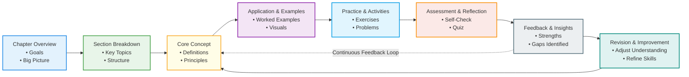
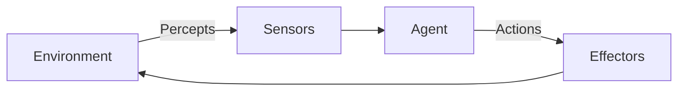
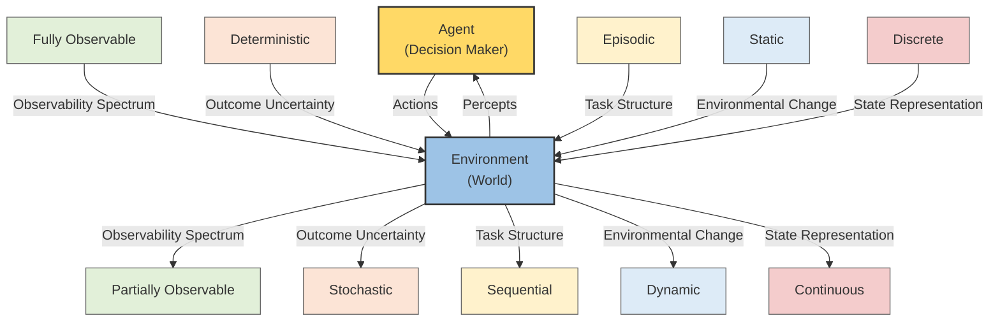

Below is the complete, comprehensive section as requested.

---

Section: Conceptual Foundations of Agents and Environments  
Part I: Foundations and Core Concepts of Agentic AI  
Chapter 4: Agents and Their Operating Environments  
Order: 1  

============================================================

1. Overview and Context

Artificial intelligence systems do not exist in isolation. At their core, all AI systems interact with something outside themselves—whether that is physical space, digital information, human users, or other artificial entities. The study of agents and environments provides the conceptual foundation for understanding how intelligent systems perceive the world, make decisions, and act upon those decisions. This chapter introduces the conceptual foundations that explain what an agent is, what an environment is, and how the interaction between the two defines intelligence in both natural and artificial systems.

In agentic AI, an agent is any entity capable of perceiving its environment through sensors and acting upon that environment through effectors. The environment encompasses everything external to the agent that influences its perceptions and the consequences of its actions. This simple definition underpins decades of research in artificial intelligence, robotics, cognitive science, economics, and even philosophy. From a thermostat regulating room temperature to an autonomous vehicle navigating city streets, all intelligent systems can be analyzed through the lens of agents operating within environments.

Understanding this relationship is critically important because it determines how intelligence is evaluated, designed, and improved. An agent’s effectiveness cannot be assessed without considering the structure, dynamics, and constraints of its environment. Similarly, an environment only gains meaning in relation to the agents that occupy it. This chapter lays the groundwork for later discussions on agent architectures, learning mechanisms, multi-agent systems, and ethical considerations by focusing on these foundational concepts.

Within the broader scope of agentic AI, agents and environments form the conceptual bridge between abstract decision-making theories and practical implementations. They connect high-level ideas such as rationality, autonomy, and adaptability with concrete realities like sensor noise, incomplete information, resource limitations, and dynamic uncertainty. Mastery of these foundations is essential for anyone seeking to design, analyze, or deploy intelligent systems responsibly and effectively.

------------------------------------------------------------

2. Core Concepts

The central concepts in understanding agents and environments begin with clearly defining each term and then examining the nature of their interaction. An agent, in the most general sense, is an entity that maps percept sequences to actions. This definition emphasizes behavior rather than internal structure. Whether an agent uses simple rules, complex neural networks, or symbolic reasoning systems is secondary to what it does in response to its observations.

An environment is everything that lies outside the agent and with which the agent interacts. This includes not only the physical surroundings but also abstract spaces such as financial markets, online platforms, social systems, or game worlds. Environments can be simple and predictable or complex and stochastic. They may be fully observable, where the agent has access to complete information about the state of the world, or partially observable, where critical information is hidden or noisy.

The interaction between agents and environments occurs through a continuous feedback loop. Agents perceive the environment through sensors, process that information internally, and act through effectors. These actions alter the environment, which in turn affects the agent’s future perceptions. This loop is fundamental to all intelligent behavior and distinguishes agentic systems from static computational tools like calculators or databases.

A key theoretical foundation underpinning this interaction is the concept of rationality. A rational agent is one that selects actions expected to maximize its performance measure, given its percept history and knowledge of the environment. Importantly, rationality does not imply omniscience or perfection; it accounts for the agent’s limitations in perception, computation, and action. An agent can act rationally even when it makes mistakes, as long as it is doing the best it can with the information available.

The properties of environments play a decisive role in shaping agent design. Environments can be classified along several dimensions: deterministic versus stochastic, episodic versus sequential, static versus dynamic, discrete versus continuous, and single-agent versus multi-agent. Each dimension imposes specific challenges and opportunities. For example, a deterministic environment allows precise prediction of outcomes, while a stochastic environment requires probabilistic reasoning and robustness to uncertainty.

These core concepts matter because they guide how we build systems that can function effectively in the real world. Mischaracterizing an environment can lead to brittle agents that fail under unexpected conditions. Overestimating an agent’s abilities can result in unsafe or unethical behavior. By grounding agent design in a clear understanding of environments, researchers and practitioners can develop systems that are resilient, adaptable, and aligned with their intended purpose.

------------------------------------------------------------

3. Detailed Explanation

### The Agent–Environment Interface

At the heart of agent-based models lies the agent–environment interface. This interface consists of sensors, which provide the agent with perceptual input, and effectors, which allow it to act. Sensors may include cameras, microphones, APIs, logs, or data streams, depending on the environment. Effectors range from motors and actuators in robots to API calls or text outputs in software agents.

For example, a web-based recommendation agent uses user interaction data as its sensors and adjusts displayed content as its effectors. The quality and limitations of these interfaces directly influence the agent’s performance. Poor sensors lead to incomplete or inaccurate perceptions, while constrained effectors limit the agent’s ability to influence outcomes.

### Types of Agents

Agents can be categorized by their internal complexity. Simple reflex agents operate on condition-action rules, responding directly to percepts without memory. While limited, they can perform well in fully observable and stable environments, such as automatic door sensors.

Model-based agents extend this approach by maintaining an internal representation of the environment’s state, allowing them to handle partial observability. Goal-based agents take this further by selecting actions that move them toward specific objectives. Utility-based agents introduce preferences among outcomes, enabling trade-offs and nuanced decision-making. Learning agents adapt over time by improving their internal models or policies based on experience.

Each type emerges as a response to increasing environmental complexity. As environments become less predictable or more dynamic, agents require richer internal representations and learning capabilities.

### Environment Dynamics and Constraints

Environments are not passive backgrounds; they actively shape agent behavior. A static environment, such as a board game frozen between turns, allows extensive deliberation. A dynamic environment, like stock trading or autonomous driving, demands rapid responses and continuous adaptation.

Constraints such as limited resources, time pressure, and competing agents further complicate decision-making. In multi-agent environments, agents must account for the actions and intentions of others, introducing strategic reasoning and coordination challenges. These dynamics explain why techniques from game theory, control theory, and reinforcement learning are often integrated into agentic AI systems.

### Performance Measures and Alignment

Every agent operates under a performance measure that defines success. This could be minimizing error, maximizing profit, improving safety, or enhancing user satisfaction. The choice of performance measure has profound implications. Poorly defined metrics can lead to unintended consequences, where agents optimize for the letter rather than the spirit of their goals.

For example, an automated content moderation agent rewarded solely for engagement may inadvertently promote sensational or harmful material. Understanding the environment, including social and ethical dimensions, is therefore critical for aligning agent behavior with human values.

### Diagram: Agent–Environment Interaction







This diagram should visually represent how perceptions flow from the environment to the agent via sensors, and how actions flow back via effectors, emphasizing the cyclical interaction.

------------------------------------------------------------

4. Real-World Applications

One prominent application of agent–environment concepts is autonomous driving. Self-driving cars function as agents operating within highly dynamic, partially observable environments. Sensors include cameras, radar, and lidar, while effectors control steering, acceleration, and braking. The environment consists of roads, traffic laws, pedestrians, and other drivers. Early deployments revealed that misjudging environmental complexity—such as unpredictable human behavior—can lead to safety failures, underscoring the importance of robust agent–environment modeling.

In finance, algorithmic trading systems act as agents within market environments. These environments are stochastic, multi-agent, and adversarial. Successful trading agents incorporate probabilistic models, learning algorithms, and risk constraints to adapt to market dynamics. Poorly designed agents may exacerbate volatility, as seen in historical flash crashes.

Customer service chatbots represent another application. These agents interact with users through natural language, operating in a social and linguistic environment. Their sensors include text input and user metadata, while effectors include generated responses or actions such as ticket creation. Lessons from real-world deployments highlight the importance of context awareness and ethical constraints.

In healthcare, diagnostic support systems act as agents assisting clinicians. The environment includes patient data, medical guidelines, and institutional constraints. The success of such agents depends not only on predictive accuracy but also on interpretability and trust.

------------------------------------------------------------

5. Practical Examples

Consider a simple software agent designed to manage file backups. The environment is a file system, with sensors reading file changes and effectors copying or deleting files.

Example pseudocode concept:

The agent periodically scans directories (perception), compares file states to a backup policy (internal model), and decides whether to create backups (action). Over time, the agent may learn typical usage patterns to optimize storage and scheduling.

In a reinforcement learning scenario, an agent navigating a grid world receives rewards for reaching goals. Step by step, the agent observes its position, selects an action (move up, down, left, right), and updates its policy based on the outcome. This illustrates how environment structure directly influences learning strategies.

------------------------------------------------------------

6. Common Patterns and Best Practices

A recurring pattern in agent design is to start with simple assumptions and gradually increase complexity as needed. Designing an overly complex agent for a simple environment wastes resources and increases failure risk. Conversely, underpowered agents struggle in complex settings.

Another best practice is explicit environment modeling. Even approximate models improve decision quality compared to purely reactive behavior. Incorporating uncertainty through probabilistic representations helps agents remain robust under noise and change.

Clear performance metrics aligned with real objectives are essential. Regular evaluation under varied environmental conditions prevents overfitting to narrow scenarios. Finally, human-in-the-loop designs often enhance safety and effectiveness, especially in high-stakes environments.

------------------------------------------------------------

7. Potential Challenges and Solutions

One common challenge is partial observability, where agents lack complete information. Solutions include maintaining belief states, using memory, and integrating multiple sensor modalities. Another challenge is non-stationary environments that change over time. Continuous learning and adaptation help address this issue.

Misaligned objectives pose significant risks. Careful metric design, validation against real-world outcomes, and ethical review processes are essential preventive measures. Computational constraints can also limit agent performance; using approximations and hierarchical decision-making helps manage complexity.

------------------------------------------------------------

8. Integration with Other Concepts

Agents and environments are deeply connected to learning paradigms such as reinforcement learning, where reward signals emerge from agent–environment interactions. They also underpin multi-agent systems, where environments mediate cooperation and competition.

Connections to cognitive architectures illuminate how human intelligence can be modeled as agentic processes. Ethical AI discussions rely on environment definitions to specify accountability, responsibility, and social impact.

------------------------------------------------------------

9. Key Takeaways

Understanding agents and environments provides the conceptual backbone of agentic AI. Agents are defined by their capacity to perceive, decide, and act, while environments supply the context that gives meaning to these actions. Intelligence emerges not from agents alone, but from their continuous interaction with dynamic, constrained, and often uncertain environments. Effective AI design depends on accurately characterizing both sides of this relationship, selecting appropriate performance measures, and aligning agent behavior with human values. These foundations enable the development of systems that are adaptable, robust, and socially responsible.

------------------------------------------------------------

10. Further Reading

Readers interested in deepening their understanding should explore foundational AI textbooks such as “Artificial Intelligence: A Modern Approach” by Russell and Norvig, which offers extensive treatment of agents and environments. Research on reinforcement learning, particularly Sutton and Barto’s work, provides practical insights into agent–environment dynamics. Interdisciplinary perspectives from cognitive science and systems theory also enrich understanding by connecting artificial agents to natural intelligence and complex adaptive systems.

---

Section: **Types of Agents and Internal Architectures**  
Part I: Foundations and Core Concepts of Agentic AI  
Chapter 4: Agents and Their Operating Environments  
Order: 2  

============================================================

## 1. Overview and Context

In the previous section, we established what agents are, how they interact with environments, and why the agent–environment abstraction is foundational to artificial intelligence. Building upon that conceptual groundwork, this section delves deeper into **the different types of agents** and, more importantly, **how agents are internally structured to operate effectively within complex environments**. Understanding types of agents is not merely an academic exercise—it directly influences how AI systems are designed, what problems they are capable of solving, and how robustly they can operate in the real world.

At a high level, an agent’s behavior is determined by two intertwined aspects: **its external role** (what kind of agent it is) and **its internal architecture** (how it decides what to do). Different environments impose different demands. A temperature-monitoring agent in a smart building does not need the same cognitive complexity as a self-driving car navigating unpredictable traffic. Likewise, an internal architecture suitable for a chess-playing agent might be entirely inadequate for an adaptive trading system operating in volatile financial markets.

The classification of agents provides a systematic way to reason about increasing levels of intelligence, autonomy, and adaptability. These classifications also reveal the historical evolution of AI—from simple reflex-based systems governed by fixed rules to sophisticated learning agents capable of improving over time. Internal architectures, on the other hand, describe the mechanisms that transform perception into action: how sensors feed into decision-making modules, how memory is structured, how goals are represented, and how learning is integrated into behavior.

In modern agentic AI, especially in the age of large language models, autonomous workflows, and multi-agent systems, understanding these types and architectures is more relevant than ever. Designers must make informed architectural choices to balance performance, interpretability, scalability, and safety. This section therefore serves as a bridge between theory and practice, offering a comprehensive exploration of agent categories and the internal structures that make intelligent behavior possible.

---

## 2. Core Concepts

At the heart of agent design lies a deceptively simple question: **how does an agent decide what action to take at any given moment?** The answer depends on both the _type_ of agent and its _internal architecture_. These two dimensions are closely related but conceptually distinct.

### Agent Types as Levels of Intelligence

Agent types represent increasingly sophisticated ways of mapping percepts (inputs from the environment) to actions. They are often presented as a hierarchy, where each type subsumes the capabilities of the previous one. This hierarchy reflects both computational complexity and cognitive richness.

Simple agents prioritize immediate reactions. More advanced agents incorporate models of the world, representations of goals, and mechanisms for learning. Importantly, agent types are not mutually exclusive in practice; many real-world systems combine elements from multiple types. For example, a robotics system may use reflex-based safety mechanisms while also relying on goal-directed planning and reinforcement learning.

### Internal Architectures as Decision-Making Pipelines

While agent types describe _what kind_ of intelligence an agent exhibits, internal architectures explain _how_ that intelligence is implemented. An internal architecture typically includes:
- **Perception modules** that process raw sensor data
- **State representations** that summarize relevant aspects of the environment
- **Decision-making mechanisms** (rules, planners, policies, or learned models)
- **Actuators** that execute actions
- **Optional learning components** that modify behavior over time

These components may be organized in simple linear pipelines or in complex layered, modular, or even distributed systems. The architecture determines properties such as responsiveness, adaptability, explainability, and robustness.

### Why These Concepts Matter

Understanding types of agents and internal architectures is essential for several reasons. First, it allows researchers and practitioners to **match agent complexity to problem requirements**, avoiding overengineering or underpowered designs. Second, it provides a shared vocabulary for analyzing and comparing AI systems. Third, it lays the foundation for ethical and safety considerations, since the degree of autonomy and learning capability directly impacts risk.

In agentic AI systems deployed in real environments—such as autonomous vehicles, digital assistants, or decision-support tools—these design choices have tangible consequences. Poor architectural decisions can lead to brittle systems, unpredictable behaviors, or catastrophic failures. Conversely, well-aligned agent types and architectures enable reliable, scalable, and trustworthy AI systems.

---

## 3. Detailed Explanation

### 3.1 Simple Reflex Agents

Simple reflex agents are the most basic type of agent. They operate on a straightforward principle: **condition–action rules**. The agent observes the current percept and selects an action based solely on that percept, without any memory of the past or model of the future.

Internally, the architecture of a simple reflex agent consists of:
- A percept input
- A rule-matching mechanism
- An action output

For example, a thermostat is a classic simple reflex agent. If the temperature is below a threshold, it turns the heater on; if above, it turns it off. The simplicity of this architecture offers speed and reliability in stable, fully observable environments. However, it fails in situations where context, history, or partial observability matters.

Simple reflex agents are vulnerable to perceptual ambiguity. If the environment changes in unexpected ways or if sensors provide incomplete information, the agent has no way to compensate.

### 3.2 Model-Based Reflex Agents

Model-based reflex agents address some limitations of simple reflex agents by maintaining an **internal state** that represents aspects of the world not directly observable at any moment. This internal model is updated based on percept history and knowledge of how the world evolves.

The internal architecture includes:
- A state representation
- A world transition model
- Rule-based decision logic

Consider a robotic vacuum cleaner that remembers which rooms it has already visited. Even if it cannot see the entire house at once, its internal state allows it to make informed decisions about where to go next.

These agents are particularly well-suited for **partially observable environments**, where decisions depend on inferred information rather than immediate sensory input alone. While still rule-based, they introduce a form of reasoning about the world.

### 3.3 Goal-Based Agents

Goal-based agents extend the model-based approach by explicitly representing **goals**—desired outcomes the agent aims to achieve. Decision-making is no longer limited to reactive rules but involves evaluating future states.

Internally, these agents rely on:
- A representation of goals
- A model of the environment
- A planning or search mechanism

For example, a navigation agent in a GPS system evaluates multiple possible routes to reach a destination. It reasons about future states (traffic conditions, distances) and selects actions that minimize time or distance.

Goal-based agents are significantly more flexible than reflex-based agents. They can adapt to new tasks by changing goal definitions without modifying the underlying architecture. However, this flexibility comes at the cost of computational complexity, especially in large or dynamic environments.

### 3.4 Utility-Based Agents

Utility-based agents generalize goal-based agents by introducing a **utility function**, which assigns a numerical value to states or outcomes. Instead of merely achieving a goal, the agent seeks to maximize overall satisfaction or performance.

Internally, this architecture includes:
- A utility function
- A predictive model of outcomes
- A decision-theoretic selection mechanism

A self-driving car is a prime example. It must balance multiple objectives: safety, speed, comfort, and efficiency. These competing factors are encoded in a utility function, allowing the agent to make nuanced trade-offs.

Utility-based agents are essential in uncertain environments, where goals may conflict and outcomes are probabilistic. They form the basis of decision theory and are widely used in economics, robotics, and reinforcement learning.

### 3.5 Learning Agents

Learning agents represent the most advanced category. They can **improve their performance over time** by learning from experience. Their internal architecture is typically divided into four components:
- A **performance element** that selects actions
- A **learning element** that modifies the performance element
- A **critic** that evaluates performance
- A **problem generator** that encourages exploration

Reinforcement learning agents exemplify this design. For instance, an AI system learning to play Go starts with minimal knowledge and progressively refines its strategy through self-play and feedback.

Learning agents are indispensable in environments that are unknown, complex, or constantly changing. However, they introduce challenges related to stability, safety, and interpretability.

---


```mermaid
flowchart LR

%% =========================
%% Hierarchy of Agent Types
%% =========================
subgraph H[Hierarchy of Intelligent Agent Types]
direction TB
SR[Simple Reflex Agent\n• Condition–Action Rules\n• No Memory]
MB[Model-Based Agent\n• Internal State\n• World Model]
GB[Goal-Based Agent\n• Goal Representation\n• Planning]
UB[Utility-Based Agent\n• Utility Function\n• Optimization]
LA[Learning Agent\n• Performance Improvement\n• Experience-Based]

SR --> MB
MB --> GB
GB --> UB
UB --> LA
end

%% =========================
%% Generic Internal Architecture
%% =========================
subgraph A[Generic Internal Agent Architecture]
direction LR
S[Sensors\n(Environment Input)]
P[Perception\n(Interpret Signals)]
ST[State / Model\n(Internal Representation)]
D[Decision Module\n(Rules / Goals / Utility)]
AC[Actuators\n(Actions on Environment)]

S --> P
P --> ST
ST --> D
D --> AC
end

%% =========================
%% Learning Feedback Loop
%% =========================
L[Learning Element\n(Evaluate & Update)]
AC -. Experience / Feedback .-> L
L -. Updates Knowledge .-> ST
L -. Improves Decision .-> D

%% =========================
%% Mapping Agent Types to Architecture
%% =========================
SR -. Uses .-> D
MB -. Uses .-> ST
GB -. Uses .-> D
UB -. Uses .-> D
LA -. Extends .-> L

%% =========================
%% Styling
%% =========================
classDef agent fill:#E3F2FD,stroke:#1565C0,stroke-width:2px;
classDef arch fill:#E8F5E9,stroke:#2E7D32,stroke-width:2px;
classDef learn fill:#FFF3E0,stroke:#EF6C00,stroke-width:2px;

class SR,MB,GB,UB,LA agent
class S,P,ST,D,AC arch
class L learn
```


---

## 4. Real-World Applications

One prominent application of agent types and architectures is **autonomous driving systems**. Early driver-assist features, such as automatic braking, resemble simple reflex agents reacting to sensor inputs. More advanced systems incorporate world models, goals (reach destination), and utility functions balancing safety and comfort. Learning components continuously refine driving policies based on data collected from millions of miles.

In **financial trading systems**, agents often operate as utility-based and learning agents. They must evaluate uncertain outcomes, balance risk and reward, and adapt to changing market conditions. Firms that relied solely on rule-based trading systems have increasingly turned to learning architectures to remain competitive.

In **healthcare decision support**, agents assist clinicians by recommending treatments. Goal-based agents focus on achieving patient outcomes, while utility-based systems manage trade-offs between effectiveness, cost, and side effects. Learning agents can personalize recommendations over time based on patient data.

**Smart home systems** provide another illustration. Thermostats began as simple reflex agents but have evolved into learning agents that model occupant behavior, optimize energy use, and adjust preferences dynamically.

Finally, **game AI**, such as agents in complex strategy games, often combines multiple architectures: reflex mechanisms for micro-decisions, goal-based planning for strategy, and learning components for long-term improvement.

---

## 5. Practical Examples

Consider a simplified Python-style pseudocode for a reflex versus a learning agent controlling a thermostat:

```
# Simple Reflex Agent
if temperature < 18:
    turn_heater_on()
else:
    turn_heater_off()
```

This agent reacts instantly but cannot adapt.

```
# Learning Agent (conceptual)
state = current_temperature, time_of_day
action = policy(state)
reward = comfort_score - energy_cost
update_policy(state, action, reward)
```

Here, the agent learns preferences over time, optimizing comfort and cost. The difference illustrates how internal architecture fundamentally changes behavior and capability.

---

## 6. Common Patterns and Best Practices

One common pattern in agent design is **hybrid architectures**, where reflex layers handle safety-critical responses while higher-level planning or learning modules manage strategic decisions. This layered approach improves robustness and interpretability.

Another best practice is **aligning agent complexity with environmental complexity**. Overly sophisticated agents in simple environments waste resources, while simplistic agents in complex environments fail unpredictably.

Designers should also emphasize **modularity**, allowing components such as perception, planning, and learning to evolve independently. This modularity facilitates maintenance, testing, and ethical oversight.

---

## 7. Potential Challenges and Solutions

A major challenge is **computational scalability**, especially for goal-based and utility-based agents in large state spaces. Approximation techniques and hierarchical planning can mitigate this issue.

Another challenge is **unintended behavior in learning agents**, particularly during exploration. Solutions include constrained learning, simulation-based training, and human-in-the-loop oversight.

Finally, **interpretability** becomes harder as architectures grow complex. Using transparent models, logging decision rationales, and combining symbolic and learned components can help maintain trust.

---

## 8. Integration with Other Concepts

Types of agents and internal architectures are closely tied to **environment classifications** (fully observable vs. partially observable, deterministic vs. stochastic). They also integrate with **ethical AI**, as more autonomous agents demand stronger alignment mechanisms. Additionally, these concepts form the groundwork for **multi-agent systems**, where interactions among agents introduce new dynamics.

---

## 9. Key Takeaways

Understanding types of agents and their internal architectures is central to designing effective agentic AI systems. Agent types describe increasing levels of intelligence and autonomy, from simple reflex mechanisms to adaptive learning systems. Internal architectures explain how perception, decision-making, and action are structured to support these capabilities. Together, they provide a framework for matching AI designs to real-world problem requirements, balancing performance, adaptability, safety, and explainability. As AI systems become more autonomous and embedded in society, these foundational concepts become not only technical tools but also guides for responsible and sustainable AI development.

---

## 10. Further Reading

Readers seeking deeper insights should explore *Artificial Intelligence: A Modern Approach* by Russell and Norvig for foundational agent models. Sutton and Barto’s *Reinforcement Learning: An Introduction* provides an in-depth treatment of learning agents. For practical architectures, research on hybrid and layered agent systems in robotics literature offers valuable perspectives. Recent papers on agentic workflows using large language models also demonstrate how classical agent concepts are being reinterpreted in modern AI.

---

## Section 3: Key Characteristics and Dimensions of Operating Environments  
**Part I: Foundations and Core Concepts of Agentic AI**  
**Chapter 4: Agents and Their Operating Environments**

---

## 1. Overview and Context

In the previous section, we examined different types of agents and their internal architectures, focusing on how agents perceive, decide, and act. While understanding the internal structure of an agent is essential, it is only half of the equation. An agent never exists in isolation; its intelligence is always expressed in relation to the environment in which it operates. This section shifts focus outward, toward the operating environments themselves, and explores the fundamental characteristics and dimensions that define them.

Operating environments determine what information is available to an agent, how predictable the world is, how fast it changes, and how the agent’s actions influence future states. These factors profoundly shape how an agent must be designed, which algorithms are appropriate, and what level of intelligence or autonomy is achievable. A simple reflex agent may perform perfectly well in a stable, fully observable environment but fail catastrophically in a partially observable, dynamic one. Conversely, a sophisticated learning agent designed for uncertainty may be unnecessarily complex for simpler environments.

Understanding environment characteristics allows practitioners to reason systematically about agent–environment interactions instead of treating them as ad hoc challenges. These dimensions provide a shared conceptual vocabulary that connects agent design, learning theory, reinforcement learning, robotics, game-playing AI, and real-world system deployment. They also help explain why certain problems are inherently hard, why some tasks require learning and adaptation, and why others can be solved with straightforward rules.

This section introduces the primary dimensions used to classify operating environments in agentic AI, explains their theoretical foundations, and shows how they influence agent design decisions. By the end of this section, readers should be able to analyze any problem domain, characterize its operating environment, and understand the implications for intelligent agent behavior.

---

## 2. Core Concepts

At its core, an operating environment in AI is everything external to the agent that the agent can perceive and act upon. This includes the physical world for robots, digital spaces for software agents, users for conversational systems, and even other agents in multi-agent systems. To reason precisely about these varied contexts, AI research has introduced a set of dimensions that describe environments abstractly, independent of any specific implementation.

One of the most fundamental distinctions is observability. An environment is fully observable if the agent’s sensors provide complete and accurate information about the current state of the environment at each point in time. In contrast, partially observable environments hide some variables, introduce noise, or limit the agent’s perspective. Most real-world environments are partially observable because sensors are imperfect, information is delayed, or some aspects of the world are inherently hidden. This distinction matters because full observability allows an agent to act based purely on current percepts, while partial observability often requires internal memory, belief states, or probabilistic reasoning.

Another core dimension is determinism. In a deterministic environment, the next state of the environment is completely determined by the current state and the agent’s action. In stochastic environments, outcomes are uncertain and may involve randomness or unpredictable external influences. Determinism simplifies planning and control, while stochasticity necessitates probabilistic models, expectation-based decision-making, and often learning from experience.

Environments are also categorized as episodic or sequential. In episodic environments, each interaction is independent of previous ones, and actions do not affect future percepts beyond the current episode. Sequential environments, by contrast, make long-term consequences central to decision-making. This distinction defines whether an agent needs to plan ahead, consider delayed rewards, or learn policies over time.

Dynamic versus static environments represent another critical distinction. Static environments do not change while the agent is deliberating, whereas dynamic environments may evolve independently of the agent’s actions. In highly dynamic environments, agents must react in real time, sometimes with incomplete computation. This has profound implications for algorithm choice, computational efficiency, and robustness.

Finally, environments can be discrete or continuous in terms of states, actions, time, or percepts. Discrete environments allow enumeration and symbolic reasoning, while continuous environments require function approximation, numerical methods, and often approximation-based learning techniques.

Together, these dimensions form a conceptual framework for understanding why agent design is context-dependent and how environmental complexity drives the need for intelligence.

---

## 3. Detailed Explanation

### Observability: Full vs Partial

Observability describes how much of the environment’s true state is accessible to the agent through its sensors. In a fully observable environment, the agent’s percept at time t provides all necessary information to determine the environment’s state. Classic board games like chess or checkers are examples: all pieces and their positions are visible at all times.

In partially observable environments, the agent receives incomplete, noisy, or indirect information. Driving a car illustrates this well: a driver cannot see around corners, predict intentions of other drivers with certainty, or have perfect knowledge of road conditions ahead. For AI agents, partial observability often requires maintaining an internal belief state, which is a probabilistic representation of possible world states consistent with past observations.

For example, a robot navigating a building with limited sensors may not know whether a room is occupied until it enters, requiring cautious exploration strategies. This need for inference and memory significantly increases computational complexity and influences the selection of algorithms, such as Partially Observable Markov Decision Processes (POMDPs).

### Deterministic vs Stochastic Environments

Deterministic environments behave consistently: the same action in the same state always results in the same outcome. Many simulated environments, logic-based systems, and classical puzzles intentionally enforce determinism to make problem-solving tractable.

Stochastic environments introduce uncertainty. This uncertainty may come from random events, unknown external agents, sensor noise, or incomplete models. Financial markets are a clear example: even with identical strategies, outcomes can vary drastically due to uncontrollable factors.

Agents operating in stochastic environments must reason in terms of probabilities, expected rewards, and risk. This often shifts the goal from finding an optimal sequence of actions to finding a policy that performs well on average. Reinforcement learning methods, Bayesian inference, and Monte Carlo simulations are commonly employed in these settings.

### Episodic vs Sequential Environments

In episodic environments, the agent’s experience can be divided into independent episodes. Spam classification is a typical example: each email is analyzed independently, and classifying one email does not affect the next. This independence allows agents to focus solely on immediate accuracy.

Sequential environments create dependencies over time. Actions affect future states, rewards may be delayed, and mistakes can have long-lasting consequences. Playing a video game, managing inventory, or negotiating with humans all require long-term planning and strategy.

Sequentiality introduces the concept of policy-making, where agents must select actions based on maximizing cumulative reward over time. This is central to reinforcement learning and decision theory.

### Static vs Dynamic Environments

A static environment remains unchanged while the agent is deciding on an action. Crossword puzzles are static: nothing changes unless the solver acts. Dynamic environments evolve independently, sometimes rapidly. Stock trading, robotic soccer, and real-time strategy games are dynamic, requiring rapid perception and action.

Dynamic environments often force a trade-off between optimality and responsiveness. An agent that spends too long computing the perfect move may miss its opportunity entirely. This constraint motivates approximate reasoning, anytime algorithms, and reactive architectures.

### Discrete vs Continuous Environments

Discrete environments have a finite or countably infinite number of states and actions. Continuous environments involve values drawn from continuous ranges, such as position, velocity, temperature, or time.

Robotic control systems operate in continuous spaces, which makes exhaustive enumeration impossible. Instead, agents rely on control theory, neural networks, and other function approximation techniques. Understanding whether an environment is discrete or continuous affects representation choices, computational methods, and learning strategies.

---





Mermaid diagram example:

```
graph TD
    A[Agent]
    E[Environment]
    A -->|Actions| E
    E -->|Percepts| A
    E --> O[Observability]
    E --> D[Determinism]
    E --> S[Sequential vs Episodic]
    E --> Y[Static vs Dynamic]
    E --> C[Discrete vs Continuous]
```

---

## 4. Real-World Applications

One prominent application is autonomous driving. The environment is partially observable, stochastic, sequential, dynamic, and continuous. Autonomous vehicles must fuse sensor data, predict other agents’ behavior, and act in real time. Safety constraints arise directly from environmental uncertainty, leading to conservative decision-making and extensive simulation-based testing.

In recommendation systems, such as those used by streaming platforms, the environment is partially observable and sequential. User preferences change over time, and recommendations influence future behavior. Designers must model long-term engagement rather than immediate clicks, illustrating how sequential environments complicate optimization.

Robotic warehouse automation represents a semi-structured environment. While layouts may be known (increasing observability), the presence of humans and other robots introduces stochastic and dynamic elements. Successful systems balance planning with real-time adaptation.

Financial trading agents operate in highly stochastic and dynamic environments where actions affect not only profits but also market behavior. These environments have driven the use of probabilistic models, risk management strategies, and continuous learning.

Finally, game AI in competitive multiplayer games exemplifies complex multi-agent environments where partial observability and strategic uncertainty dominate, requiring opponent modeling and adaptive policies.

---

## 5. Practical Examples

Consider a simple example of classifying environments when designing an agent:

A thermostat agent controlling room temperature operates in a mostly deterministic and continuous environment. Temperature changes predictably based on heater output. A simple feedback control loop is sufficient.

In contrast, an email spam filter operates in an episodic environment. Each email is an independent case, allowing supervised learning:

Pseudo-code example:

```
for each email:
    features = extract_features(email)
    label = classifier.predict(features)
    deliver_or_block(label)
```

No memory of previous emails is required for correct classification.

A robot vacuum cleaner operates in a partially observable, sequential environment. It must remember which areas it has cleaned to be effective:

```
initialize map
while battery > threshold:
    observe surroundings
    update internal map
    choose action to maximize coverage
    move
```

This example demonstrates how partial observability necessitates internal state and memory.

---

## 6. Common Patterns and Best Practices

A common best practice is to explicitly characterize the environment before choosing an agent architecture. Many design failures occur because agents are over- or under-engineered for their environments.

Another pattern is using hierarchy to manage complexity. In dynamic, continuous environments, hierarchical control structures allow high-level planning while lower-level controllers handle real-time responses.

Simulation is also widely used to explore stochastic environments safely. Training agents in simulated environments allows controlled experimentation before deployment in the real world.

Finally, robust agents assume uncertainty. Designing for partial observability and stochasticity, even when the environment appears simple, leads to systems that fail more gracefully when conditions change.

---

## 7. Potential Challenges and Solutions

One major challenge is mischaracterizing the environment, such as assuming determinism where randomness exists. This leads to brittle agents. The solution is to adopt probabilistic models and validate assumptions empirically.

Another challenge is computational complexity in sequential, continuous environments. Approximation methods, abstraction, and learning-based approaches help manage this complexity.

Delayed feedback in sequential environments can also hinder learning. Techniques like reward shaping and temporal-difference methods mitigate this issue.

---

## 8. Integration with Other Concepts

Environmental dimensions directly influence agent architectures discussed earlier. Reflex agents assume full observability and determinism, while learning agents are designed for stochastic and partially observable settings.

These concepts also integrate with reinforcement learning, control theory, and multi-agent systems. Environment characterization determines whether Markov Decision Processes, POMDPs, or game-theoretic models are appropriate.

Understanding environments also informs ethical and safety discussions, as uncertainty and dynamics directly affect risk and accountability.

---

## 9. Key Takeaways

Operating environments define the context in which intelligence emerges. By analyzing environments along dimensions such as observability, determinism, structure, dynamics, and representation, we gain a systematic way to understand why different problems demand different kinds of agents. These characteristics explain both the limitations and possibilities of AI systems and guide the selection of appropriate algorithms and architectures. Mastery of these concepts allows designers to anticipate challenges, reason about complexity, and build agents that interact effectively with the world rather than merely execute predefined logic.

---

## 10. Further Reading

For a deeper theoretical foundation, *Artificial Intelligence: A Modern Approach* by Russell and Norvig provides extensive treatment of environment classifications and their implications. Sutton and Barto’s *Reinforcement Learning: An Introduction* explores sequential, stochastic environments in depth. For robotics-focused perspectives, *Probabilistic Robotics* by Thrun, Burgard, and Fox offers detailed coverage of partial observability and uncertainty. Finally, recent research papers on embodied AI and multi-agent reinforcement learning provide insight into modern, complex operating environments and emerging challenges.

---

## Perception and Action in Diverse Environments

*Content pending...*

---

## Performance Measures, Reward Structures, and Evaluation Metrics

*Content pending...*

---

## Adaptation, Learning, and Environment Modeling

*Content pending...*

---

## Multi-Agent Environments and Interaction Dynamics

*Content pending...*

---

## Real-World Operating Environments and Case Studies

*Content pending...*
