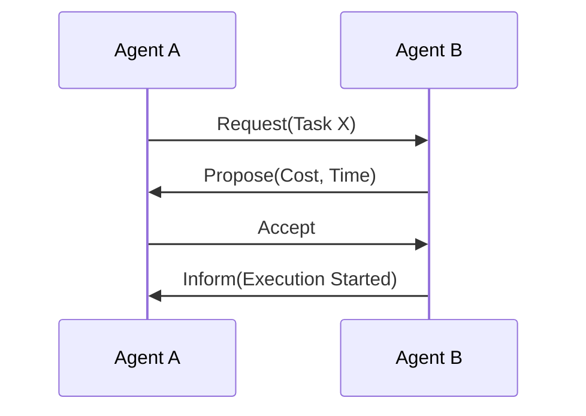

## Introduction: Why Multi-Agent Systems Matter

As artificial intelligence systems have evolved from single, isolated agents into increasingly complex ecosystems of interacting entities, the study of **multi-agent systems (MAS)** has become central to modern AI, distributed systems, and intelligent software engineering. A multi-agent system consists of multiple autonomous agents that coexist within a shared environment and interact with one another—sometimes cooperatively, sometimes competitively, and often with a mixture of both. Unlike single-agent systems, where the primary challenge is decision-making under uncertainty, multi-agent systems introduce fundamentally social dimensions: coordination, communication, collective behavior, conflict resolution, and scalability.

This chapter builds on the foundations established in earlier chapters, especially the taxonomy of agents and agent architectures. By now, you should be familiar with what an agent is, how agents can be reactive, deliberative, hybrid, or learning-based, and how individual agents perceive and act within environments. Here, we extend that understanding to situations where *many* agents operate simultaneously, each with its own goals, beliefs, and capabilities.

The central questions guiding this chapter are:

- What distinguishes a multi-agent system from a collection of independent agents?
- How do agents coordinate actions without centralized control?
- When do agents cooperate, compete, or negotiate—and why?
- How can agents communicate effectively, and what protocols enable meaningful interaction?
- What happens when we scale from a handful of agents to thousands or millions?

By the end of this chapter, you should not only understand the theoretical principles of multi-agent systems, but also be able to reason about their design, evaluate trade-offs, and anticipate challenges that arise in real-world deployments.

---

## From Single-Agent to Multi-Agent Thinking

Before diving into coordination and communication, it is important to clarify what fundamentally changes when we move from a single-agent perspective to a multi-agent one.

### Defining Multi-Agent Systems

A **multi-agent system** is a system composed of multiple autonomous entities—agents—that:

- Have individual control over their actions
- Possess partial or complete information about the environment
- Interact with other agents through communication, observation, or indirect effects on the environment
- Operate without necessarily having global control or centralized coordination

Autonomy is crucial here. If individual entities are simply executing predefined roles under strict central control, the system may be distributed, but it is not truly multi-agent in the AI sense. In a true multi-agent system, each agent makes decisions independently, even if those decisions are influenced by shared protocols or common objectives.

### Why Multiple Agents Instead of One?

At first glance, one might ask why we would ever choose to design a system with multiple agents when a single, more powerful agent could theoretically do the job. There are several compelling reasons:

1. **Scalability and distribution**: Many problems are naturally distributed across space, time, or resources. Examples include traffic management, sensor networks, and large-scale simulations.
2. **Robustness**: A multi-agent system can continue functioning even if individual agents fail.
3. **Parallelism**: Multiple agents can operate simultaneously, speeding up problem-solving.
4. **Heterogeneity**: Different agents can specialize in different tasks or possess different capabilities.
5. **Modeling real-world systems**: Many natural and social systems—markets, ecosystems, teams—are inherently multi-agent.

However, with these advantages come new challenges. When multiple agents interact, their decisions influence one another, often in unpredictable ways. This is where coordination, cooperation, and competition come into play.

---

## Environments and Interaction in Multi-Agent Systems

### Shared Environments and Interdependence

In a multi-agent system, agents typically operate within a **shared environment**. This environment may be physical (such as robots in a warehouse), virtual (such as agents trading in a simulated market), or abstract (such as logical states in a negotiation protocol). What matters is that agents’ actions can affect the environment in ways that influence other agents.

This creates **interdependence**. An agent’s success is no longer determined solely by its own actions, but also by the actions of others. Interdependence can take many forms:

- **Positive interdependence**, where agents benefit from working together
- **Negative interdependence**, where agents compete for limited resources
- **Mixed interdependence**, where cooperation and competition coexist

Understanding the type of interdependence present is critical for designing effective coordination mechanisms.

### Observability and Information Availability

Another key factor is how much information agents have about one another and the environment. Environments may be:

- **Fully observable**, where each agent can perceive the complete state of the environment
- **Partially observable**, where agents have limited or noisy perceptions
- **Unobservable**, where agents must infer state entirely from indirect signals

Information availability strongly influences coordination strategies. For example, in a fully observable environment, agents may coordinate implicitly by observing each other’s actions. In partially observable environments, explicit communication or shared protocols become more important.

---

## Core Concepts: Coordination, Cooperation, and Competition

At the heart of multi-agent systems lie three closely related but distinct concepts: coordination, cooperation, and competition. Understanding their differences and relationships is essential.

### Coordination: Aligning Actions in Time and Space

**Coordination** refers to the process by which agents align their actions to avoid conflict, redundancy, or inefficiency. Importantly, coordination does not necessarily imply shared goals. Agents may coordinate simply to prevent interference.

For example, consider autonomous vehicles approaching an intersection. Even if each vehicle’s goal is purely selfish (to minimize its own travel time), coordination mechanisms—such as traffic rules or signaling protocols—are required to prevent collisions.

Coordination problems often involve questions such as:

- Who acts when?
- Who uses which resource?
- How are conflicts detected and resolved?

Coordination can be **explicit**, involving communication and negotiation, or **implicit**, emerging from shared conventions or environment-mediated signals.

### Cooperation: Working Toward Shared Goals

**Cooperation** occurs when agents actively work together to achieve a common or compatible objective. This typically involves:

- Shared goals or reward structures
- Task decomposition and role assignment
- Mutual support and information sharing

In cooperative systems, agents evaluate not only their own outcomes but also the collective outcome. Examples include teams of robots carrying an object, distributed problem-solving agents, or collaborative filtering systems.

Cooperation raises its own challenges, such as how to allocate tasks fairly, how to handle free-riding agents, and how to coordinate under uncertainty.

### Competition: Conflicting Interests and Strategic Behavior

**Competition** arises when agents have conflicting goals or when success for one agent reduces the success of others. Competitive settings are common in markets, games, and resource allocation problems.

Here, agents must reason strategically. They may model other agents’ beliefs, preferences, and potential actions. Tools from **game theory** often play a central role in analyzing competitive multi-agent systems.

It is important to note that competition does not preclude coordination. Competing agents may still coordinate on certain norms or protocols if doing so benefits all parties—for example, agreeing on a trading mechanism or communication language.

---

## Models of Interaction: Game-Theoretic and Distributed AI Perspectives

Two major intellectual traditions inform the study of multi-agent systems: **game theory** and **distributed artificial intelligence (DAI)**. Each offers different lenses through which to analyze interaction.

### Game-Theoretic Models

Game theory provides a mathematical framework for analyzing strategic interaction among rational agents. In this view:

- Agents are assumed to be rational and utility-maximizing
- Outcomes are defined by payoff functions
- Interaction is modeled as a game, such as a matrix game, repeated game, or extensive-form game

Key concepts include Nash equilibrium, dominant strategies, and Pareto efficiency. These ideas help us reason about stability and optimality in competitive and mixed-motive scenarios.

However, classical game theory often assumes perfect rationality, complete information, and static preferences—assumptions that may not hold in real-world AI systems.

### Distributed AI and Emergent Behavior

Distributed AI takes a more practical, constructivist approach. Instead of assuming perfect rationality, it focuses on:

- How agents are designed and implemented
- How local interactions lead to global behavior
- How coordination emerges from decentralized control

This perspective emphasizes mechanisms such as stigmergy (coordination through the environment), learning, and adaptation. Agent-based simulations are often used to study how simple rules can give rise to complex collective phenomena.

In practice, many systems blend ideas from both traditions, using game-theoretic insights to guide design while relying on distributed algorithms and heuristics for implementation.

---

## Mechanisms for Coordination

Coordination is one of the most studied problems in multi-agent systems, and for good reason. Without effective coordination, even cooperative agents can work at cross purposes.

### Centralized vs Decentralized Coordination

One of the first design decisions is whether coordination will be **centralized** or **decentralized**.

In centralized coordination, a central controller (which may itself be an agent) collects information from all agents and assigns tasks or resolves conflicts. This approach is often simpler to implement and reason about, but it suffers from scalability and robustness issues.

Decentralized coordination, by contrast, relies on local decision-making and communication among agents. While more complex, it aligns better with the autonomy assumption and scales more naturally.

### Explicit Coordination Through Communication

Explicit coordination involves agents communicating directly to negotiate roles, schedules, or resource usage. For example, agents might use a contract-net protocol, where:

1. An agent announces a task
2. Other agents bid to perform the task
3. The announcing agent awards the contract based on bids

This approach allows flexible task allocation but introduces communication overhead and requires well-defined protocols.

### Implicit Coordination and Social Conventions

Not all coordination requires communication. **Implicit coordination** arises when agents follow shared conventions or norms. For instance, robots might follow a “keep right” rule in corridors, or agents might agree implicitly to take turns accessing a resource.

Implicit coordination is often more scalable and robust, but it requires careful design to ensure that conventions emerge and persist.

---

## Cooperation and Collective Problem Solving

When agents share goals, coordination becomes a tool in service of cooperation. Cooperative multi-agent systems introduce additional design considerations.

### Task Decomposition and Role Assignment

Complex tasks are often decomposed into subtasks that can be handled by different agents. Effective decomposition considers:

- Agent capabilities
- Dependencies between subtasks
- Communication costs

Role assignment may be static (fixed roles) or dynamic (roles assigned at runtime). Dynamic role assignment allows greater flexibility but requires mechanisms for negotiation and conflict resolution.

### Shared Knowledge and Belief Models

Cooperative agents often benefit from maintaining shared or mutually consistent beliefs about the environment and each other. Techniques such as belief sharing, consensus algorithms, and distributed state estimation help maintain coherence in the system’s understanding of the world.

### Handling Failures and Uncertainty

In cooperative systems, individual agent failures can jeopardize group objectives. Robust systems incorporate redundancy, re-planning, and fault detection mechanisms to adapt to changing conditions.

---

## Competition, Negotiation, and Strategic Interaction

### Competitive Environments and Rationality

In competitive settings, agents must anticipate and respond to the actions of others. This often involves strategic reasoning, where agents model opponents as rational decision-makers.

However, in real systems, agents may be boundedly rational, learning over time rather than solving games analytically. Designing agents that balance strategic sophistication with computational feasibility is an ongoing research challenge.

### Negotiation Protocols

Negotiation provides a structured way for agents to resolve conflicts and reach agreements. Protocols define:

- How offers are made and countered
- What information is revealed
- When negotiation terminates

Different protocols suit different environments. For example, auctions are effective for resource allocation, while bilateral negotiation protocols are common in service-oriented systems.

---

## Communication in Multi-Agent Systems

Communication is a cornerstone of coordination and cooperation, but it also introduces complexity.

### Why Communication Is Hard

Unlike human communication, agent communication must be:

- Precisely specified
- Machine-interpretable
- Efficient and reliable

Miscommunication can lead to miscoordination or system failure. As a result, communication languages and protocols must be carefully designed.

### Communication Languages and Semantics

Agent communication languages (ACLs) such as KQML and FIPA-ACL define not only message syntax but also semantics—what it means to send a particular type of message, such as a request, inform, or propose.

The semantic grounding of messages is crucial. Agents must interpret messages consistently, and designers must define how messages affect beliefs, intentions, or commitments.

### Example Communication Protocol Flow

This simple diagram illustrates how structured communication enables coordination without centralized control.

---

## Designing Communication Protocols

### Protocol Design Principles

Effective protocols balance expressiveness with simplicity. Key considerations include:

- What information must be exchanged?
- How often do agents communicate?
- What are the failure modes?

Overly complex protocols can become bottlenecks, while overly simple ones may lack the expressiveness needed for rich coordination.

### Synchronous vs Asynchronous Communication

Communication may be synchronous, where agents wait for responses, or asynchronous, where messages are sent and processed independently. Asynchronous communication is generally more scalable and robust but complicates reasoning about timing and ordering.

---

## Scalability Challenges in Multi-Agent Systems

As the number of agents grows, coordination and communication become increasingly difficult.

### Communication Overhead

If every agent communicates with every other agent, communication costs grow quadratically. Scalable systems must limit communication through:

- Hierarchical organization
- Local neighborhoods
- Aggregation and abstraction

### Coordination Complexity

Many coordination algorithms have complexity that grows exponentially with the number of agents or resources. Approximation, heuristics, and learning-based methods are often necessary in large-scale systems.

### Emergence and Unpredictability

Large multi-agent systems can exhibit emergent behavior that is difficult to predict or control. While emergence can be beneficial, it also poses risks, especially in safety-critical applications.

---

## Case Study: Warehouse Robotics

Consider a warehouse with hundreds of autonomous robots tasked with retrieving items and delivering them to packing stations. Each robot is an agent with its own navigation and task execution capabilities.

Key challenges include:

- Coordinating paths to avoid collisions
- Allocating tasks dynamically as orders arrive
- Handling robot failures without disrupting operations

This scenario illustrates the interplay of coordination (path planning), cooperation (task sharing), and scalability (hundreds of agents). Effective solutions combine implicit coordination (traffic rules), explicit communication (task assignment), and decentralized control.

---

## Best Practices and Design Trade-Offs

Designing multi-agent systems involves navigating trade-offs:

- Centralization vs autonomy
- Communication overhead vs coordination quality
- Optimality vs scalability

There is no one-size-fits-all solution. Successful designs are guided by a clear understanding of the environment, agent capabilities, and system objectives.

---

## Summary and Key Takeaways

Multi-agent systems represent a powerful paradigm for modeling and implementing complex, distributed intelligent behavior. By moving beyond single-agent thinking, designers can build systems that are more scalable, robust, and aligned with real-world dynamics.

The key lessons from this chapter include:

- Multi-agent systems introduce social dimensions such as coordination, cooperation, and competition.
- Effective coordination can be explicit or implicit and may be centralized or decentralized.
- Communication is both an enabler and a challenge, requiring carefully designed protocols.
- Scalability is a central concern, influencing every design decision.
- Understanding trade-offs and context is essential for successful multi-agent system design.

As you move forward, keep in mind that multi-agent systems are as much about interaction as they are about intelligence. Mastering this perspective prepares you to tackle some of the most complex and fascinating problems in modern AI.


