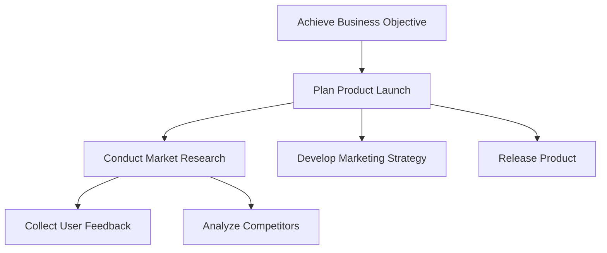

## Introduction: From Intent to Intelligent Action

In previous chapters, we established what agentic AI systems are, how they perceive their environment, and how they maintain internal representations of state, memory, and context. With these foundations in place, we now turn to one of the most critical capabilities that distinguishes an *agent* from a passive model: the ability to **formulate goals, plan actions to achieve those goals, and make decisions in the face of uncertainty**.

This chapter explores how intelligent agents decide *what* to do, *why* to do it, *how* to do it, and *when* to change course. Goal formulation, planning, and decision-making are deeply interconnected processes. Goals define desirable future states. Planning transforms goals into structured sequences of actions. Decision-making governs action selection when outcomes are uncertain, resources are limited, or multiple goals compete.

In human terms, consider planning a career move. You may set a long-term goal (career growth), break it into sub-goals (acquire skills, change teams), evaluate options under uncertainty (job market conditions), and constantly revise plans as new information emerges. Agentic AI systems face analogous challenges, albeit in computational form.

By the end of this chapter, you will understand:
- How agents formulate, represent, and prioritize goals
- Classical and modern planning approaches, from symbolic planners to learning-based methods
- Decision-making models under uncertainty, including utility theory and probabilistic reasoning
- How to integrate goals, planning, and decision-making into real-world agentic workflows

This chapter bridges theory and practice, offering both conceptual understanding and actionable patterns for building intelligent, goal-driven systems.

---

## Understanding Goals in Agentic Systems

### What Is a Goal?

At its core, a **goal** is a specification of a desired future state of the environment—or of the agent itself. In agentic AI, goals serve as the primary drivers of behavior. Without goals, an agent merely reacts; with goals, it acts *purposefully*.

Formally, a goal can be defined as a condition or set of conditions that the agent aims to make true. These conditions may refer to:
- External environment states (e.g., “deliver the package to location X”)
- Internal agent states (e.g., “maximize confidence in my answer”)
- Temporal or abstract objectives (e.g., “minimize total cost over time”)

Goals vary along several important dimensions:
- **Specificity**: from precise (“reach coordinates (x, y)”) to abstract (“help the user”)
- **Time horizon**: short-term (immediate tasks) vs. long-term (strategic objectives)
- **Measurability**: easily verifiable vs. subjective or probabilistic
- **Stability**: fixed vs. dynamically changing

In agentic AI, goal representation is not merely a design choice; it fundamentally shapes what kinds of planning and decision-making algorithms are feasible.

---

### Why Goal Formulation Matters

The quality of an agent’s goals directly determines the quality of its behavior. Poorly defined goals lead to:
- Ambiguity: the agent does not know when it has succeeded
- Misalignment: the agent optimizes the wrong outcome
- Inefficiency: unnecessary actions or resource use

A classic example is reward hacking in reinforcement learning, where poorly specified objectives lead an agent to exploit loopholes rather than achieve the intended outcome. For instance, an agent instructed to “maximize game score” might discover unintended exploits instead of playing the game properly.

In real-world agentic workflows—such as autonomous research assistants, customer support agents, or planning bots—goal formulation is a *safety-critical* concern. It determines not only effectiveness but also trustworthiness.

---

### Sources of Goals: Where Do Goals Come From?

Goals do not arise in a vacuum. They typically originate from one or more of the following sources:

1. **External directives**  
   These include explicit instructions from users, system designers, or APIs. For example, a user might ask, “Draft a project plan for launching feature X.”

2. **Derived goals**  
   Agents may derive sub-goals from higher-level objectives. If the goal is “launch feature X,” sub-goals might include “gather requirements,” “estimate engineering effort,” and “identify risks.”

3. **Internal drives or policies**  
   Some agents are designed with intrinsic objectives, such as minimizing uncertainty, conserving resources, or maintaining system health.

4. **Environmental triggers**  
   Changes in the environment may generate new goals, such as responding to an alert or handling an exception.

Understanding goal sources is essential because it influences how goals should be validated, prioritized, and potentially overridden.

---

## Goal Representation and Formalization

### Why Representation Matters

The way goals are represented determines:
- Which planning algorithms can be used
- How easily goals can be decomposed
- Whether goals can be compared, prioritized, or optimized

A goal written in natural language (“help the user plan their trip”) is expressive but ambiguous. A goal represented as a logical formula or numeric objective is precise but limited in scope. Agent designers must carefully balance expressiveness and tractability.

---

### Common Goal Representation Paradigms

#### Logical and Symbolic Goals

In symbolic AI and classical planning, goals are often represented as logical expressions. For example:
- “At(robot, roomB) AND Has(robot, key)”

This representation is well-suited to deterministic environments with clear state transitions. It enables provable planning but struggles with uncertainty and real-world complexity.

#### State-Based Goals

In this approach, a goal is defined as reaching a particular state or set of states in the state space. This is common in search-based planning and reinforcement learning.

For example, in a navigation task:
- Goal: reach any state where distance_to_target < 1 meter

This formulation naturally supports optimization but may obscure symbolic meaning.

#### Utility-Based Goals

Rather than defining a binary success condition, utility-based goals specify a **utility function** that assigns a numeric value to outcomes. The agent’s objective is to maximize expected utility.

This approach is powerful because it:
- Handles trade-offs between competing objectives
- Works naturally with uncertainty
- Supports continuous decision-making

However, defining a good utility function is notoriously difficult.

#### Natural Language and Hybrid Goals

Modern agentic systems—especially those built on large language models—often maintain goals in natural language or hybrid representations. For example:
- A high-level goal in text
- Sub-goals translated into structured constraints or metrics

This hybrid approach reflects a broader trend toward combining symbolic structure with learned representations.

---

## Goal Decomposition and Hierarchies

### The Need for Decomposition

Complex goals are rarely achievable in a single step. Decomposition allows agents to break long-term objectives into manageable parts, reducing cognitive and computational load.

For example, the goal “organize an international conference” can be decomposed into:
- Secure a venue
- Invite speakers
- Manage registrations
- Coordinate logistics

This mirrors how humans approach complex tasks and is essential for scalability.

---

### Hierarchical Goal Structures

Goals are often organized into **hierarchies**, where:
- High-level goals define *what* should be achieved
- Mid-level goals define *how*
- Low-level goals correspond to concrete actions

This hierarchy enables abstraction and reuse. A sub-goal such as “send email invitation” may be reused across multiple higher-level goals.

The following diagram illustrates a typical goal hierarchy:



Hierarchical goal structures are foundational to many planning frameworks, including Hierarchical Task Networks (HTNs), which we will revisit later.

---

### When and How to Revisit Goal Decomposition

Decomposition is not a one-time process. Agents must be prepared to:
- Refine goals when plans fail
- Abandon sub-goals that become irrelevant
- Introduce new sub-goals in response to surprises

This dynamic aspect differentiates robust agents from brittle ones.

---

## Goal Prioritization and Trade-Offs

### Why Prioritization Is Necessary

Agents often face multiple goals simultaneously. Resources such as time, computation, and attention are finite. Prioritization is the process of deciding:
- Which goals to pursue now
- Which goals to defer
- Which goals to drop entirely

Without prioritization, agents risk oscillation, inefficiency, or failure to complete any goal satisfactorily.

---

### Factors Influencing Goal Priority

Several factors commonly influence prioritization decisions:

- **Urgency**: deadlines or time-sensitive opportunities
- **Importance**: alignment with core objectives or user intent
- **Feasibility**: likelihood of success given current resources
- **Risk**: potential negative consequences of failure
- **Dependencies**: whether one goal enables others

These factors are often weighted differently depending on the application domain.

---

### Multi-Objective Optimization

In many cases, goals cannot be linearly ordered. Instead, agents must balance competing objectives, such as speed versus accuracy or cost versus quality.

Multi-objective optimization frameworks provide tools for this, including:
- Weighted sum approaches
- Pareto optimality
- Lexicographic ordering

These methods allow agents to reason explicitly about trade-offs rather than relying on ad hoc heuristics.

---

## Foundations of Planning

### What Is Planning?

**Planning** is the process of generating a sequence (or policy) of actions that transitions the agent from an initial state to a state that satisfies its goals.

Planning answers the question: *Given what I want and what I know about the world, what should I do next—and after that?*

---

### Elements of a Planning Problem

A planning problem typically consists of:
- An **initial state**
- A **goal specification**
- A set of **actions** or operators
- A **transition model** describing action effects
- Optional cost or reward structures

Planning assumes that the agent has, or can learn, a model of how its actions affect the world. This assumption distinguishes planning from purely reactive or model-free approaches.

---

## Classical Planning Approaches

### State-Space Search

One of the earliest planning paradigms is **state-space search**, where planning is treated as a search problem over possible states.

The agent:
1. Starts from the initial state
2. Applies available actions to generate successor states
3. Searches for a path to a goal state

Common algorithms include:
- Breadth-first search
- Depth-first search
- A* search (with heuristics)

Heuristic functions are crucial, as they guide the search toward promising regions of the state space.

---

### STRIPS and Symbolic Planning

The STRIPS (Stanford Research Institute Problem Solver) formalism represents actions using:
- Preconditions: what must be true before an action
- Effects: how the action changes the state

This symbolic representation enables clear reasoning and is foundational to many planning systems.

However, STRIPS-style planners assume:
- Deterministic actions
- Fully observable environments
- Discrete, well-defined states

These assumptions rarely hold fully in real-world agentic applications.

---

### Planning Graphs and Partial-Order Planning

Planning graphs and partial-order planners aim to reduce computational complexity by:
- Representing actions and states at multiple levels of abstraction
- Allowing flexibility in action ordering

Rather than committing to a strict sequence, these planners reason about constraints and dependencies, which is especially useful when multiple actions can occur in parallel.

---

## Hierarchical Planning

### Hierarchical Task Networks (HTNs)

HTN planning leverages goal hierarchies by specifying how high-level tasks can be decomposed into lower-level tasks.

For example:
- Task: “Prepare dinner”
  - Method 1: “Cook at home”
  - Method 2: “Order takeout”

Each method further decomposes into subtasks. This approach closely mirrors human procedural knowledge.

HTNs are particularly effective when:
- Domain knowledge is rich
- Tasks follow recurring patterns
- Explainability is important

---

### Advantages and Limitations of Hierarchical Planning

Advantages:
- Scalability through abstraction
- Incorporation of expert knowledge
- More human-like plans

Limitations:
- Knowledge engineering effort
- Reduced flexibility in novel situations
- Dependence on predefined decompositions

---

## Planning Under Uncertainty

### Why Uncertainty Changes Everything

Real-world environments are noisy, partially observable, and stochastic. Actions may fail, information may be incomplete, and outcomes may vary.

Under uncertainty, planning must account not only for *what could happen* but also for *how likely* different outcomes are.

---

### Markov Decision Processes (MDPs)

An MDP formalizes decision-making under uncertainty using:
- States
- Actions
- Transition probabilities
- Rewards

The agent’s objective is to find a **policy** that maximizes expected cumulative reward.

MDPs provide a mathematical foundation for many planning and reinforcement learning algorithms.

---

### Partially Observable MDPs (POMDPs)

In many cases, the agent cannot fully observe the true state. POMDPs extend MDPs by introducing:
- Belief states (probability distributions over possible states)
- Observation models

Planning in POMDPs is computationally challenging but critical for robust real-world agents.

---

## Decision-Making and Utility Theory

### The Role of Decision-Making

Decision-making governs action selection, especially when:
- Multiple plans are available
- Outcomes are uncertain
- Goals conflict

While planning generates possibilities, decision-making chooses among them.

---

### Expected Utility Maximization

The dominant normative model of decision-making is **expected utility theory**. The agent evaluates each action by:
1. Estimating possible outcomes
2. Assigning utilities to outcomes
3. Weighting utilities by probabilities

The action with the highest expected utility is selected.

This framework is elegant and powerful but depends critically on accurate models and utility functions.

---

### Bounded Rationality

In practice, agents are limited by computational resources. **Bounded rationality** acknowledges that agents often rely on:
- Heuristics
- Approximations
- Satisficing (good enough solutions)

Understanding bounded rationality is essential for designing agents that perform well under real constraints.

---

## Modern Planning and Decision Approaches

### Reinforcement Learning

Reinforcement learning (RL) shifts the focus from explicit planning to learning policies through interaction.

Instead of being given a model, the agent learns:
- Which actions yield higher reward
- How to act in different states

Model-based RL reintroduces planning by learning a transition model, while model-free RL relies purely on experience.

---

### Planning with Large Language Models

LLM-based agents introduce new planning paradigms:
- Chain-of-thought reasoning
- Natural language plans
- Tool-augmented execution loops

These systems often perform **implicit planning**, reasoning step by step without explicit state or action representations.

Example pseudo-code for an LLM-based planning loop:

```python
while not goal_achieved:
    plan = llm.generate_plan(goal, current_context)
    for step in plan:
        result = execute(step)
        update_context(result)
```

While flexible, these approaches raise questions about reliability, verification, and controllability.

---

### Hybrid Approaches

Many practical systems combine:
- Symbolic planners for structure
- Learning-based components for adaptability
- Heuristics for efficiency

Hybrid architectures represent the current frontier of agentic AI design.

---

## Applying Planning and Decision-Making to Agentic Workflows

### End-to-End Agent Pipelines

In a typical agentic workflow:
1. Interpret user intent and formulate goals
2. Decompose goals into sub-goals
3. Generate a plan
4. Execute actions
5. Monitor outcomes and revise plans

Each stage feeds into the next, creating a continuous loop of perception, reasoning, and action.

---

### Case Study: Autonomous Research Agent

Consider an agent tasked with “research emerging trends in renewable energy.”

Goals:
- Identify recent publications
- Summarize key developments
- Highlight open challenges

Planning involves:
- Selecting data sources
- Scheduling queries
- Deciding when sufficient information has been gathered

Decision-making under uncertainty arises when:
- Sources conflict
- Information is incomplete
- Time constraints limit exploration

This case illustrates how abstract goals translate into concrete agent behavior.

---

## Challenges, Failure Modes, and Best Practices

### Common Challenges

- Goal mis-specification
- Plan fragility
- Computational scalability
- Distributional shift

Understanding these challenges helps prevent brittle designs.

---

### Monitoring, Reflection, and Replanning

Robust agents monitor their progress, detect deviations, and adapt. Reflection mechanisms—where agents evaluate their own performance—are increasingly important in advanced systems.

---

## Summary and Key Takeaways

Goal formulation, planning, and decision-making form the cognitive backbone of agentic AI. Goals provide direction, planning provides structure, and decision-making provides adaptability under uncertainty.

Key lessons from this chapter include:
- Well-defined goals are essential for alignment and effectiveness
- Planning transforms abstract intent into actionable steps
- Hierarchies and decomposition enable scalability
- Uncertainty necessitates probabilistic reasoning and utility-based decisions
- Modern agents increasingly blend symbolic, statistical, and language-based approaches

As we move forward in this book, these concepts will reappear in increasingly concrete implementations and advanced techniques. Mastery of goal-driven reasoning is what transforms intelligent systems from reactive tools into autonomous collaborators.


