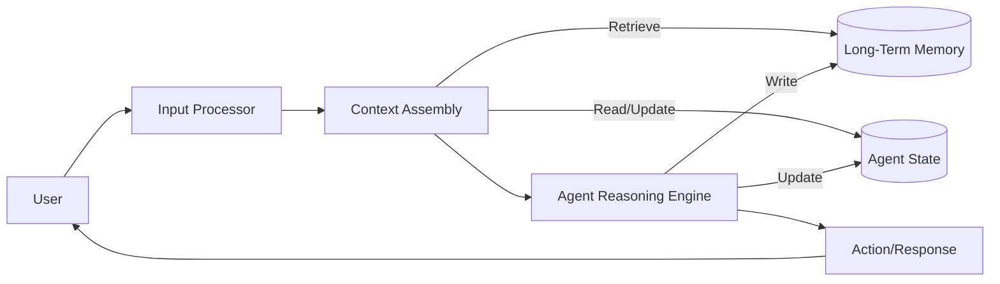

## Overview and Context

Intelligent agents differ from traditional software systems primarily in their ability to perceive, reason, and act over time. Unlike stateless functions that simply map an input to an output, agents are expected to operate in dynamic environments, learn from experience, adapt to changing conditions, and maintain continuity across interactions. At the heart of these capabilities lie three deeply interrelated concepts: memory, state, and context. Together, they define how an agent understands its past, interprets its present, and plans its future.

In agentic AI systems, memory refers to the mechanisms through which information from prior interactions, observations, or internal computations is stored and retrieved. State describes the agent’s internal representation of its current situation, including goals, beliefs, and environment-related variables. Context encompasses the broader situational framing that gives meaning to both input and output, including conversational history, environmental conditions, user intent, and task constraints. Managing these elements effectively is not optional; it is foundational to building agents that behave coherently, reliably, and in a way that humans perceive as intelligent.

As agentic systems move beyond simple prompt–response workflows toward long-running, autonomous processes, the need for robust memory and state management becomes even more critical. A customer support agent must remember prior tickets in a conversation. A research assistant must track hypotheses, sources, and evolving conclusions over days or weeks. A robotic agent navigating a physical environment must maintain spatial memory and continuously update its state as it moves. In each case, failures in memory, state, or context management lead to inconsistent behavior, repeated mistakes, lost progress, or responses that feel disconnected from the situation at hand.

This chapter is situated within the broader discussion of design, architecture, and implementation of agentic AI. Earlier discussions establish what agents are and how they reason, plan, and act. Here, the focus shifts to the persistent substrate that underpins all those capabilities. We explore not only what memory, state, and context are, but why they matter, how they are represented, when they are updated, where they are stored, and how they interact across architectural layers.

The relevance of this topic extends beyond large language model–based agents. Concepts of state and memory have deep roots in computer science, from finite state machines and operating systems to databases and distributed systems. Context management has parallels in human–computer interaction, linguistics, and cognitive science. Agentic AI brings these strands together in a unique way, because the agent itself is both a reasoning entity and a software system embedded in a technical stack.

By the end of this chapter, the reader should have a deep understanding of how to design memory and state systems that support coherent agent behavior, how to choose appropriate representations and storage mechanisms, and how to avoid common pitfalls that arise when context grows large or fragmented. The chapter emphasizes practical relevance through real-world case studies and concrete implementation examples, while grounding all recommendations in clear conceptual foundations.

## Core Concepts

Memory, state, and context are often used interchangeably in casual discussions of AI agents, but they refer to distinct, though overlapping, constructs. Understanding their differences and relationships is a prerequisite for designing effective agent architectures.

Memory, in its broadest sense, is any mechanism that allows an agent to retain information over time. This information can originate from user interactions, environment observations, internal reasoning traces, or externally provided knowledge. Memory can be short-term, such as the tokens currently in a language model’s attention window, or long-term, such as entries in a database or vector store. Importantly, memory implies persistence beyond a single computational step; it allows the past to influence future behavior.

State, by contrast, is the agent’s internal snapshot of “where things stand” at a given moment. It includes variables such as current goals, progress indicators, belief estimates, and environmental parameters. State is typically structured and explicitly represented, often as key–value pairs or structured objects. While memory can be vast and historical, state is usually compact and focused on what is immediately relevant for decision-making. One can think of state as the working set derived from memory and perception.

Context is the interpretive layer that makes information meaningful in a particular situation. In conversational agents, context includes recent dialogue turns, inferred user intent, tone, and constraints. In task-oriented agents, it may include the current task, priors about user preferences, and environmental assumptions. Context is dynamic and situational; it often determines which parts of memory are relevant and how the current state should be interpreted.

These three concepts are deeply interdependent. Memory feeds state by providing historical data. State selects and shapes context by identifying what matters now. Context, in turn, guides which memories should be retrieved and how new experiences should be encoded. The effectiveness of an agent depends not just on having each component, but on orchestrating them coherently.

The theoretical foundations for these ideas draw from multiple disciplines. In cognitive science, human memory is often divided into working memory, episodic memory, and semantic memory. These distinctions map closely to agent architectures that separate transient context windows from long-term knowledge stores. In control theory and reinforcement learning, state representations are central to policy learning and decision-making. In software engineering, context propagation and state management are core concerns in distributed and reactive systems.

Why do these concepts matter so much in agentic AI? The answer lies in coherence and learning. An agent that cannot remember will repeat itself and fail to improve. An agent with poorly defined state will behave unpredictably, as actions are taken without a clear understanding of current conditions. An agent that mismanages context will produce outputs that are technically correct but situationally inappropriate. Together, these failures erode trust and usefulness.

Moreover, modern AI agents often operate under practical constraints such as limited context windows, latency requirements, and privacy considerations. These constraints force designers to make deliberate choices about what to remember, what to forget, and how to summarize or abstract past experience. Thus, memory, state, and context management are not merely conceptual concerns but central engineering challenges.

## Detailed Explanation

### Key Components

At a high level, memory systems in agents can be categorized by duration and purpose. Short-term memory is typically embodied in the immediate input context provided to a language model or reasoning engine. This includes recent dialogue turns, recent observations, and active instructions. It is fast to access but limited in capacity.

Long-term memory, on the other hand, persists beyond individual interactions. It may store user profiles, task histories, learned preferences, or domain knowledge acquired over time. Long-term memory often requires external storage systems such as databases, file systems, or vector stores, and retrieval mechanisms to bring relevant information back into the agent’s working context.

State management operates at an intermediate level. The agent maintains a structured representation of its current objectives, progress markers, and environment-related variables. For example, a travel-planning agent might maintain state variables such as selected destination, travel dates, budget range, and pending questions. This state evolves as the conversation progresses.

Context management binds these components together. It determines which state variables and memory entries are injected into the reasoning process at any given time. Context management also governs how new inputs are interpreted. A user’s statement like “Let’s go with the cheaper option” only makes sense if contextualized within a prior discussion of alternatives.

### Implementation Details

Implementing these components requires careful architectural decisions. One common approach is to separate concerns into layers. The agent core handles reasoning and decision-making, often invoking a language model. A memory layer provides APIs for storing and retrieving information. A state layer maintains structured variables. A context assembly module determines what information flows into each reasoning step.

Consider a conversational agent built using a language model. The raw conversation history cannot always be passed in full due to token limits. Thus, implementation often involves summarization strategies. Older dialogue turns may be summarized into a concise description that preserves essential facts while discarding surface details. This summary becomes part of long-term memory, while the most recent turns remain in short-term memory.

Vector embeddings are frequently used to implement long-term memory retrieval. Each memory item is embedded into a high-dimensional space, enabling similarity-based retrieval. When new context arises, the agent can query the vector store for memories that are semantically related to the current situation. This allows contextually relevant recall without exhaustive search.

State is often implemented as a structured object, such as a Python dictionary or a typed data class. Explicitly modeling state has advantages over implicitly inferring it from text, as it allows for validation, easier debugging, and more predictable behavior. State updates can be triggered by specific events, such as user confirmations or task completions.

### Technical Considerations

Several technical challenges arise in practice. One is consistency: ensuring that state, memory, and context do not contradict each other. For example, if long-term memory indicates a user preference for vegetarian food but the current state shows a confirmed reservation at a steakhouse, the agent must reconcile this discrepancy.

Another challenge is scalability. As memory grows, retrieval must remain efficient. Naïve approaches that load all memory into context quickly become infeasible. Indexing, ranking, and filtering mechanisms are essential. Additionally, memory management policies must decide when to archive, summarize, or delete old information.

Privacy and security are also critical. Memory often contains sensitive user data. Agents must implement access control, data minimization, and, where necessary, mechanisms to forget information upon request. These considerations influence architectural choices such as whether memory is stored locally, centrally, or in encrypted form.

The following diagram illustrates a typical agent architecture with explicit memory and state components:



This architecture emphasizes the bidirectional flow between reasoning, memory, and state, with context assembly acting as the mediator.

## Real-World Applications

One prominent application of memory and state management is customer support automation. In a support chatbot deployed by a telecommunications company, the agent must handle multi-turn conversations that can span minutes or hours. The agent maintains state variables such as customer identity, account status, and current issue category. Long-term memory stores prior tickets and resolutions. Context management ensures that when a customer says “It’s still not working,” the agent understands what “it” refers to. Companies that invested in robust memory systems reported higher first-contact resolution rates and improved customer satisfaction, while those relying on stateless bots saw frequent breakdowns.

Another example is personal productivity assistants. These agents help users manage tasks, schedules, and goals over extended periods. Memory includes past commitments, preferences, and recurring patterns. State captures what tasks are currently active or pending. Context enables the agent to interpret ambiguous commands like “Move it to tomorrow” correctly. Real-world deployments show that users quickly abandon assistants that forget prior agreements, underscoring the importance of reliable persistence.

In healthcare, clinical decision support agents must maintain careful state and context. An agent assisting with patient triage needs to track symptoms reported, questions already asked, and risk assessments. Memory may include anonymized historical cases to inform recommendations. Context ensures that advice is appropriate to the clinical setting. Errors in state management can have serious consequences, making this an area where explicit models and auditability are essential.

Autonomous research agents provide another illustrative case. These agents may run for days, gathering sources, forming hypotheses, and refining outputs. Long-term memory stores notes and citations. State tracks the current research phase. Context determines which sources are relevant when drafting a section. Successful systems use layered memory, combining structured state with rich unstructured notes.

In robotics, physical agents navigating real environments rely heavily on state estimation and memory. A delivery robot maintains a state estimate of its location, battery level, and task progress, while memory stores maps and obstacle encounters. Context integrates sensor readings with mission objectives. Field deployments show that robust state estimation and memory reduce navigation errors and downtime.

Educational tutoring systems also benefit. An AI tutor that remembers a student’s misconceptions and progress can personalize instruction. State variables represent mastery levels. Memory stores interaction history. Context frames new questions in light of prior learning. Studies demonstrate improved learning outcomes when agents maintain such individualized context over time.

## Practical Examples

To ground these ideas, consider a simplified Python example of an agent state and memory manager:

```python
class AgentMemory:
    def __init__(self):
        self.long_term = []
    
    def store(self, item):
        self.long_term.append(item)
    
    def retrieve(self, predicate):
        return [m for m in self.long_term if predicate(m)]

class AgentState:
    def __init__(self):
        self.variables = {
            "goal": None,
            "progress": 0
        }
    
    def update(self, key, value):
        self.variables[key] = value

## Example usage
memory = AgentMemory()
state = AgentState()

memory.store({"type": "preference", "content": "User prefers email communication"})
state.update("goal", "Prepare project summary")
state.update("progress", 0.5)

relevant_memories = memory.retrieve(lambda m: m["type"] == "preference")
```

In this example, memory and state are clearly separated. Memory is used for historical facts, while state tracks the current goal. In a real agent, retrieval would involve embeddings and similarity search, but the conceptual separation remains.

A conversational context assembly step might look like this:

```python
def build_context(user_input, state, memories):
    context = []
    context.append(f"Current goal: {state.variables['goal']}")
    for m in memories:
        context.append(f"Relevant memory: {m['content']}")
    context.append(f"User says: {user_input}")
    return "\n".join(context)
```

This illustrates how context is constructed dynamically from state and memory, rather than being a raw dump of history.

## Common Patterns and Best Practices

One widely used pattern is layered memory. Agents maintain multiple tiers of memory, each with different capacity and access costs. Short-term context handles immediate reasoning. Medium-term summaries capture recent interactions. Long-term memory archives durable knowledge. This pattern mirrors human cognition and balances relevance with efficiency.

Explicit state modeling is another best practice. Rather than relying on the language model to infer state implicitly from text, designers define state variables explicitly. This improves predictability and allows external systems to inspect and modify state when necessary.

Regular summarization helps manage context growth. By periodically summarizing interactions and storing the summary in long-term memory, agents prevent context windows from overflowing while preserving essential information. Effective summarization focuses on decisions, preferences, and outcomes rather than verbatim dialogue.

Context-selective retrieval is also crucial. Instead of retrieving all memories, agents apply filters based on relevance signals such as task type or semantic similarity. This reduces noise and improves reasoning quality.

Finally, clear update rules for state and memory prevent drift. Designers should specify when state variables are updated and when memory entries are written. This reduces ambiguity and makes system behavior more understandable.

## Potential Challenges and Solutions

A common pitfall is context overload, where too much information is injected into the agent’s reasoning process. This can confuse the model and degrade performance. The solution is aggressive filtering and summarization, coupled with relevance scoring.

Another challenge is inconsistency between memory and state. Without reconciliation mechanisms, agents may act on outdated information. Regular validation checks and priority rules help resolve conflicts.

Memory leakage is also problematic, particularly with sensitive data. Implementing retention policies and user-controlled deletion mechanisms mitigates this risk.

Finally, debugging agent behavior can be difficult when memory and context interactions are complex. Instrumentation and logging of context assembly steps provide visibility and aid troubleshooting.

## Integration with Other Concepts

Memory and state management integrate closely with planning, learning, and tool use. Planning algorithms rely on state representations to evaluate actions. Learning mechanisms update memory with outcomes and rewards. Tool-using agents store tool call results in memory for future reference.

These concepts also intersect with evaluation and alignment. Understanding what an agent remembers and how it uses context is essential for assessing reliability and bias. Transparent memory architectures support better auditing and alignment with user expectations.

## Key Takeaways

Memory, state, and context management form the backbone of agentic AI systems. Memory enables learning and continuity, state provides a snapshot for decision-making, and context gives meaning to interactions. Their effective integration determines whether an agent behaves coherently over time.

Designing these systems requires both conceptual clarity and practical engineering. Clear distinctions between memory, state, and context allow architects to choose appropriate representations and storage mechanisms. Robust architectures balance persistence with efficiency, relevance with completeness, and autonomy with control.

Real-world applications demonstrate that investment in memory and state management yields tangible benefits, from improved user satisfaction to safer autonomous behavior. Conversely, neglecting these aspects leads to brittle, frustrating systems.

Ultimately, agents that manage memory, state, and context well are better equipped to act as reliable collaborators, not just reactive tools. As agentic AI continues to evolve, these foundational capabilities will only grow in importance.

## Further Reading

Readers interested in deepening their understanding may explore literature on cognitive architectures such as ACT-R and SOAR, which provide longstanding perspectives on memory and state modeling. Research on vector databases and semantic search offers practical insights into modern memory retrieval techniques. Documentation for agent frameworks like LangChain, AutoGPT, and OpenAI’s Assistants API illustrates real-world implementations of context and state management. Finally, work in human–computer interaction and conversation analysis sheds light on contextual coherence, offering valuable lessons for designing agents that interact naturally over extended periods.

---

This chapter covers core foundations and begins to explore practical depth. If you would like, I can provide the continuation or expand specific sections such as implementation scaling, advanced retrieval strategies, or formal state machines in a follow-up.


