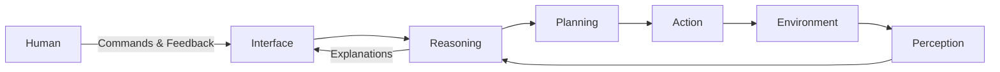

## Overview and Context

Human–Agent Interaction and Collaboration sits at the heart of modern agentic artificial intelligence. As AI systems have progressed from passive tools—such as calculators or simple rule-based software—to active agents capable of perceiving, reasoning, planning, and acting autonomously, the nature of their interaction with humans has fundamentally changed. Rather than issuing isolated commands to a system and receiving static outputs, humans increasingly engage in ongoing, dynamic relationships with intelligent agents that can take initiative, make suggestions, adapt to preferences, and collaborate toward shared goals.

This shift represents more than a technical evolution; it marks a transformation in how work, decision-making, creativity, and responsibility are distributed between humans and machines. In earlier paradigms of human–computer interaction (HCI), systems were largely deterministic, instructions were explicit, and the user retained direct control over every step. In agentic AI systems—such as autonomous assistants, AI copilots, robotic teammates, or organizational decision agents—the system can independently choose actions, weigh trade-offs, and operate under uncertainty. This autonomy creates both powerful opportunities and significant challenges.

Why does human–agent interaction matter so deeply? Because the effectiveness, safety, trustworthiness, and societal impact of agentic AI depend as much on how humans and agents work together as on the algorithms themselves. A highly capable agent that users do not understand, trust, or feel comfortable collaborating with may be underutilized or misused. Conversely, a well-designed collaborative agent can enhance human performance, reduce cognitive load, uncover insights, and enable new forms of creativity and problem-solving that neither humans nor machines could achieve alone.

This chapter is situated within Part III: Applications, Ethics, and the Future of Agentic AI, which reflects the recognition that technical capability alone is insufficient. Human–agent collaboration raises questions about explainability, accountability, delegation, coordination, and shared mental models. It touches on ethics—such as informed consent, power asymmetries, and over-reliance on automation—as well as future-of-work considerations, including skill shifts and organizational change.

Human–Agent Interaction and Collaboration builds on foundational ideas from several disciplines:

• Human–Computer Interaction (HCI), which studies usability, interface design, and cognitive ergonomics  
• Cognitive science and psychology, which explain how humans perceive, reason, learn, and trust  
• Multi-agent systems, which provide models of coordination, negotiation, and joint decision-making  
• Organizational theory and teamwork research, which offer insights into collaboration, roles, and shared goals  

In this context, an “agent” is not merely a chatbot. It is an entity capable of autonomous decision-making, proactive behavior, and goal-directed action, often operating over time and across environments. Human–agent interaction therefore involves continuous feedback loops, evolving roles, and negotiated control. Humans may supervise agents, collaborate as peers, or even defer authority in specific contexts.

The relevance of this topic is evident across domains. In healthcare, clinicians increasingly rely on AI agents to assist with diagnosis, triage, and treatment planning. In software development, AI copilots collaborate with engineers to write, test, and refactor code. In logistics, autonomous planning agents coordinate supply chains in real time. In education, tutoring agents adapt curricula to individual learners. Each of these scenarios demands careful design of interaction, communication, and collaboration to ensure positive outcomes.

This chapter provides a comprehensive exploration of human–agent interaction and collaboration, examining core concepts, design principles, technical considerations, and real-world applications. The goal is to equip readers with both conceptual understanding and practical guidance for building, deploying, and working with agentic AI systems that complement rather than compete with human capabilities.

## Core Concepts

At the foundation of human–agent interaction lie several interrelated concepts that define how humans and intelligent agents perceive each other, communicate, share goals, and coordinate actions. Understanding these concepts is critical for designing systems that are effective, ethical, and usable.

### Agency and Autonomy

Agency refers to the capacity of a system to perceive its environment, make decisions, and act toward goals. In the context of AI, autonomy exists on a spectrum. At one end are assistive systems that act only in response to explicit commands. At the other end are fully autonomous agents capable of long-term planning and self-directed action.

Human–agent collaboration requires careful calibration of autonomy. Too little autonomy undermines the benefits of agentic systems, turning them into glorified tools. Too much autonomy risks loss of human control, misunderstandings, and ethical concerns. Effective collaboration often involves adjustable autonomy, where the level of agent independence can change based on context, user preference, or task complexity.

### Shared Goals and Intent Alignment

Collaboration presupposes shared or compatible goals. For human–agent systems, this requires translating human intent—often vague, evolving, or implicit—into machine-interpretable objectives. Misalignment between human goals and agent objectives can lead to frustration or harm.

Intent alignment depends on continuous communication, clarification, and feedback. Agents must be able to ask questions, infer preferences, and revise plans as human goals change. Humans, in turn, need mechanisms to understand and correct agent behavior.

### Communication and Interaction Modalities

Communication is the medium through which collaboration occurs. Human–agent interaction can involve multiple modalities, including natural language, visual interfaces, gestures, and even physiological signals. The choice of modality affects usability, cognitive load, and trust.

Natural language interaction has become especially prominent due to advances in large language models. However, language alone is often insufficient for complex tasks. Effective systems combine conversational interfaces with visualizations, controls, and contextual cues that support shared understanding.

### Mental Models and Interpretability

A mental model is an internal representation of how a system works. For collaboration to succeed, humans need accurate mental models of the agent’s capabilities, limitations, and decision processes. Similarly, agents require models of human preferences, expertise, and intent.

Interpretability and explainability play a key role here. When agents can explain why they made a recommendation or took an action, users are better able to trust them, detect errors, and collaborate effectively.

### Trust, Reliance, and Calibration

Trust is not binary; it must be calibrated. Over-trust can lead to complacency and automation bias, while under-trust can result in disuse and inefficiency. Designing for appropriate trust involves transparency, reliability, feedback, and accountability.

Agent behavior, interface design, and prior user experience all shape trust. Systems must not only be accurate but also communicate uncertainty and limitations clearly.

### Roles and Responsibility

In human–agent teams, roles must be clearly defined. Who makes final decisions? Who is accountable for outcomes? When does the agent take initiative, and when does it defer to the human?

These questions are especially important in high-stakes domains such as healthcare, finance, and aviation. Effective collaboration requires explicit role definitions and escalation mechanisms.

## Detailed Explanation

Human–agent collaboration is a multi-layered phenomenon involving cognitive, social, technical, and ethical dimensions. This section breaks down the key aspects of collaboration and interaction in depth.

### Key Components

#### Perception and Context Awareness

Agents must perceive both the external environment and the human collaborator’s state. Context awareness includes understanding task progress, environmental constraints, and human factors such as workload or expertise level. For example, a navigation agent assisting a driver must account for road conditions while also adapting to whether the driver is stressed or distracted.

Context awareness reduces friction by allowing agents to anticipate needs and act proactively rather than reactively.

#### Decision-Making and Action Selection

Collaborative agents must balance autonomous decision-making with human guidance. Hybrid decision frameworks are common, where agents propose options and humans make final choices, or vice versa. The design of these frameworks affects efficiency, satisfaction, and safety.

Decision-making transparency is critical. When an agent presents multiple options along with rationale and risk assessments, humans can engage in informed collaboration.

#### Feedback and Learning

Interaction is not static. Agents should learn from human feedback—both explicit corrections and implicit signals. Over time, this learning enables personalization and improved collaboration.

At the same time, humans learn how agents behave. This mutual adaptation leads to smoother interaction and shared routines, similar to how human teammates develop rapport and workflow patterns.

### Implementation Details

#### Interaction Architectures

From a system perspective, human–agent interaction often involves layered architectures. A perception layer gathers inputs, an interaction layer manages communication, a reasoning layer makes decisions, and an execution layer acts on the environment.

These layers must be tightly integrated to support real-time collaboration. For example, conversational intent detection must feed directly into planning modules.



#### Dialogue Management

Dialogue is central to many collaborative agents. Effective dialogue management involves maintaining state, handling ambiguity, asking clarifying questions, and gracefully recovering from errors. This requires combining linguistic models with task-oriented logic.

#### Explainability Mechanisms

Explanations can take many forms, from textual rationales to visual traces of decision paths. The level of detail should adapt to the user’s expertise and context. Excessive explanation can overwhelm users, while insufficient explanation undermines trust.

### Technical Considerations

#### Latency and Responsiveness

Collaboration depends on timely responses. High latency disrupts conversational flow and coordination. Systems must be optimized for responsiveness, particularly in interactive or real-time domains.

#### Robustness and Error Handling

Agents must handle misunderstandings and errors gracefully. Rather than failing silently or proceeding incorrectly, collaborative agents should detect anomalies, seek clarification, and, when necessary, escalate to human control.

#### Privacy and Data Use

Human–agent collaboration often entails significant data sharing. Designers must ensure privacy protections, informed consent, and secure data handling, especially when agents learn from personal or sensitive information.

## Real-World Applications

### Healthcare Clinical Decision Support

In hospitals, AI agents collaborate with clinicians by analyzing patient data, suggesting diagnoses, and recommending treatment plans. In one large healthcare system, an AI triage agent reduced emergency room wait times by prioritizing cases based on severity. Clinicians reported improved efficiency but emphasized the need for transparency to understand recommendations.

### Software Development Copilots

AI coding assistants collaborate with developers by generating code, suggesting improvements, and identifying bugs. These agents excel at handling boilerplate work, freeing human developers to focus on design and architecture. Effective collaboration depends on clear presentation of suggestions and respect for human coding style.

### Autonomous Robotics in Warehouses

Human workers and robotic agents collaborate in fulfillment centers. Robots handle shipping and inventory tasks, while humans manage exceptions and quality control. Successful deployment requires careful coordination, safety protocols, and intuitive interaction mechanisms.

### Financial Advisory Systems

AI agents assist financial advisors by analyzing market trends and customer portfolios. Advisors retain final decision authority but rely on agents for scenario analysis. Trust and accountability are critical in this domain.

### Education and Intelligent Tutoring

Adaptive tutoring agents collaborate with students, adjusting instruction based on performance and learning style. Studies show improved retention when agents engage in dialogue rather than one-way instruction.

### Disaster Response Coordination

In emergency management, AI agents assist human coordinators by aggregating data, predicting hotspots, and simulating response strategies. Collaboration enhances situational awareness under time pressure.

## Practical Examples

Below is a simplified example of a collaborative task agent that proposes actions and incorporates user feedback.

```python
class TaskAgent:
    def __init__(self):
        self.preferences = {}

    def propose_actions(self, context):
        # Generate multiple options based on context
        return [
            {"action": "Option A", "reason": "Fast and low risk"},
            {"action": "Option B", "reason": "Slower but higher accuracy"}
        ]

    def receive_feedback(self, chosen_action):
        # Learn user preferences over time
        self.preferences["last_choice"] = chosen_action
```

In practice, such an agent would be integrated with a conversational interface. The human reviews options, asks questions, and selects an action. Over time, the agent adapts to preferences.

A step-by-step collaborative workflow might involve:

1. Agent analyzes context and proposes options.
2. Human reviews and asks clarifying questions.
3. Agent explains trade-offs.
4. Human selects or modifies an option.
5. Agent executes and reports outcomes.

## Common Patterns and Best Practices

Effective human–agent collaboration tends to follow recurring patterns.

One key pattern is the “proposal–review–approve” loop, where agents suggest actions and humans validate them. This balances efficiency with oversight, particularly in high-stakes settings.

Another best practice is progressive disclosure—revealing information as needed rather than overwhelming users. Agents should start with high-level summaries and allow users to drill into details.

Clear communication of uncertainty is essential. Agents should express confidence levels and alternative possibilities rather than presenting outputs as absolute truths.

Consistency in behavior and interface design helps users form accurate mental models, reducing confusion and cognitive load.

Finally, continuous evaluation with real users is critical. Collaboration cannot be fully optimized in isolation; it must be iteratively refined based on human feedback.

## Potential Challenges and Solutions

A common challenge is automation bias, where users over-rely on agent recommendations. This can be mitigated by encouraging critical review, presenting alternatives, and training users in appropriate reliance.

Another challenge is misaligned expectations. Users may overestimate or underestimate agent capabilities. Clear onboarding, documentation, and transparent communication help calibrate expectations.

Communication breakdowns can occur due to ambiguity or misunderstanding. Systems should be designed to ask clarifying questions and confirm intent rather than making assumptions.

Ethical concerns arise when agents influence decisions without sufficient transparency. Embedding explainability and maintaining human accountability are essential safeguards.

## Integration with Other Concepts

Human–agent collaboration intersects with ethics by shaping power dynamics and responsibility. It connects with explainable AI through the need for shared understanding. It builds on reinforcement learning when agents adapt based on human feedback. It also relates to multi-agent systems, where humans may be one of several collaborators.

Understanding these connections enables more holistic system design.

## Key Takeaways

Human–Agent Interaction and Collaboration is not a peripheral concern but a central determinant of agentic AI’s success. As agents become more capable and autonomous, the quality of their interaction with humans shapes trust, effectiveness, and ethical outcomes. Collaboration requires careful attention to autonomy, communication, shared goals, and interpretability. It demands technical robustness and thoughtful design grounded in human factors. Real-world applications demonstrate both the promise and challenges of collaborative agents. By focusing on calibrated trust, adaptive interaction, and clear role definitions, designers and practitioners can create systems that truly augment human capabilities rather than undermine them.

## Further Reading

Readers interested in deepening their understanding should explore literature on human–computer interaction, such as works by Don Norman on design and usability, which provide foundational insights into user-centered systems. Research on explainable AI offers valuable perspectives on transparency and trust. Studies in teamwork and organizational psychology shed light on collaboration dynamics applicable to human–agent teams. Finally, recent conference proceedings from venues like CHI, IUI, and AAMAS provide cutting-edge research on human–agent interaction and collaborative AI systems.


