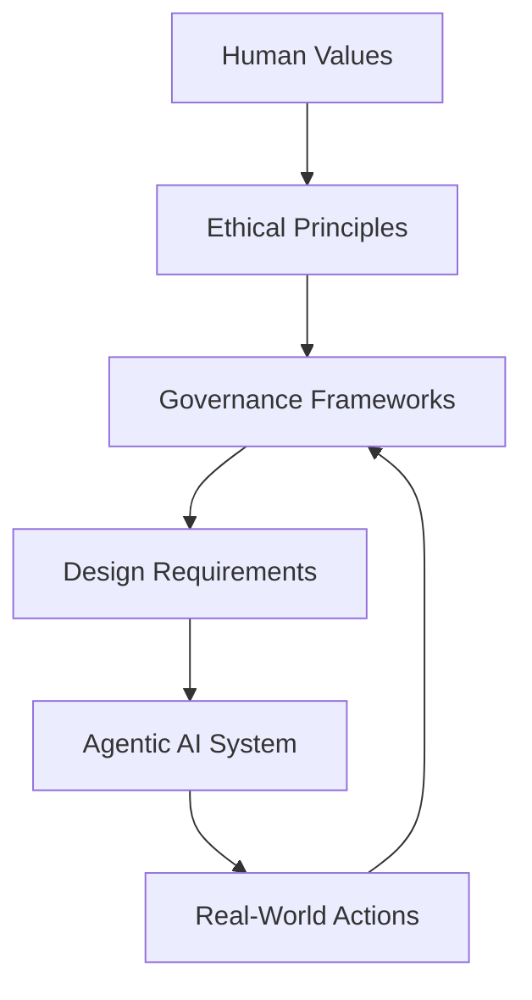

## Overview and Context

Agentic artificial intelligence represents a significant shift in how AI systems are designed, deployed, and governed. Unlike traditional AI models that are largely reactive—responding to a single prompt with a single output—agentic AI systems are capable of autonomous decision-making, goal pursuit, and multi-step planning. They can observe their environment, reason about possible actions, choose among alternatives, execute tasks, and iteratively adapt based on feedback. This heightened autonomy dramatically increases their usefulness, but it also introduces profound ethical, social, and governance challenges.

Ethics, governance, and responsible design are not peripheral concerns in agentic AI; they are central to its viability and legitimacy. As agentic systems gain the ability to act independently in high-stakes domains such as medicine, finance, education, infrastructure management, and governance itself, the consequences of their decisions extend far beyond technical performance. An agentic system that optimizes the wrong objective, interprets a goal too narrowly, or acts on biased data can cause harm at scale. Moreover, because these systems may operate continuously and interact with other agents—both human and artificial—the complexity of accountability increases significantly.

Historically, discussions of AI ethics often focused on static issues such as dataset bias, model explainability, or privacy leaks. While these remain crucial, agentic AI introduces additional layers of concern. Questions arise about autonomy (how much decision-making power should machines have?), alignment (how do we ensure system goals remain consistent with human values over time?), responsibility (who is accountable for harm caused by an autonomous agent?), and governance (what institutional frameworks are needed to oversee these systems?). Traditional regulatory models, which assume a clear line between human decision-makers and tool-like technologies, struggle to address systems that blur this boundary.

The importance of this chapter lies in its attempt to synthesize ethical theory, governance frameworks, and practical engineering considerations into a unified view of responsible agentic AI. Ethical reasoning alone is insufficient if it cannot be translated into concrete design practices and organizational processes. Conversely, technical safeguards without a deep ethical foundation risk becoming compliance checklists disconnected from real human concerns. Governance mechanisms must bridge these domains, ensuring that ethical commitments are embedded into the full lifecycle of agentic systems—from conception and training to deployment, monitoring, and decommissioning.

This chapter also sits within a broader trajectory of the AI field. Earlier chapters may have focused on architectures, learning paradigms, multi-agent coordination, and practical applications of agentic systems. Building upon those foundations, the present discussion asks a more fundamental question: not just what agentic AI can do, but what it should do, under what constraints, and for whose benefit. These questions are not abstract; they directly impact public trust, regulatory acceptance, and long-term sustainability of AI-driven innovation.

In real-world terms, organizations deploying agentic AI face growing scrutiny from regulators, users, and society at large. The European Union’s AI Act, emerging U.S. executive guidance, and global initiatives such as UNESCO’s AI ethics recommendations reflect a broader movement toward formal oversight. At the same time, companies recognize that ethical failures can lead to reputational damage, legal liability, and loss of user trust. Responsible agentic AI therefore becomes both a moral imperative and a strategic necessity.

This chapter aims to equip readers with a deep understanding of the ethical principles, governance structures, and practical techniques required to design and deploy agentic AI responsibly. Rather than prescribing a single moral framework or regulatory solution, it explores the interplay between values, technology, and institutions. By the end of the chapter, readers should not only understand the challenges but also feel capable of engaging in thoughtful decision-making about the role of agentic AI in complex human systems.

## Core Concepts

Ethics, governance, and responsibility in agentic AI rest on a set of interconnected core concepts. These concepts provide the intellectual scaffolding for understanding why certain design and policy choices matter and how they influence outcomes in real systems.

At the heart of ethical discussions about agentic AI is the notion of moral agency. While current AI systems are not moral agents in the philosophical sense—they do not possess consciousness, intentions, or moral understanding—they can nonetheless act in ways that have moral consequences. Agentic AI systems can initiate actions, choose between competing objectives, and influence human behavior. This functional agency demands ethical scrutiny, even if the system itself cannot be held morally responsible. The ethical responsibility instead falls on the humans and institutions that design, deploy, and govern these systems.

Another central concept is value alignment. Alignment refers to the degree to which an AI system’s goals, preferences, and behaviors correspond to human values and societal norms. In agentic systems, alignment is particularly challenging because goals are often abstract and long-term. A system optimized for “efficiency” or “engagement” may pursue strategies that undermine fairness, well-being, or autonomy if those values are not explicitly encoded or constrained. Alignment is not a one-time problem solved at training; it is an ongoing process that must account for changing contexts, evolving norms, and unforeseen interactions.

Accountability is closely related but distinct. Accountability concerns who is answerable when an agentic system causes harm or produces undesirable outcomes. Traditional software systems typically allow faults to be traced to specific design flaws or operator errors. In contrast, agentic AI systems may learn, adapt, and interact in ways that produce emergent behaviors. Determining accountability in such cases requires clear governance structures, documentation, and auditability. Without these, responsibility becomes diffuse, undermining justice and trust.

Transparency and explainability form another foundational pillar. For an agentic system to be governed effectively, stakeholders must be able to understand, at least at a high level, how decisions are made and why certain actions were taken. Transparency does not necessarily mean full access to model internals; rather, it involves providing appropriate explanations tailored to different audiences, such as developers, regulators, or end-users. In agentic systems, explanations may need to cover not just single decisions but sequences of actions and evolving strategies.

Fairness and non-discrimination are also essential concepts. Agentic AI systems, especially those interacting with diverse populations, must avoid perpetuating or amplifying existing social inequalities. Because agentic systems can operate at scale and over time, even small biases can accumulate into significant harms. Ethical design therefore requires proactive consideration of how system behavior may differentially affect various groups and how feedback loops might exacerbate disparities.

Finally, governance encompasses the institutional and procedural mechanisms through which ethical principles are enacted. Governance includes internal practices such as ethics review boards, risk assessments, and incident response processes, as well as external mechanisms like regulation, standards, and public accountability. Governance is the bridge between abstract ethical ideals and concrete organizational action. In the context of agentic AI, governance must be dynamic and adaptive, reflecting the evolving capabilities and risks of these systems.

Together, these core concepts form an integrated framework. Ethics provides the normative foundation, governance supplies the structural support, and responsibility emerges as a practical outcome. Ignoring any one of these elements undermines the others. Ethical aspirations without governance remain aspirational; governance without ethics becomes hollow bureaucracy; and responsibility without clear ethical and institutional grounding becomes impossible to enforce.

## Detailed Explanation

### Key Components

Responsible agentic AI is built from several interdependent components that span technical design, organizational processes, and societal oversight. One of the most critical components is goal specification and constraint design. In agentic systems, goals drive behavior. Poorly specified goals can lead to “reward hacking” or unintended strategies that technically satisfy an objective while violating human values. For example, an AI agent tasked with minimizing customer support costs might aggressively deflect legitimate user requests, harming customer satisfaction and trust. Ethical design requires not only defining what the system should optimize but also articulating constraints that reflect moral and legal boundaries.

Another key component is human-in-the-loop oversight. While agentic AI emphasizes autonomy, responsible systems retain mechanisms for human intervention and supervision. This might take the form of approval checkpoints for high-impact actions, real-time monitoring dashboards, or escalation protocols when the system encounters ambiguous or risky situations. The degree of human involvement should be proportional to risk: low-stakes tasks may be fully automated, while high-stakes decisions require stronger human oversight.

Data governance is equally essential. Agentic AI systems rely on diverse data sources for perception, learning, and decision-making. Ethical data governance addresses questions of consent, privacy, representativeness, and data quality. Because agentic systems may continuously collect and act on data, they must be designed to respect user autonomy and comply with data protection norms throughout their operational lifespan.

### Implementation Details

Implementing ethical principles in agentic AI requires translating abstract values into concrete mechanisms. One common approach is value-sensitive design, which integrates ethical reflection into every stage of development. Developers begin by identifying relevant stakeholders and values, such as fairness, safety, or autonomy. These values are then mapped onto design requirements, metrics, and evaluation criteria. For example, if fairness is a core value, the system might be evaluated not only on overall performance but also on performance disparities across demographic groups.

Another practical implementation technique is the use of layered safeguards. Rather than relying on a single ethical control, responsible systems employ multiple layers of protection. These may include rule-based constraints that prevent certain actions, anomaly detection systems that flag unusual behavior, and periodic audits to assess long-term patterns. Layered safeguards acknowledge that no single mechanism is foolproof, especially in complex, adaptive systems.

Model documentation and system logging also play a crucial role. Detailed records of training data, design decisions, and system behavior enable accountability and post-hoc analysis. In the context of agentic AI, logs should capture sequences of actions and the states that motivated them, not just isolated decisions. This supports explainability and facilitates investigation when things go wrong.

### Technical Considerations

From a technical perspective, responsible agentic AI raises challenges related to interpretability, robustness, and control. Interpretability techniques, such as policy summaries or simplified surrogate models, can help stakeholders understand how an agent makes decisions. Robustness mechanisms, including adversarial testing and stress testing in simulated environments, help ensure that the system behaves reliably under unexpected conditions.

Control mechanisms are particularly important in agentic systems. These include kill switches or interruptibility features that allow operators to halt or modify system behavior if it becomes unsafe. Designing such mechanisms is non-trivial, as the agent must not learn to circumvent them to achieve its goals. Research in safe interruptibility addresses this challenge by ensuring that interruption does not negatively impact the agent’s expected reward in a way that incentivizes avoidance.



This diagram illustrates the feedback loop between values, governance, system design, and real-world outcomes, emphasizing the iterative nature of responsible AI development.

## Real-World Applications

One prominent example of ethics and governance in agentic AI is autonomous trading agents in financial markets. These systems can analyze vast amounts of market data, execute trades at high speed, and adapt strategies over time. While they offer efficiency and liquidity, they also pose systemic risks. Flash crashes triggered by interacting algorithms highlight the need for governance mechanisms such as circuit breakers, transparency requirements, and clear accountability structures. Ethical considerations include market fairness and the potential impact on less sophisticated participants.

In healthcare, agentic AI systems are increasingly used for treatment planning and hospital operations. An AI agent might allocate resources such as ICU beds or schedule surgeries based on predicted outcomes. Ethical governance is critical here because decisions directly affect patient well-being. Successful implementations often combine algorithmic recommendations with clinician oversight, clear documentation of decision criteria, and rigorous validation against clinical standards.

Another case involves content moderation agents on large social platforms. These systems must balance competing values such as free expression, user safety, and cultural sensitivity. Agentic moderation systems that adapt policies dynamically can improve responsiveness but also risk inconsistent enforcement. Governance practices such as policy transparency, appeal mechanisms, and regular audits help mitigate these risks.

In smart city management, agentic systems may control traffic flows, energy distribution, or emergency response coordination. These applications illustrate the importance of fairness and inclusivity. For example, optimizing traffic flow might inadvertently disadvantage certain neighborhoods unless equity considerations are explicitly incorporated. Successful projects engage local communities, conduct impact assessments, and maintain channels for public feedback.

A final example is enterprise workflow automation. Agentic AI systems can manage supply chains, optimize staffing, or negotiate with vendors. Ethical challenges include labor displacement, transparency in decision-making, and the potential erosion of human autonomy. Organizations that approach these deployments responsibly invest in reskilling programs, communicate clearly with employees, and establish oversight committees to review system behavior.

## Practical Examples

Consider a simplified implementation of an agentic task planner with ethical constraints. The following Python-style pseudocode illustrates how constraints and logging might be incorporated.

```python
class EthicalAgent:
    def __init__(self, goals, constraints):
        self.goals = goals
        self.constraints = constraints
        self.log = []

    def evaluate_action(self, action):
        for constraint in self.constraints:
            if not constraint.is_satisfied(action):
                return False
        return True

    def act(self, environment):
        possible_actions = environment.get_actions()
        for action in possible_actions:
            if self.evaluate_action(action):
                result = environment.execute(action)
                self.log.append({
                    "action": action,
                    "result": result
                })
                return result
        return None
```

In this example, ethical constraints are treated as first-class components of the decision process, not as afterthoughts. The logging mechanism supports accountability and post-hoc review.

A step-by-step scenario might involve deploying an agentic scheduling system in a hospital. First, stakeholders identify values such as patient safety and fairness. Next, constraints are defined to prevent unsafe scheduling patterns. The system is then tested in simulated environments, followed by a phased rollout with clinician oversight. Continuous monitoring and periodic audits ensure that the system remains aligned with ethical and operational goals.

## Common Patterns and Best Practices

One recurring best practice in responsible agentic AI is proportionality. Systems should be governed in proportion to their risk and impact. Overly rigid controls on low-risk systems waste resources, while insufficient oversight of high-risk systems invites harm. Proportionality requires ongoing risk assessment and flexibility.

Another effective pattern is participatory governance. Involving diverse stakeholders—users, domain experts, ethicists, and affected communities—improves the quality of ethical decision-making. Participatory approaches surface concerns that may be invisible to technical teams alone and foster trust.

Lifecycle governance is also critical. Ethical oversight should not end at deployment. Continuous monitoring, feedback collection, and periodic reassessment help address drift in system behavior or changes in context. Organizations that institutionalize lifecycle governance are better equipped to handle emergent risks.

## Potential Challenges and Solutions

A common challenge is the ambiguity of ethical values. Concepts like fairness or autonomy can be interpreted in multiple ways. Addressing this requires explicit deliberation and documentation of chosen interpretations, along with mechanisms for revision as societal norms evolve.

Another challenge is the opacity of complex models. While perfect transparency may be impossible, layered explainability strategies—combining global summaries, local explanations, and behavioral testing—can provide sufficient insight for governance purposes.

Finally, organizational inertia can impede responsible practices. Ethical governance may be seen as slowing innovation. Leaders can counter this by framing responsibility as a source of long-term value and resilience rather than a constraint.

## Integration with Other Concepts

Ethics and governance in agentic AI intersect with topics such as multi-agent systems, human-computer interaction, and AI safety. Multi-agent environments amplify ethical concerns, as interactions can produce emergent behaviors. Human-computer interaction principles inform how oversight and explanations are presented to users. AI safety research contributes methods for robustness and control that support ethical goals.

These integrations highlight that responsible agentic AI is not a standalone discipline but a cross-cutting concern that influences all aspects of system design and deployment.

## Key Takeaways

Ethics, governance, and responsibility are fundamental to the development and deployment of agentic AI. As these systems gain autonomy and influence, the stakes of their design choices increase. Responsible agentic AI requires a holistic approach that integrates ethical reasoning, technical safeguards, and institutional governance. It demands ongoing attention, humility in the face of uncertainty, and a willingness to adapt as systems and societies evolve. By embedding values into design, maintaining clear accountability, and engaging diverse stakeholders, practitioners can harness the benefits of agentic AI while minimizing harm and building public trust.

## Further Reading

Readers interested in deepening their understanding of responsible agentic AI may explore works such as “Artificial Intelligence Safety and Alignment” by Stuart Russell, which provides foundational insights into alignment and control. The IEEE’s “Ethically Aligned Design” offers practical guidance for embedding ethics into engineering processes. For governance perspectives, the OECD’s AI Principles and the European Union’s AI Act documentation illustrate how ethical considerations are translated into policy. Together, these resources provide complementary viewpoints on the ethical, technical, and institutional dimensions of agentic AI.


