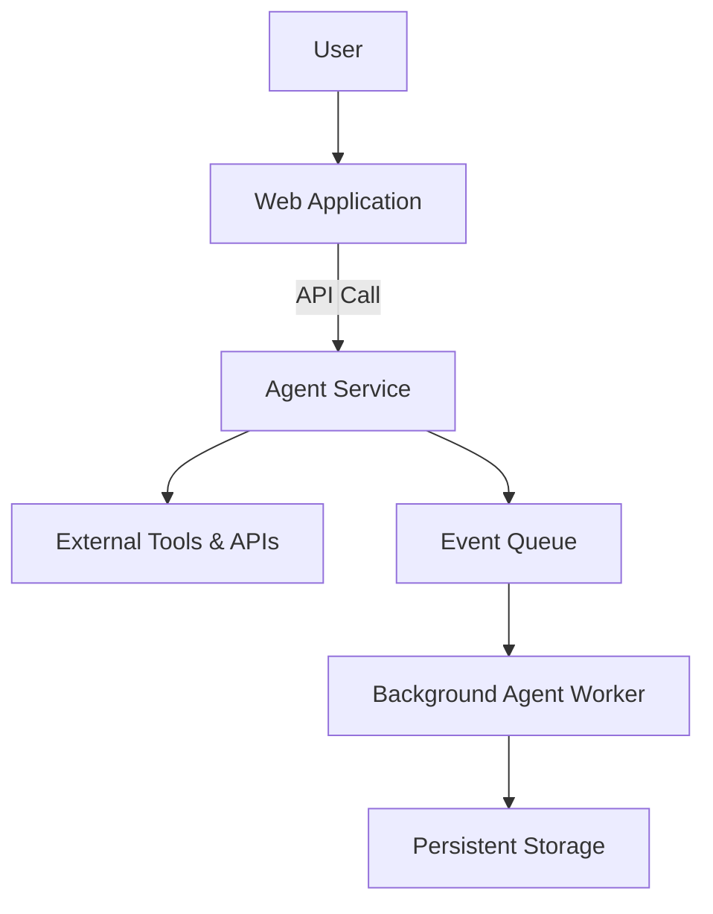

Deploying agentic systems into real-world environments is a fundamentally different challenge from prototyping or experimenting with them. While earlier chapters focused on building agents, enabling them to use tools, and integrating them with external systems, this chapter addresses what happens when an agent must operate reliably, securely, and cost‑effectively in production. Deployment is the point at which theoretical design meets operational reality, and many promising agent systems fail not because of flawed intelligence, but because of poor deployment choices or inadequate operational planning.

This chapter explores deployment architectures and operational considerations for agentic systems in depth. You will learn how to think about deployment from a systems perspective, how to choose appropriate architectural patterns, and how to monitor, update, and scale agents over time. We will also address the often-overlooked operational realities: logging, observability, failure handling, cost management, and long-term maintenance. By the end of this chapter, you should be able to make informed decisions about how to deploy agentic systems in production environments and how to operate them safely and sustainably.

## From Prototype to Production: Why Deployment Matters

In early development, agentic systems are often run in controlled environments: a developer’s machine, a research notebook, or a limited sandbox. Inputs are predictable, execution is supervised, and failures are tolerable. Deployment changes all of that.

Once deployed, an agent becomes a participant in a live socio-technical system. It interacts with real users, real data, and real external services. The reliability of the agent affects user trust. Its performance impacts operational costs. Its mistakes can have legal, ethical, or financial consequences. Deployment is therefore not merely a technical step; it is a transition of responsibility.

Unlike traditional software systems, agentic systems exhibit non-deterministic behavior, adaptive decision-making, and long-running autonomy. These characteristics make deployment more complex. You must consider not only whether the system works, but how it behaves under uncertainty, how it degrades under load, how it can be observed and controlled, and how it can be updated without disrupting ongoing operations.

This chapter builds from that premise. Deployment architectures are not just about running code somewhere; they are about designing an operational environment that supports agent behavior over time.

## Core Dimensions of Agent Deployment

Before discussing specific architectural patterns, it is helpful to understand the core dimensions that shape deployment decisions. These dimensions apply across deployment environments and influence nearly every operational choice.

The first dimension is control. How much direct control do you need over the agent’s execution environment? Some agents can safely run in fully managed platforms where many details are abstracted away. Others require fine-grained control over networking, security boundaries, or hardware configurations.

The second dimension is autonomy. Agentic systems vary widely in how independent they are. A simple chat agent responding to user prompts has limited autonomy and a short execution lifespan. A planning agent that monitors systems, triggers actions, and revises strategies over hours or days has far greater autonomy. Higher autonomy increases the need for robust monitoring, guardrails, and control mechanisms.

The third dimension is scale. Will the agent serve a handful of users or millions? Will it run continuously or only when invoked? Scale affects choices about infrastructure, cost optimization, and fault tolerance.

The fourth dimension is integration. Agents often rely on external tools, APIs, databases, and services. Deployment architectures must account for network latency, failure modes, authentication, and data consistency across these integrations.

Finally, there is the dimension of change. Agentic systems evolve: models are updated, prompts are refined, tools change, and policies evolve. Deployment architectures must support safe iteration without destabilizing production systems.

With these dimensions in mind, we can now explore common deployment architectures for agentic systems.

## Deployment Patterns for Agentic Systems

There is no single “correct” deployment architecture for all agentic systems. Instead, different patterns have emerged that trade off control, scalability, complexity, and cost. Understanding these patterns allows you to select or combine approaches that fit your use case.

### Embedded Agent Deployment

In an embedded deployment, the agent is integrated directly into an existing application or service. It runs as part of the application process or as a tightly coupled component.

This pattern is common for user-facing agents such as conversational assistants embedded in web or mobile applications. The application handles user sessions, authentication, and UI rendering, while the agent handles reasoning and decision-making.

The primary advantage of this approach is simplicity. Embedded agents can directly access application state and data structures, reducing integration complexity. Latency is often lower because fewer network hops are involved. Development workflows are straightforward, especially when the agent logic is implemented as a library or module.

However, embedded deployment has limitations. Scaling the agent requires scaling the entire application, even if only the agent component needs additional resources. Long-running agent tasks can block or degrade application performance. Updating the agent may require redeploying the entire application, which increases risk and operational overhead.

Embedded deployment is best suited for agents with limited autonomy, short execution times, and tight coupling to application logic.

### Service-Oriented Agent Deployment

In service-oriented deployment, the agent runs as a separate service, accessed via APIs by one or more client applications. This pattern treats the agent as a first-class service in the system architecture.

This approach supports better separation of concerns. The agent service can be scaled independently, deployed independently, and monitored independently. It is well-suited for agents that are reused across multiple applications or teams.

Service-oriented deployment also supports heterogeneous clients. A single agent service might serve web applications, internal tools, and automated workflows. This flexibility is a significant advantage in larger organizations.

The downside is increased complexity. Network latency must be managed carefully. Authentication and authorization become critical concerns. Debugging distributed systems is inherently harder than debugging monolithic ones.

For many production agentic systems, service-oriented deployment strikes a practical balance between flexibility and control.

### Event-Driven Agent Deployment

Event-driven deployment is a powerful pattern for agents that respond to asynchronous events rather than direct user requests. In this architecture, agents are triggered by events such as messages in a queue, changes in a database, or signals from monitoring systems.

For example, an agent might monitor error logs and trigger remediation workflows when anomalies are detected. Another agent might process incoming support tickets as they arrive.

Event-driven architectures decouple agent execution from request-response cycles. This supports scalability and resilience. If event rates increase, the system can queue events without overwhelming the agent. If the agent becomes temporarily unavailable, events can be retried later.

However, event-driven systems introduce complexity in state management and observability. Tracing the flow of decisions across asynchronous events can be challenging. Careful logging and correlation identifiers are essential.

### Long-Running Agent Deployment

Some agentic systems are designed to operate continuously, maintaining internal state over long periods. Examples include monitoring agents, trading agents, and strategic planning agents.

Long-running deployment requires special attention to fault tolerance and recovery. What happens if the agent crashes? How is state persisted? How are partial decisions resumed?

In many cases, long-running agents are deployed using container orchestration platforms such as Kubernetes. These platforms provide mechanisms for restarting failed processes, managing resource usage, and rolling out updates.

However, simply running a long-lived process is not enough. You must design explicit checkpointing, state persistence, and health monitoring to ensure the agent behaves reliably over time.

### Hybrid Deployment Approaches

In practice, complex systems often combine multiple deployment patterns. For example, an embedded user-facing agent might delegate complex tasks to a service-oriented planning agent, which in turn triggers event-driven workflows.

Hybrid architectures allow you to tailor deployment choices to different components of the agentic system. The key is to clearly define boundaries and responsibilities between components.

The following diagram illustrates a hybrid deployment architecture:

This architecture separates user interaction, agent reasoning, asynchronous processing, and state persistence into distinct components, each of which can be scaled and managed independently.

## Infrastructure Choices: Where Agents Run

Once you choose a deployment pattern, you must decide where the agent will run. Infrastructure choices have profound implications for scalability, cost, and operational complexity.

### Cloud-Based Deployment

Cloud platforms are the most common choice for deploying agentic systems. They offer managed services for compute, storage, networking, and observability. Cloud environments make it easier to scale agents, handle variable workloads, and integrate with external services.

For many teams, serverless platforms are attractive for lightweight agents. Serverless functions can be triggered on demand, scale automatically, and reduce operational overhead. However, serverless environments often impose execution time limits and restrict long-running processes, making them unsuitable for autonomous or stateful agents.

Container-based deployments offer more flexibility. Containers allow you to package the agent and its dependencies in a consistent environment. Orchestration platforms manage scheduling, scaling, and recovery. The trade-off is additional operational complexity.

### On-Premises and Edge Deployment

In some contexts, agents must be deployed on-premises or at the edge due to latency requirements, data privacy constraints, or regulatory obligations.

Edge deployment is common for agents that interact with physical systems, such as robots or IoT devices. These agents must operate reliably even when network connectivity is intermittent. This requires local inference, local decision-making, and robust synchronization mechanisms with central systems.

On-premises deployment often requires more manual infrastructure management but offers greater control over data and execution environments. Deployment architectures in these contexts must account for limited elasticity and longer provisioning times.

### Hybrid Infrastructure Models

Many organizations adopt hybrid models, where some agent components run in the cloud while others run on-premises or at the edge. Hybrid models add complexity but offer flexibility in meeting performance, compliance, and cost constraints.

In hybrid deployments, clear interfaces and resilience to network failures are essential. Agents must be designed to handle partial connectivity and eventual consistency.

## Monitoring and Observability for Agentic Systems

Operating an agentic system without robust observability is like flying an aircraft without instruments. Monitoring and logging are not optional extras; they are foundational capabilities.

### Why Observability Is Harder for Agents

Traditional software systems often have clearly defined inputs, outputs, and control flows. Agentic systems, by contrast, generate plans, intermediate reasoning steps, tool invocations, and adaptive decisions. Monitoring must capture this richness without overwhelming operators or violating privacy constraints.

Moreover, many agent failures are subtle. An agent might produce plausible but incorrect actions, or drift in performance over time. Detecting these issues requires more than checking for crashes or error codes.

### Key Observability Signals

Effective observability combines multiple types of signals.

Logs capture discrete events: tool calls, decisions taken, errors encountered. For agents, logs should include contextual information such as prompts, model versions, and tool parameters. However, logging raw prompts and responses can raise privacy and security concerns, so careful redaction and access controls are necessary.

Metrics provide quantitative signals over time: response latency, success rates, cost per action, token usage. Metrics support alerting and capacity planning.

Traces capture end-to-end flows through the system, correlating agent decisions with downstream effects. Distributed tracing is especially valuable in service-oriented and event-driven architectures.

### Designing Agent-Aware Logging

Agent logging should be designed deliberately. Rather than logging everything indiscriminately, focus on capturing information that supports debugging, evaluation, and accountability.

A useful practice is to define structured log schemas for agent events. For example, each decision might include an identifier, timestamp, context summary, and outcome. This structure supports automated analysis and reduces cognitive load during incident response.

### Monitoring Behavioral Quality

Beyond technical signals, agentic systems require monitoring of behavioral quality. This may include:

- Accuracy or task completion rates
- Policy compliance
- User satisfaction signals
- Drift in outputs over time

Behavioral monitoring often relies on sampling, evaluation pipelines, and human-in-the-loop review. Deployment architectures should make it easy to collect data for these processes.

## Updating, Versioning, and Rollouts

Agentic systems evolve continuously. Models improve, prompts are refined, tools change, and policies are updated. Managing this evolution safely is a core operational challenge.

### Versioning Agent Components

Agents are composed of multiple components, each of which may be versioned independently: model versions, prompt templates, tool interfaces, and orchestration logic.

Explicit versioning allows you to reproduce behavior, debug issues, and roll back problematic changes. Version identifiers should be included in logs and monitoring data to support traceability.

### Deployment Strategies for Updates

Several deployment strategies are commonly used to update agents.

In-place updates replace the existing agent with a new version. This approach is simple but risky, especially for long-running agents.

Blue-green deployments run two versions of the agent side by side, switching traffic from the old version to the new one once confidence is established. This strategy reduces downtime and supports quick rollback.

Canary deployments route a small fraction of traffic to a new agent version while monitoring its behavior. This approach is particularly valuable for detecting subtle regressions in agent behavior.

### Handling State During Updates

Updates become more complex when agents maintain state. You must decide whether state is migrated, discarded, or maintained separately per version.

Externalizing state, for example in a database, simplifies updates but introduces consistency challenges. Internal state may need to be checkpointed and restored.

Clear policies for state handling are essential to avoid unexpected behavior during rollouts.

## Scalability and Performance Considerations

Scalability is not just about handling more users; it is about maintaining acceptable performance and cost as workloads grow.

### Horizontal vs. Vertical Scaling

Horizontal scaling involves running more instances of the agent. Vertical scaling involves allocating more resources to each instance.

Most agentic systems favor horizontal scaling, as it provides better fault tolerance. However, some agents rely on large in-memory state or models, making vertical scaling more practical.

### Managing Latency

Latency is a critical user-facing metric. Agent reasoning, tool calls, and model inference all contribute to response time.

Caching can reduce repeated computation, especially for deterministic or semi-deterministic subcomponents. Parallelizing tool calls can also improve responsiveness.

However, aggressive optimization must be balanced against transparency and debuggability.

### Cost Management

Agentic systems can be expensive to operate, especially when using large language models with high token consumption.

Cost management strategies include:

- Limiting context size
- Using smaller models where appropriate
- Throttling or prioritizing requests
- Monitoring cost per task or user

Cost metrics should be first-class signals in monitoring dashboards.

## Reliability, Fault Tolerance, and Safety

Deployment architectures must anticipate failure. Networks fail, services time out, models produce unexpected outputs.

### Designing for Failure

Agents should be designed to fail gracefully. This might include fallback behaviors, retries with backoff, or handoff to human operators.

Timeouts are particularly important. An agent waiting indefinitely for a tool response can block resources and degrade system performance.

### Safety and Guardrails in Production

Safety mechanisms discussed in earlier chapters must be operationalized in deployment. This includes runtime policy enforcement, content filtering, and action approval workflows.

Deployment architectures should make it easy to intervene in agent behavior, for example by pausing execution or disabling specific tools.

## Security and Access Control

Agentic systems often have broad access to data and tools. Deployment must enforce strict security boundaries.

Authentication and authorization mechanisms should ensure that agents only access what they are permitted to. Secrets such as API keys must be managed securely.

Audit logs are essential for accountability, especially in regulated environments.

## Operational Case Study: Deploying a Customer Support Agent

To make these concepts concrete, consider a customer support agent deployed by a mid-sized software company.

The agent is deployed as a service-oriented component, accessed by the company’s support platform. It responds to user inquiries, queries internal knowledge bases, and creates tickets when necessary.

Monitoring includes structured logs of decisions, metrics for resolution time, and sampled transcripts for quality review. Canary deployments are used for prompt updates.

Cost is managed by using smaller models for routine queries and reserving larger models for complex cases.

This deployment illustrates how architectural choices, monitoring, and operational practices come together to support a real-world agent.

## Summary and Key Takeaways

Deployment and operations are where agentic systems prove their value—or reveal their weaknesses. Thoughtful deployment architectures enable reliability, scalability, and safe evolution. Poor operational practices can undermine even the most sophisticated agent designs.

Key ideas from this chapter include:

- Deployment is a transition from experimentation to responsibility.
- Different deployment patterns suit different agent behaviors and constraints.
- Observability is essential for understanding and managing agent behavior in production.
- Safe updates and versioning require explicit strategies and tooling.
- Scalability, cost, and reliability must be considered together.
- Security and safety are operational concerns, not just design-time choices.

As agentic systems become more capable and autonomous, the importance of robust deployment and operations will only grow. Mastery of these considerations is a defining skill for practitioners building real-world agentic systems.


